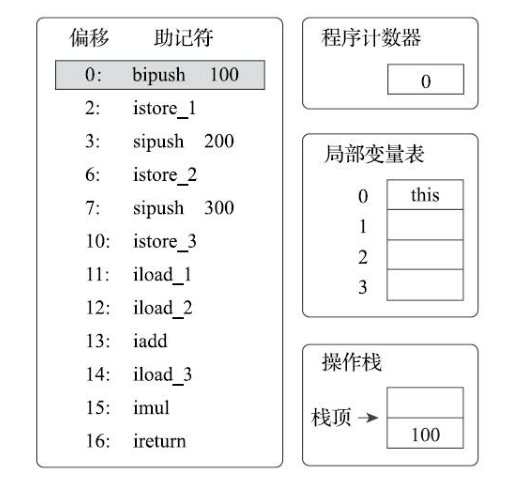
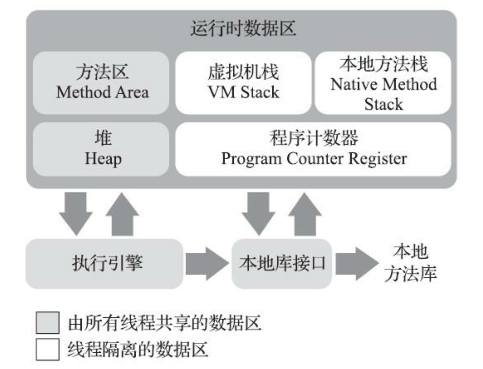
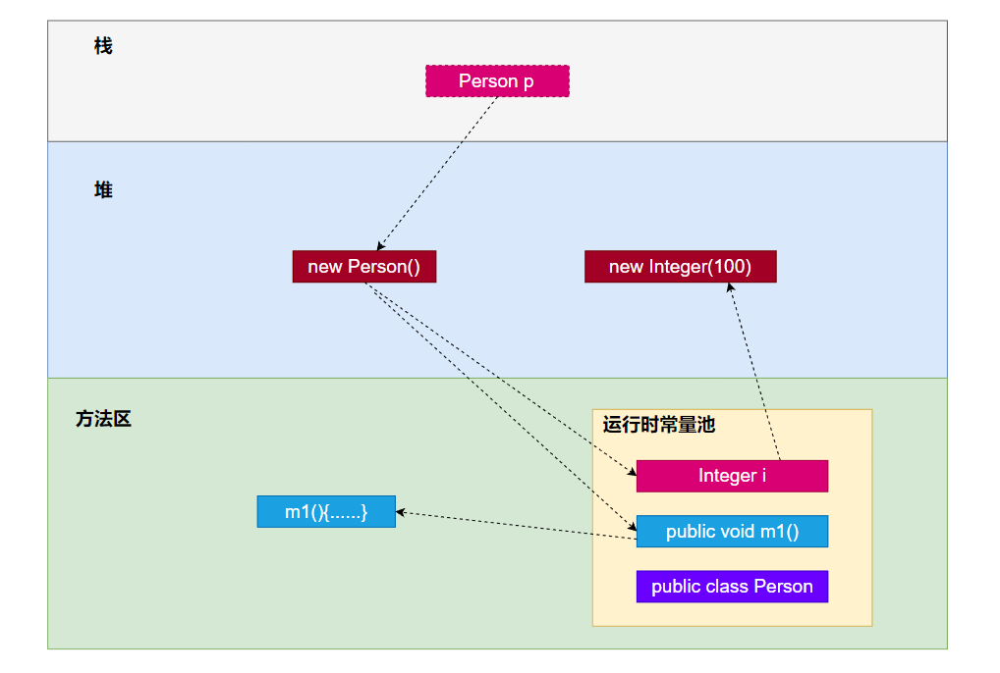
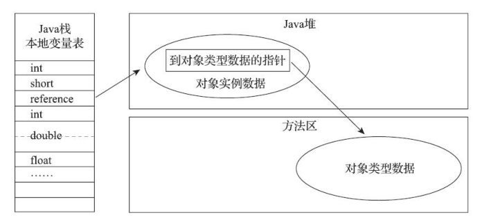
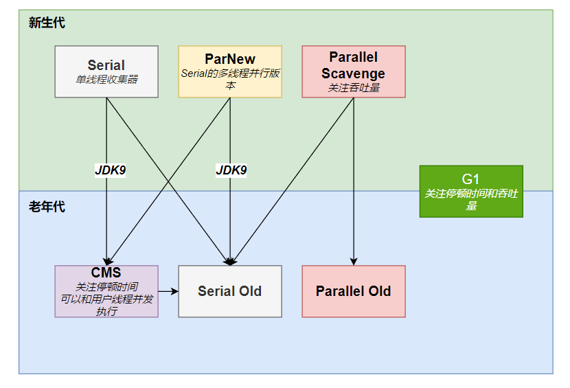

## 前端编译与优化

### 前端编译与优化的作用

　　前端编译的作用是把Java文件编译成class文件，优化的作用是提高程序员的编码效率。

　

### 前端编译过程

　　1、准备过程：初始化插入式注解处理器；

　　2、解析与填充符号表过程：词法语法分析，填充符号表；

　　3、插入式注解处理器的注解处理过程：插入式注解处理器的执行阶段；

　　4、分析与字节码生成过程：标注检查，数据流及控制流分析，解语法糖，字节码生成。

## 后端编译与优化

### 后端编译与优化的作用

　　后端编译的作用是把class文件翻译成本地机器码，优化的作用是让生成的机器码执行效率更高。

　

### 解释器和即时编译器

　　JVM通过**解释器**执行代码，当某段代码执行频率很高时，在运行时JVM会把这部分代码通过**即时编译器**翻译成本地机器码，并进行优化。解释器的特点是启动快、执行过程慢，即时编译器的特点是编译过程慢，但是执行机器码的速度很快，编译的过程比较消耗内存。一般两者一起工作，当程序启动后解释器首先发挥作用，随着时间推移，即时编译器逐渐发挥作用，把越来越多的代码翻译成本地机器码。

　

### 客户端编译器和服务端编译器

　　HotSpot虚拟机中内置了两个即时编译器，分别称为客户端编译器和服务端编译器，或者称为C1编译器和C2编译器，二者搭配使用的方式叫做“混合模式(Mixed Mode)”。C2编译器比C1编译器的编译过程更加复杂、更加激进。

　

### 编译对象与触发条件

　　即时编译器会将热点代码编译成机器码，热点代码分为两类：被多次调用的方法和被多次执行的循环体。

　　判断热点代码的方法叫做”热点探测“，主流的探测方法有：基于采样的热点探测和基于计数器的热点探测。

　

### 提前编译器

　　提前编译是指在代码运行之前就编译成机器码。

　

### 编译优化技术

　　编译优化的作用是让生成的机器码执行效率更高。常见的编译优化技术有：

　　1、**方法内联**：将目标方法中的代码复制到发起调用的方法内，避免发生真实的方法调用。

　　2、**逃逸分析**：一个对象在作用域内(可能是方法，也可能是线程)被定义，但是可能会被其它作用域访问到，称为逃逸。根据对象不同的逃逸程度，可以采取不同的优化方式。

　　　　常见的优化方式有：

　　　　**栈上分配**：堆内存线程共享，栈内存线程独立，如果一个对象不会逃逸出线程，那么可以给它在栈上分配内存，从而大大减轻垃圾收集系统的压力。

　　　　**标量替换**：如果一个对象不会被外部访问，那么在运行时可能不会创建这个对象，而是创建它的成员变量，即将对象拆分。

　　　　**同步消除**：如果一个变量不会逃逸出线程，那么对它的同步措施就可以消除掉。

　　　　**公共子表达式消除**：如果一个表达式在之前已经被计算过了，并且表达式中的所有变量值都没有修改过，那么对于这种表达式不需要再计算，只需要用前面的计算结果代替该表达式。

　　　　**数组边界检查**：为了避免数组越界，在运行期会对数组进行边界检查，频繁的检查很消耗性能，因此可以在后端编译时，根据条件来取消边界检查，比如数组在循环体中被访问，并且判断出循环变量的取值范围不超过数组长度，即不会出现数组越界，此时就可以取消边界检查。

　　　

## 类加载

### 类加载的七个阶段

　　加载->验证->准备->解析->初始化->使用->卸载。

### 加载

　　1、通过类的全限定名来获取定义此类的二进制字节流；

　　2、将这个字节流所代表的静态存储结构转换为方法区的运行时数据结构；

　　3、在堆内存中生成一个代表这个类的Class对象，作为方法区这个类的各种数据的访问入口。

### 验证

　　1、文件格式验证。验证字节流是否符合Class文件格式的规范；

　　2、元数据验证。对字节码描述的信息进行语义分析，保证其符合规范，比如除了Object外的所有类都应该有父类；

　　3、字节码验证。通过数据流和控制流分析，保证程序语义合法，比如把一个对象赋值给一个不相干类型的引用是不合法的；

　　4、符号引用验证。检查该类是否缺少它依赖的某些外部类、方法、字段。

### 准备

　　为静态变量分配内存并设置初始值，这里的初始值指的是默认值，一般是0。

### 解析

　　将常量池中的符号引用替换为直接引用。符号引用用一组字符描述、定位目标，它与虚拟机实现的内存布局无关，而直接引用可以直接指向目标在内存中的位置，它与内存布局直接相关。

　　解析的目标包括类、接口、字段、类方法、接口方法。

### 初始化

　　初始化就是执行类构造器`<clinit>()`方法的过程，`<clinit>()`是由编译器自动收集类中的所有静态变量的赋值动作和静态代码块中的语句合并产生的，收集的顺序和在源文件中定义的顺序一致。**因此初始化实际上就是给静态变量赋值和执行静态代码块的过程**。

　　初始化的过程是：

　　1、当虚拟机启动时，会先初始化主类(即包含`main()`方法的类)；

　　2、使用new关键字实例化对象时，会初始化对象类型；

　　3、访问一个类的静态变量时，会初始化该类(被final修饰的静态变量不算，因为在编译器已经把结果放入了常量池中)；

　　4、调用一个类的静态方法时，会初始化该类；

　　5、使用反射调用某个类型时，会初始化该类；

　　6、如果当前正在初始化类的父类还没有初始化，那么会先初始化父类；

　　7、JDK8中新加入的接口`default()`方法，会在实现类初始化之前初始化；

　　8、对于接口，实现类的初始化不会触发其接口的初始化，接口的初始化不会触发其父接口的初始化；

　　9、如果多个线程去初始化同一个类，那么只有一个线程会去执行，其它线程会阻塞。

## 类加载器

　　“通过一个类的全限定名来获取描述该类的二进制字节流”这个动作是在Java虚拟机的外部实现的，其目的是让应用程序自己决定如何去获取所需的类，实现这个动作的代码叫做类加载器。

　　对于任意一个类，必须由这个类和加载它的类加载器一起确立其在虚拟机中的唯一性，如果两个类来源于同一个class文件，但是由不同的类加载器加载，那这两个类必定不相等。

### 双亲委派模型

* #### 双亲委派模型的架构

　　自JDK1.2以来，Java一直保持着**三层类加载器、双亲委派**的类加载架构。

　　第一层类加载器是**启动类加载器**，它由C++实现，无法被Java程序直接引用。它负责加载存放在`<JAVA_HOME>\lib`目录中，或者是被`-Xbootclasspath`参数指定的路径中存放的，而且能被虚拟机识别的类库。启动类加载器也叫做**引导类加载器**。

　　第二层类加载器是**扩展类加载器**，它由Java实现，位于`sun.misc.Launcher$ExtClassLoader`。它负责加载`<JAVA_HOME>\lib\ext`目录中，或者是被`java.ext.dirs`系统变量所指定的路径中所有的类库。

　　第三层加载器是**应用程序类加载器**，它由Java实现，位于`sun.misc.Launcher$AppClassLoader`。它负责加载用户类路径(ClassPath)上的所有类库。如果程序中没有自己定义的类加载器，那么一般它就是程序默认的类加载器。程序类加载器也叫做**系统类加载器**。

　　双亲委派模型的架构是，扩展类加载器的父类加载器是启动类加载器，应用程序类加载器的父类加载器是扩展类加载器，用户自定义加载器的父类加载器是应用程序类加载器。

* #### 双亲委派模型的工作过程

　　双亲委派模型的工作过程是，如果一个类加载器收到了类加载的请求，它首先会将这个请求委派给父类加载器去执行，每一层的类加载器都是如此，因此所有的加载请求最后都会传送给启动类加载器，只有当父类加载器无法完成加载请求(即在它的搜索范围中没有找到目标类)时，子类加载器才会去尝试加载。

 　　因为类的唯一性是由class文件和类加载器共同决定的，如果由各个类加载器自行去加载类，就会导致同一个class文件加载出了不同的类，**双亲委派模型解决了这个问题，保证了虚拟机中类的唯一性**。

　　实现双亲委派的代码很简单，全部集中在`java.lang.ClassLoader`的`loadCLass()`方法中。

* #### 破坏双亲委派模型

　　双亲委派模型有三次较大规模被破坏的情况。

　　第一次是在双亲委派模型出现之前，这时类加载器的概念和抽象类`java.lang.ClassLoader`已经存在，用户自定类加载器是通过重写`ClassLoader`中的`loadCLass()`方法实现的，所以称为第一次破坏。后面引入了双亲委派模型，为了不影响旧代码，在`ClassLoader`中新增了一个`findClass()`方法，用户自定义类加载器如果要使用双亲委派模型，就要重写这个方法，如果不想使用双亲委派模型，就要重写`loadClass()`方法。

　　第二次是为了解决基础类型调用用户类型的问题，在双亲委派模型中，基础类型主要由启动类加载器来加载，而用户类型由应用程序类加载器或者自定义加载器来加载，在SPI(Service Provider Interface，服务提供者接口)中，**往往是在基础类型中调用用户类型，这是一种由父类加载器去请求子类加载器的行为**，JDBC就是一个例子。

　　第三次是为了解决代码热部署的问题。

* #### <font color='red'>破坏双亲委派模型的案例</font>

　　<font color='red'>案例1：JDBC(还需要整个类加载的过程)</font>

　　JDBC创建连接的代码是：

```java
Connection conn = DriverManager.getConnection()
```

　　`DriverManager`是一个基础类型，由启动类加载器加载，而`DriverManager`内部又会去加载`Driver`的具体实现类，这些实现类是由第三方厂商提供的，启动类加载器无法加载这些实现类，因此`DriverManager`内部使用了线程上下文类加载器(实际上是AppClassLoader)来加载这些实现类。

　

　　<font color='red'>案例2：Tomcat(还需要看tomcat源码，了解应用的类加载器到底是什么)</font>

　　由于Web服务器上会部署多个应用程序，如果它们使用同一个类库和同一个类加载器，那么只能同时加载一个类到虚拟机，这显然无法支持多个应用。Tomcat的解决办法是，为每个应用程序提供单独的类加载器，每个应用优先使用这个类加载器，只有当无法加载时才会去使用父类加载器，正好和双亲委派模型相反。

* #### <font color='red'>自定义类加载器</font>

　　如果自定义类加载器不想要继承双亲委派模型，那么就要重写`loadClass()`方法，如果想要继承双亲委派模型，就要重写`findClass()`方法。

　　<font color='red'>待办：自定义一个类加载器。</font>

## 运行时栈帧结构

### 栈与栈帧

* #### 概述

　　Javac编译器输出的字节码指令流，基本上是一种**基于栈的指令集架构**，与之相对应的是基于寄存器的指令集，最典型的就是x86的二地址指令集，即主流PC机中物理硬件直接支持的指令集架构。**基于栈的指令集的主要优点是可移植**(不受硬件约束)、**代码更加紧凑、编译器实现更加简单**等，**缺点是理论上执行速度会慢一点**，这里的执行速度主要局限在解释器层面，如果通过即时编译器编译成机器指令，就与指令集架构没有关系了，另外基于栈架构的**指令数量会比较多，**因为出栈入栈操作本身就产生了大量的指令，并且由于栈实现在内存中，**频繁的栈访问也就意味着频繁的内存访问**，对处理器来说，内存始终是执行速度的瓶颈。

　　**栈**是先进后出的数据结构，一个栈里面有多个**栈帧**。Java虚拟机以方法为最基本的执行单元，每执行一次方法就会生成一个栈帧，栈帧中存放着方法的**局部变量表、操作数栈、返回地址**等信息。

* #### 栈帧的组成

　　**局部变量表**：局部变量表中存放着方法参数和方法局部变量。局部变量表的最大容量在编译后就已经确定，以变量槽为最小单位，对于实例方法，第0个变量槽中存放的是所属对象的实例引用(即`this`)。方法局部变量包括基本类型变量和对象的引用(真正的对象存放在堆中)。

　　**操作数栈**：操作数栈的作用有两个，一是进行算术运算，二是当调用其它方法时，通过操作数栈来传递方法参数。操作数栈的最大深度在编译后就已经确定。

　　**返回地址**：当方法退出时，会将返回值传递给方法调用者，这时就需要用返回地址来定位调用者。

* #### 基于栈的解释器执行过程

　　代码：

```java
public int calc() {
    int a = 100;
    int b = 200;
    int c = 300;
    return (a+b)*c;
}
```

　　代码对应的字节码：



　　执行过程：

　　PC-0：执行偏移地址为0的指令，将操作数100压入操作栈的栈顶；

　　PC-2：执行偏移地址为2的指令，将栈顶的100出栈并存放到局部变量表的1号变量槽中。后面的PC-3到PC-10都是同样的操作，对应的是代码中的三个赋值操作；

　　PC-11：将1号变量槽中的整形值100复制到操作栈顶；

　　PC-12：将2号变量槽中的整形值200复制到操作栈顶；

　　PC-13：将操作栈中头两个栈顶元素出栈，做整形加法，然后把结果300重新入栈；

　　PC-14：将3号变量槽中的整形值300复制到操作栈顶；

　　PC-15：将操作栈中头两个栈顶元素出栈，做整形乘法，然后把结果90000重新入栈；

　　PC-16：结束方法执行，并把操作栈顶的整形值返回给方法调用者。

### 虚方法与非虚方法

　　**非虚方法**指的是，**一个方法在运行之前就有了确定的版本，并且在运行期间不会改变**，换句话说，这个方法在运行之前就已经确定好要执行哪段具体代码了。符合这个要求的方法主要包括**静态方法、私有方法、构造方法、父类方法、final方法**，这些方法的一个共同点是都不可能通过继承或其它方式重写出其它版本，因此在类加载阶段就可以把方法的符号引用解析为直接引用。

　　非虚方法以外的方法都是**虚方法**。

### 重载与重写的实质

* #### 重载

　　重载指的是在一个类中，多个方法的方法名相同，参数列表不同。**当调用重载方法时，只能通过参数来判断最终要调用哪一个重载方法，而判断的依据是参数的静态类型，而非实际类型**。举个例子，在下面的代码中，`Human human = new Man(); `中的`Human`是静态类型，而`Man`是实际类型，**静态类型在编译期是可知的，而实际类型在编译期是不可知的**。

```java
public class Test {
    static class Human {
    }

    static class Man extends Human {
    }

    void sayHello(Human human) {
        System.out.println("Hello,human!");
    }

    void sayHello(Man man) {
        System.out.println("Hello,man!");
    }

    public static void main(String[] args) throws Exception {

        Human human = new Man();
        Test test = new Test();
        test.sayHello(human); //静态分派
        test.sayHello(new Man()); //动态分派
    }
}

打印结果：
Hello,human!
Hello,man!
```

　　所有依赖静态类型来决定方法执行版本的分派动作，都称为**静态分派**，静态分派最典型的表现就是方法重载。

* #### 重写

　　重写指的是子类继承父类，同时定义一个方法名、方法参数、返回值类型都与父类方法相同(也可以存在继承关系)的方法。当调用重写方法时，会根据运行期的实际类型来选择方法版本，并且如果在当前类型中没有找到目标方法，就会从下往上依次在父类中查找，如果找到了就会执行。下面是一个重写的典型例子：

```java
public class Test {
    static class Father {
        int money = 10;

        public Father() {
            money = 20;
            showMoney();
        }
        void showMoney() {
            System.out.println("I am father,I have $"+money);
        }
    }

    static class Son extends Father {
        int money = 30;

        public Son() {
            money = 40;
            showMoney();
        }
        @Override
        void showMoney() {
            System.out.println("I am son,I have $"+money);
        }
    }

    public static void main(String[] args) throws Exception {

        Father man = new Son(); //动态分派
        System.out.println(man.money); //访问字段属于静态分配
    }
}

打印结果：
I am son,I have $0
I am son,I have $40
20
```

　　在上面的代码中，执行父类构造方法时，调用的是子类中的重写方法，这说明方法分配的依据是实际类型，这叫做**动态分派**。另外，访问字段的依据是静态类型，属于静态分派。

## 虚拟机内存

### 运行时数据区域

* #### 概述

　　Java虚拟机的运行时数据区域如下图所示：



* #### 程序计数器

　　程序计数器是一块较小的内存空间，它记录了**正在执行的字节码指令的地址**。为了让线程切换时能够恢复到正确的执行位置，每个线程都有独立的程序计数器。

* #### 虚拟机栈和本地方法栈

　　虚拟机栈也是线程私有的，它的生命周期和线程相同。当每个方法被执行的时候，虚拟机都会同步创建一个栈帧，用来存放**局部变量表、操作数栈、动态连接、方法出口**等信息，每一个方法被调用直至执行完毕的过程，就对应着一个栈帧在虚拟机中从入栈到出栈的过程。

　　如果线程请求的栈深度超过了虚拟机允许的深度，就会抛出`StackOverflowError`异常；如果虚拟机支持栈容量动态扩展，当扩展到无法申请足够内存时，就会抛出`OutOfMemoryError`异常，HotSpot虚拟机是不支持动态扩展的，因此不会出现这种情况。

　　本地方法栈和虚拟机栈的作用很像，区别在于虚拟机栈是为Java方法服务的，而本地方法栈是为Native方法服务的，而HotSpot虚拟机将二者合二为一了。

* #### Java堆

　　堆是所有线程共享的内存区域，在虚拟机启动时创建，**此内存区域的唯一作用就是存放对象实例，对象实例包括实例数据和指向类型数据的指针，实例数据是指实例成员变量的值，类型数据包括对象所属类中各种字面量和符号引用、静态成员变量的值、方法体中的字节码指令等，类型数据位于方法区**。Java堆是垃圾收集器管理的内存区域，因此也叫做GC堆。在当前主流的虚拟机中，Java堆都是可扩展的(通过`-Xms`和`-Xmx`设定)。如果Java堆中没有内存可以完成实例分配，并且堆也无法扩展时，就会抛出`OutOfMemoryError`异常。

* #### 方法区

　　方法区也是所有线程共享的内存区域，它用来存放已经**被虚拟机加载的类型数据、即时编译器编译后的代码缓存**等数据。如果方法区内存不够时，就会抛出`OutOfMemoryError`异常。

* #### 运行时常量池

　　运行时常量池是方法区的一部分，Class文件中有一个常量池表，表中存放着**编译期生成的各种字面量与符号引用**，字面量指的就是常量，比如字符串类型和final类型常量，符号引用包括类、字段、方法的名称和描述符。字面量和符号引用将在类加载后存放到方法区的运行时常量池中。如果运行时常量池内存不够时，就会抛出`OutOfMemoryError`异常。

### 内存中的对象

* #### 对象的创建

　　创建过程如下：

　　1、**类加载检查**：当虚拟机遇到一个字节码new指令时，会去检查这个指令的参数能否在常量池中定位到一个类的符号引用，并且检查这个符号引用代表的类是否已经被加载、解析、初始化过，如果没有，就必须先进行相应的初始化过程；

　　2、**分配内存**：在类加载检查通过后，虚拟机将为新生对象分配内存，对象所需内存大小在类加载完成后就可以确定。分配内存主要有两种方式：指针碰撞和空闲列表，前者内存规整，后者内存分散。分配内存在多线程下是不安全的，需要采用CAS等方式保证线程安全；

　　3、**初始化零值**：内存分配完成后，虚拟机必须将分配到的内存空间都初始化为零值，这保证了对象的实例字段在Java代码中不赋初始值就可以直接使用；

　　4、**设置对象头**：接下来，虚拟机还要对对象进行必要的设置，例如这个对象是哪个类的实例、怎样才能找到类的元数据信息、对象的哈希码、对象的GC分代年龄等信息，这些信息存放在对象头中；

　　5、**执行构造方法**：上面的工作完成后，从虚拟机的视角看，一个新的对象已经产生了，但是从Java程序的角度来看，对象创建才刚刚开始，因为构造方法还没有执行，所有字段都是默认的零值。当执行完构造方法后，一个真正的、可用的对象才算完全被构造出来。

* #### 对象的组成

　　对象在堆内存中由三部分组成：**对象头、实例数据、对齐填充**。

　　对象头中存放着两类信息，第一类是用于对象自身的运行时数据，比如哈希码、GC分代年龄、锁状态标志、线程持有的锁、偏向线程ID、偏向时间戳等，第二类是类型指针，即指向它的类型元数据的指针，Java虚拟机通过该指针来确定该对象是哪个类的实例；如果对象是数组，对象头中还要保存数组长度。

　　实例数据部分是对象真正存储的有效信息，即我们在代码里面定义的各种类型的字段内容，包括从父类继承的。

　　对齐填充仅仅起着占位符的作用。

* #### 对象内存布局图解

　　声明一个类：

```java
public class Person {
    Integer age = new Integer(50);
    
    public void m1() {...}
}
```

　　在方法中创建一个对象`Person p = new Person()`，那么它的内存布局是：



## Java程序运行的完整过程

### 一、编译阶段

　　Java编译器将java代码编译为class字节码，字节码由**常量池、访问标志、类索引、字段表集合、方法表集合、属性表集合**六部分组成。

　　**1、常量池**：顾名思义，常量池中存放的都是常量，即不会改变的值，包括了**字面量和符号引用**。

　　字面量指的就是**通常意义上的常量**，比如`String s = "hello"`中`"hello"`就是字面量，因为字符串是不可变的，再比如`final int a = 1000`中`1000`也是字面量，而`int a = 1000`中的`1000`不是字面量，因此不会放入常量池。

　　符号引用主要包括**类与接口的全限定名、字段名称和描述符、方法名称和描述符**等，符号引用实际上只是个字符串，与数据在内存中的布局无关。

　　**2、访问标志**：用于标识**类与接口的访问信息**，比如这个Class是接口还是类、是不是public类型、是不是abstract类型、是不是final类型等。

　　**3、类索引**：类索引用于确定这个**类的全限定名**，父类索引用于确定这个类的**父类的全限定名**，接口索引集合用于确定这个类**实现了哪些接口**。

　　**4、字段表集合**：字段表用于记录**静态和实例成员变量的名称、描述符**，但不包括它们的值。

　　**5、方法表集合**：方法表用于记录**静态和实例方法的名称、描述符**，但不包括方法体。

　　**6、属性表集合**：属性表中最重要的是Code属性，**方法体中的代码经过编译后会变成字节码指令，存放在Code属性中**，如果方法中使用了`try...catch`，还会生成一个异常表。Code属性中的方法包含了类中的所有方法，比如静态、实例方法、构造方法、代码块等。

### 二、类加载阶段

　　Java虚拟机将class字节码**加载**到内存，然后对数据进行**验证、准备、解析、初始化**，最终形成可以被虚拟机直接使用的Java类型。

　　**1、加载阶段**：将class字节码中的**静态存储结构转换为内存方法区的运行时数据结构**，同时在堆内存中生成一个代表这个类的Class对象。

　　**2、准备阶段**：为静态成员变量分配内存并赋零值。

　　**3、解析阶段**：将常量池中的符号引用转换为直接引用，直接引用和内存相关，可以直接指向目标对象。

　　**4、初始化阶段**：前面的阶段都和用户代码无关，由虚拟机主导控制，初始化阶段开始执行`<clinit>()`方法，这个方法是编译器自动产生的，其目的是**为静态成员变量赋值、执行静态代码块、执行静态方法**。

### 三、执行字节码指令阶段

* #### 创建对象

　　虚拟机会从静态main方法进入，开始执行各个方法，实际上是执行方法中已经编译好的字节码指令。其中一个重要的指令是`new`指令，它的作用是创建对象并压入栈顶。

　　`new`指令的执行过程是：

　　**1、类加载检查**：检查要创建的对象的类型是否已经加载过、解析、初始化过，如果没有，就要先进行类加载；

　　**2、分配内存**：类加载检查通过后，会为对象分配内存，并对实例成员变量赋零值；

　　`new`指令执行完成后，会**执行对象所属类的构造方法**，通过构造方法给实例成员变量赋值，这样一个真正可用的对象就创建好了。

* #### 调用对象中的方法

　　在HotSpot虚拟机中，主要通过直接指针访问对象。如下图所示：



　　方法栈帧中存放了一个`reference`变量，它指向Java堆中对象的地址，Java堆中对象存放了一个指针，这个指针指向该对象所属类在方法区的类型数据，其中就包括了类中的方法，通过这种方式就可以调用到对象的方法、字段了。

## 垃圾收集

### 概述

* #### 垃圾回收的对象

　　垃圾回收的范围是堆内存和方法区，其中堆内存是重点。判断对象是否存活的基本思路是，将一系列根对象(`GC Roots`)作为起始节点集，从这些节点开始，根据引用关系向下搜索，搜索的路径叫做“引用链”，如果一个对象到根节点之间没有任何引用链相连，则证明此对象是不可能再被使用的，我认为用**对象失踪**来形容很合适，这种判断思路称为**可达性分析算法**。

　　可以作为固定根对象的有：**栈内存中的参数、局部变量，方法区的静态变量、常量，被同步锁持有的对象等**。当堆内存的某一区域里面的对象被另一区域里面的对象所引用时，那么后者也要作为根对象进行分析。

* #### 引用的分类

　　**1、强引用**：是最传统的引用定义，即常见的引用赋值，比如`Object o = new Object()`。只要强引用存在，被引用的对象就不会被回收；

　　**2、软引用**：比强引用的强度更弱，当要发生内存溢出异常前，会对软引用对象进行回收，如果内存还是不够，才会抛出异常。JDK1.2后提供了`SoftReference`来实现软引用；

　　**3、弱引用**：比软引用的强度更弱，弱引用对象只能生成到下一次垃圾回收为止，于内存是否足够无关。JDK1.2后提供了`WeakReference`来实现弱引用；

　　**4、虚引用**：比弱引用的强度更弱，无法通过虚引用来获取一个对象，虚引用的唯一作用是在对象被回收时获得一个系统通知。JDK1.2后提供了`PhantomReference`来实现虚引用。

* #### finalize()方法

　　要宣告一个对象真正死亡(或失踪)，要经过两次标记。对象经过可达性分析后，没有发现与根对象相连，这时它会被第一次标记；随后会判断该对象是否有必要执行`finalize()`方法，如果该对象没有重写`finalize()`方法，或者该方法已经被虚拟机调用过，那么这两种情况都视为没有必要执行，此时就可以宣告对象真正死亡了。

　　因此`finalize()`方法是对象逃脱死亡命运的最后一次机会，只需要重写`finalize()`方法，并在方法中将对象本身赋值给另一个成员变量或静态变量，就可以避免被回收。但是任何对象的`finalize()`方法只会被虚拟机执行一次，所以说是最后一次机会。

　　`finalize()`运行代价高昂，不确定性大，不推荐使用。

### 垃圾回收算法

* #### 分代收集理论

　　分代收集理论建立在两个假说之上：

　　1、**弱分代假说**：绝大多数对象都是朝生夕灭的；

　　2、**强分代假说**：熬过越多次垃圾收集过程的对象就越难以消亡。

　　目前的商业垃圾收集器大都遵循了分代收集的理论，**即收集器应该将Java堆划分出不同的区域，然后将回收对象依据其年龄(年龄就是对象熬过垃圾收集过程的次数)分配到不同的区域中存储**。

　　在商业垃圾收集器中，设计者一般至少会把Java堆划分为**新生代(Young Generation)和老年代(Old Generation)**两个区域，新生代中，每次垃圾收集都发现有大量对象死去，而每次回收后存活的少量对象，将会逐步晋升到老年代中存放。

　　**分代收集的好处是，可以针对不同的区域，采取不同的回收方式，提高回收效率和空间利用率**。比如对于新生代，它的特点是死亡对象较多，为了避免对所有死亡对象进行标记，就可以采用标记-复制算法，对于老年代，它的特点是存活对象较多，为了提高空间利用率，就可以采用标记-清除算法。

* #### 跨代引用假说

　　老年代可能会引用新生代中的对象，因此要找出新生代中的存活对象，就要遍历整个老年代，反过来也一样，这种做法会对内存回收带来很大负担。为了解决这个问题，提出了：

　　3、**跨代引用假说**：跨代引用相对于同代引用，只占极少数。理由是存在引用关系的两个对象，应该是倾向于同时生存或同时消亡的。

　　根据这个假说，我们不需要去扫描整个老年代，只需要在新生代上建立一个全局的数据结构(**记忆集**)，这个结构把老年代划分为若干小块，标识出老年代的哪一块内存会存在跨代引用，此后当回收新生代时，只需要扫描老年代中包含了跨代引用的小块内存。这种方法虽然需要在对象改变引用关系时维护数据集，会增加一些运行时开销，但比起扫描整个老年代还是划算的。

* #### 收集方式

　　1、**部分收集(Partial GC)**：目标不是收集整个Java堆。

　　　　1）**新生代收集(Minor GC/Young GC)**：目标是收集整个新生代。

　　　　2）**老年代收集(Major GC/Old GC)**：目标是收集整个老年代。

　　　　3）**混合收集(Mixed GC)**：目标是收集整个新生代和部分老年代。

　　2、**整堆收集(Full GC)**：目标是收集整个Java堆和方法区。

* #### 垃圾收集算法

　　**1、标记-清除算法(Mark-Sweep)**：首先标记出所有要回收的对象，然后统一回收所有被标记的对象。它的缺点有两个，一是当大量对象需要回收时，需要进行大量标记和清除动作，二是会产生大量不连续的内存碎片，空间碎片太多会导致无法为大对象分配内存。

　　**2、标记-复制算法(Mark-Copy)**：将可用内存分成大小相同的两块，每次只使用其中一块，当这一块的内存用完了，就将还存活的对象复制到另一块内存中，然后把已经用过的内存块一次清理掉。它的优点有两个，一是当需要回收的对象比较多时，可以免去大量的标记和清除动作，二是避免了空间碎片化；它的缺点也有两个，一是当存活的对象比较多时，需要进行大量的复制，二是可用内存缩小了一半，造成了空间浪费。

　　现在的商用虚拟机大都采用了这种算法来回收新生代，新生代的特点是存活下来的对象是少数，针对这个特点对标记-复制算法进行了优化，即“**Appel式回收**”，它的具体做法是把新生代分为一块较大的Eden空间和两块较小的Survivor空间，每次分配内存时只使用Eden空间和其中一块Survivor，当发生垃圾收集时，将存活的对象一次性复制到另一块Survivor中，然后直接清理掉Eden和已经用过的Survivor空间。HotSpot虚拟机默认Eden和Survivor的大小比例是8:1:1，即只有10%的新生代空间会被浪费。当存活的对象大小多于10%的Survivor空间时，这些对象就会通过分配担保机制直接进入老年代。

　　HotSpot虚拟机的**Serial、ParNew等新生代收集器**都采用了Appel式回收策略。

　　**3、标记-整理算法(Mark-Compact)**：标记过程和标记-清除算法一样，整理过程是让所有存活对象都向内存一端移动，然后直接清理掉边界以外的内存。它的优点是可以避免空间碎片化，缺点是要对大量的存活对象进行移动，而且移动时必须停止用户进程(ZGC和Shenandoah收集器可以和用户进程并发执行)，这样的停顿被最初的虚拟机设计者描述为“Stop The World”。

　　移动则内存回收更复杂，不移动则内存分配更复杂，如果程序的吞吐量是用户程序和收集器的效率总和，因为内存分配的频率比内存回收的频率高很多，所以整体吞吐量还是下降的。

　　HotSpot虚拟机中**关注吞吐量的Parallel Scavenge收集器**是基于标记-整理算法的，而**关注延迟的CMS收集器**是基于标记-清除算法的，当它面临空间碎片过多时才会使用标记-整理算法。

### HotSpot的算法细节实现

* #### 根节点枚举

　　迄今为止，**所有收集器在根节点枚举这一步骤时都必须暂停所有用户线程**。在枚举根节点时，虚拟机并不需要在运行时从方法区一个一个查找，而是会在类加载期间就统计根节点的信息，将这些信息放入一组OopMap数据结构中，这样收集器在扫描时就可以直接获取到了。

* #### 安全点

　　如果为每一条指令都生成对应的OopMap，需要大量的存储空间，**HotSpot的做法是只在特定位置上记录这些信息，这些位置称为安全点，因此用户程序执行时并非在代码指令流的任意位置都能停顿下来开始垃圾收集，而是强制要求必须执行到安全点后才能暂停**。

　　安全点的选择要遵循“是否具有让程序长时间执行的特征”的标准，而长时间执行的最明显特征就是指令序列的复用，例如**方法调用、循环跳转、异常跳转**等，所以只有具有这些功能的指令才会产生安全点。

　　还有一个问题是，如何在垃圾收集时让所有线程都跑到对它来说最近的安全点，然后停顿下来。大部分收集器采用的是**主动式中断**的思想，即设置一个标志位，各个线程在执行过程中主动轮询这个标志位，如果发现标志位为真就让自己在最近的安全点暂停下来。轮询的位置和安全点的位置相同，除此之外还要加上所有创建对象和分配内存的地方，这是为了检查是否即将发生垃圾收集，避免没有内存分配新对象。

* #### 安全区域

　　当线程处于睡眠或阻塞状态时，无法主动轮询将自己挂起，对于这种情况必须引用安全区域来解决。

　　**安全区**域是指确保在一段代码中，引用关系不会发生变化，因此在安全区内的任意位置开始垃圾收集都是安全的，可以把安全区域看成是安全点的拉伸。当用户线程执行到安全区域里面的代码时，首先会标识自己已经进入了安全区域，这段时间内垃圾收集时就不用去管这些已经声明自己在安全区域内的线程了，当线程要离开安全区域时，它要检查虚拟机是否完成了根节点枚举，如果完成了就继续执行，否则就必须一直等待，直到收到可以离开安全区域的信号为止。

* #### 记忆集与卡表

　　记忆集是一种数据结构，卡表是记忆集的一种实现。卡表中每个指针指向一个内存块，内存块中有多个对象，如果卡表中的某个元素为1(称为卡表变脏)，代表着它指向的内存块中存在着跨代引用，如果为0则代表不存在。垃圾回收时，只需要对存在跨代引用的内存块进行扫描。

* #### 写屏障

　　卡表变脏的时间点是在引用类型字段赋值的那一刻，因此必须在机器码层面把维护卡表的动作放到每一个赋值操作中，在HotSpot中是通过**写屏障**技术维护卡表操作的，写屏障可以看作在虚拟机层面对“引用类型字段赋值”这个动作的AOP切面，应用写屏障后，虚拟机就会为所有赋值操作生成相应的指令。

* #### 并发的可达性分析

　　在可达性分析中，虽然根节点枚举部分可以让用户线程暂停，但是后面的遍历过程不能，为了保证不会出现本应存活的对象被回收的情况，HotSpot采用了**增量更新**和**原始快照**两种策略。

### 经典垃圾收集器

* #### 概述

　　这里讨论的是在JDK7 Update4之后、JDK11正式发布前，Oracle JDK中的HotSpot虚拟机所包含的全部可用的垃圾收集器。这些收集器如下图所示：



* #### Serial收集器

　　Serial是新生代收集器，采用标记-复制算法，它是最基础、最古老的收集器。**它的特点是只会使用单处理器、单线程去完成垃圾收集工作**，而且在收集过程中，必须暂停所有工作线程，直到收集结束。Serial收集器是HotSpot运行在客户端模式下的默认新生代收集器，对于运行在客户端模式下的虚拟机是一个很好的选择。

* #### ParNew收集器

　　ParNew是新生代收集器，采用标记-复制算法，**它是Serial收集器的多线程并行版本(并行指的是会有多个线程去执行收集任务，但此时用户线程是暂停的)**，在多核处理器的情况下，性能得到提升，除此之外和Serial收集器区别不大。ParNew收集器是激活CMS(一种老年代收集器)后的默认新生代收集器。

* #### Parallel Scavenge收集器

　　Parallel Scavenge收集器是新生代收集器，采用标记-复制算法，它也是多线程并行收集器。它的特点是关注点与其它收集器不同，**它的目标是达到一个可控制的吞吐量**，吞吐量指是用户程序执行时间占处理器运行时间的比重。Parallel Scavenge提供了用于控制最大垃圾收集停顿时间和直接设置吞吐量的参数，同时还提供了自适应调节吞吐量的参数。停顿时间缩短是以牺牲新生代容量和吞吐量为代价换取的，因为新生代越小收集速度越快，同时收集频率也更高，导致吞吐量下降。

* #### Serial Old收集器

　　Serial Old收集器是Serial收集器的老年代版本，也是单线程收集器，采用标记-整理算法。

* #### Parallel Old收集器

　　Parallel Old收集器是Parallel Scavenge收集器的老年版本，支持多线程并行收集，采用标记整理算法。

* #### CMS收集器

　　CMS收集器(Concurrent Mark Sweep)是老年代收集器，采用标记-清除算法。它的目标是尽可能让回收停顿时间变短，目前很多Java应用集中在基于浏览器的B/S系统的服务端上，这类应用非常关注服务的响应速度，所以很适合使用CMS收集器。

　　在CMS收集器的并发标记与并发清除阶段，不需要暂停用户线程，因此会使回收停顿时间变短。

　　CMS收集器主要有三个缺点：

　　1、**对处理器资源很敏感**，当处理器核心数量很少时，由于要降低回收停顿时间，会导致程序吞吐量大幅下降；

　　2、**无法处理浮动垃圾**，浮动垃圾指的是在并发标记和并发清理阶段，用户程序新产生的垃圾。而且CMS收集器为了保证并发收集阶段用户程序能够运行，需要预留空间给用户程序，**如果浮动垃圾越积越多，导致预留空间不够分配新对象**，就会出现一次并发失败(Concurrent Mode Failure)，这时就不得不冻结用户线程，临时启用Serial Old收集器进行收集，这样停顿时间就很长了。所以关键是预留多少空间给用户程序；

　　3、**会产生空间碎片**，触发Full GC，为了解决这个问题，提供了一些参数，让收集器能够在Full GC之前进行碎片的合并整理。

* #### Garbage First收集器

　　GarBage First(G1)收集器是面向堆内存任何区域的收集器，采用标记-清除算法和标记整理算法，它在JDK8 Update40后才被Oracle官方称为“全功能的垃圾收集器”。G1是一款主要面向服务端的垃圾收集器，**它的特点是在延迟(即回收停顿时间)可控的情况下获得尽可能高的吞吐量**，用户可以指定期望的停顿时间。

　　G1收集器的设计原理是，将堆内存划分为多个大小相等的独立区域，每个区域都可以根据需要扮演Eden空间、Survivor空间、老年代空间的角色，新生代和老年代不再是固定的了。G1将每个区域作为最小的回收单元，即每次回收的空间大小都是区域大小的整数倍，这样就可以有计划地避免在整个Java堆中进行全区域的垃圾收集。G1还会统计每个区域的垃圾堆价值大小，维护一个优先级列表，每次回收时根据用户预设的停顿时间，优先回收价值最高的那些区域。

　　G1相对于CMS来说，更适用于大内存应用，CMS更适用于小内存应用，优劣势的平衡点通常在6GB-8GB之间(作者观点)。

### 其它垃圾收集器

* #### 低延迟垃圾收集器

　　Shenandoah收集器和ZGC收集器是两款以低延迟为目标的垃圾收集器，目前仍处于实验阶段。

* #### 无回收行为的垃圾收集器

　　垃圾收集器不但要负责垃圾回收，还要负责堆的管理与布局、对象的分配、与解释器的协作、与编译器的协作等职责，近年来大型系统从传统单体应用走向微服务化、无服务化的趋势愈发明显，如果一个应用只需要运行数分钟或数秒，只需要Java虚拟机能够正确分配内存，在堆耗尽之前就会退出，那显然运行负载小、没有任何回收行为的Epsilon就是最好的选择。