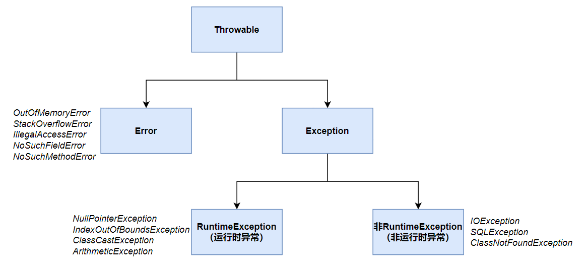

## 异常处理机制的作用

　　计算机程序在运行过程中会出现各种意外情况，比如内存溢出、传输中断、代码错误导致计算机无法计算(比如除数为0)，这些意外情况统称为异常。为了让程序在发生异常后不被中断，依然能够继续执行，就引入了异常处理机制。

　　异常处理机制最重要的功能是，在发生异常的代码位置捕获异常，然后对异常进行处理，处理方法包括修复异常和记录异常。这样一方面让程序的其它部分得以继续运行，另一方面能够修复程序中的错误，或者让程序员能够意识到程序发生了错误。

## 编译时异常和运行时异常

　　Java中的异常分为两种：编译时异常和运行时异常。

　　编译时异常要求程序员在编写代码的时候，就把可能发生的异常考虑进去，为这些异常编写修复的代码，如果在当前方法中不知道怎么修复，就要把异常抛给其它方法，尝试让其它方法去修复，这时就要在当前方法声明上添加一个该方法可能会抛出异常的列表，供其它方法辨认。编译时异常虽然理论上可以通过编译器强制性地提高编码质量，但实际效果并不好，一是因为如果每个方法都要考虑异常，会增加很多代码量，二是因为程序员为了减少工作量，会耍小聪明以躲过编译检查，比如捕获了异常，不处理也不抛出，异常就这样找不到了，反而给代码留下了隐患。

　　而运行时异常没有编译时检查，发生这种异常时不强制程序员进行处理或抛出，系统可以自动捕获并抛出到`main()`方法，然后调用它的`printStackTrace()`方法，打印出从抛出异常的方法到`mian()`方法所经历的所有方法。运行时异常当然也可以手动捕获。

　　属于编译时异常的有：`IOException、SQLException、ClassNotFoundException`等，属于运行时异常的有：`NullPointerException、ArithmeticException、IndexOutOfBoundsException、ClassCastException`等。它们的区别是，**运行时异常更加难以预料，因此不适合手动处理或抛出**。

> info "注"
>
> 实际上，只有很少的异常在被捕获后得到了修复，大多数都只是记录下来了异常方法的调用栈，但这正是异常处理机制的精髓所在。

　　还有一类意外情况，这类情况和底层有关，在代码层面难以处理，我们称之为`Error`。`Error`和运行时异常一样会被虚拟机自动捕获，并抛出到`main()`方法，最后打印出方法栈，当然也可以手动捕获。属于`Error`的有：`OutOfMemoryError、StackOverflowError、IllegalAccessError、NoSuchFieldError、NoSuchMethodError`等。

## Java异常体系

　　Java的异常体系如下图所示：



## 异常语法

### 基本语法

　　异常的基本语法如下所示：

```java
try {
    // 抛出异常
    throw new Exception();
}catch (Exception e1) {
    // 捕获异常，打印异常信息
    e1.printStackTrace();
}catch (Exception e2) {
    e2.printStackTrace();
}finally {
    // finally中的代码一定会执行
    ...
}
```

### 异常转换

　　一个异常可以转换成另一个异常，为了保留原异常对象的信息，可以将原异常对象传入新异常对象的构造方法：

```java
try {
    throw new RuntimeException("异常1");
}catch (RuntimeException e) {
    throw new RuntimeException("异常2",e);
}

打印结果：
Exception in thread "main" java.lang.RuntimeException: 异常2
	at org.example.Test.main(Test4.java:35)
// Caused by后面的才是原始异常
Caused by: java.lang.RuntimeException: 异常1
	at org.example.Test.main(Test4.java:33)
```

　　如果想从新异常对象中获取原异常对象，可以调用`getCause()`方法。

### 自定义异常

　　建议自定义异常从`RuntimeException`派生。

### try-with-resource

　　在JDK1.7及之后，可以使用`try-with-resource`自动关闭资源，如果`try()`中创建的对象实现了`AutoCloseable`接口，那么在try语句块执行结束之后，会自动调用这些对象的`close()`方法。

　　JDK1.7之前写法：

```java
Reader reader = null;
Writer writer = null;
try {
    reader = new FileReader("/");
    writer = new FileWriter("/");
    reader.read();
    writer.write(1);
}finally {
    reader.close();
    writer.close();
}
```

　　JDK1.7及之后写法：

```java
try (Reader reader = new FileReader("/");
     Writer writer = new FileWriter("/");){
    reader.read();
    writer.write(1);
}
```

