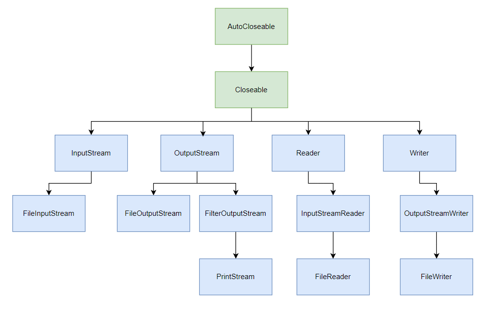

## File

　　Java的标准库`java.io`提供了`File`对象来操作文件和目录。

### 获取类路径

　　类路径(`classpath`)指的是当前类的全限定名所在的目录，获取当前类路径的方法是：

```java
String classPath = Test.class.getResource("/").getPath();
```

### 创建File对象

　　可以使用绝对路径创建File对象，也可以使用相对路径：

```java
File file1 = new File("C:/Users/12136/Desktop/JVM/learnJVM/target/classes/test.txt");
// 注意，./代表了项目根目录
File file2 = new File("./target/classes/test.txt");
```

　　创建好File对象后，也可以获取它的路径：

```java
// 获取File构造方法中传入的路径
String filePath1 = file1.getPath();
// 获取绝对路径，但绝对路径中可能会包含相对路径
String filePath2 = file1.getAbsolutePath();
// 获取规范的绝对路径，绝对路径中不会包含相对路径
String filePath3 = file1.getCanonicalPath();
```

### File中的方法

　　查询File对象属性的方法：

|                             | 作用                                             | 例子                                        |
| --------------------------- | ------------------------------------------------ | ------------------------------------------- |
| `boolean exists()`          | 判断文件或目录是否存在                           | `boolean isExist = file.exists();`          |
| `boolean isFile()`          | 判断File对象是不是文件                           | `boolean isFile = file.isFile();`           |
| `boolean isDirectory()`     | 判断File对象是不是目录                           | `boolean isDirectory = file.isDirectory();` |
| `boolean boolean canRead()` | 判断目录或文件是否可读                           | `boolean isCanRead = file.canRead();`       |
| `boolean canWrite()`        | 判断目录或文件是否可写                           | `boolean isCanWrite = file.canWrite();`     |
| `boolean canExecute()`      | 判断文件是否允许被执行(但不代表文件是可执行文件) | `boolean isCanExecute = file.canExecute();` |
| `long length()`             | 获取文件内容的字节数                             | `long length = file.length();`              |

　　创建文件的方法：

|                           | 作用                     | 例子                                                         |
| ------------------------- | ------------------------ | ------------------------------------------------------------ |
| `boolean createNewFile()` | 当文件不存在时，创建文件 | `boolean isSuccess = new File("./test.txt").createNewFile();` |
| `boolean delete()`        | 当文件存在时，删除文件   | `boolean isSuccess = new File("./test.txt").delete();`       |

　　创建目录的方法：

|                    | 作用                                       | 例子                                                         |
| ------------------ | ------------------------------------------ | ------------------------------------------------------------ |
| `boolean mkdir()`  | 创建单级目录                               | `boolean isSuccess = new File("./dir1/").mkdir();`           |
| `boolean mkdirs()` | 创建多级目录                               | `boolean isSuccess = new File("./dir1/dir2/dir3/").mkdirs();` |
| `boolean delete()` | 删除单级目录，目录中不能包含其它文件或目录 | `boolean isSuccess = new File("./dir1/").delete();`          |

　　遍历文件和目录：

|                      | 作用                           | 例子                                            |
| -------------------- | ------------------------------ | ----------------------------------------------- |
| `String[] list()`    | 获取目录中的所有文件名、目录名 | `String[] nameList = new File("./").list();`    |
| `File[] listFiles()` | 获取目录中的所有文件、目录     | `File[] fileList = new File("./").listFiles();` |

## java.io的继承结构

　　`java.io`的继承结构如下图所示：



## 字节输入

### InputStream

　　`InputStream`是一个抽象类，它是所有字节输入流的父类，它定义了一个抽象方法`int read()`，作用是以字节为单位进行读取。

### FileInputStream

* #### read()

　　`FileInputStream`继承了`InputStream`，它重写了父类的`int read()`方法，作用是读取输入流的下一个字节，如果读到文件末尾，就会返回`-1`。

　　使用`FileInputStream.read()`读取文件内容的一个例子：

```java
InputStream inputStream = new FileInputStream("./test.txt");
while (true) {
    // 每次读取一个字节
    int res = inputStream.read();
    System.out.println(res);
    // 当读到文件末尾时返回-1
    if(res == -1) break;
}
```

> info "注"
>
> `FileInputStream.read()`方法和`String.getBytes("utf-8")`方法都可以获得一个字符的`utf-8`编码，它们的区别是，前者将编码以字节为单位转换为`int`类型，因此是正数，正数的补码等于原码，而后者将编码以字节为单位转换为`byte`类型，因此有可能是负数，负数的补码不等于原码。因此对于同样的字符和编码格式，两个方法的返回值看起来不同，如`"你"`用`read()`方法读取后的结果是`int{228, 189, 160}`，而用`getBytes()`方法读取后的结果是`byte{-28, -67, -96}`，但它们的原码都是一样的，所以实际上返回值是一样的。

* #### read(byte[] b)

　　`read()`方法每次只能读取一个字节，它的重载方法`read(byte[] b)`每次可以读取多个字节。使用时需要传入一个`byte[]`缓冲数组，`read(byte[] b)`方法会尽可能读取更多字节到数组中，但不会超过数组的大小。`read(byte[] b)`方法的返回值将不再是文件内容，而是一次读取字节的个数，当读到文件末尾时返回`-1`。

　　使用`FileInputStream.read(byte[] b)`读取文件内容的一个例子：

```java
InputStream inputStream = new FileInputStream("./test.txt");
byte[] buffer = new byte[5];
while (true) {
    // 每次读取多个字节，返回值是读取字节的个数
    int count = inputStream.read(buffer);
    System.out.println(count);
    // 当读到文件末尾时返回-1
    if(count == -1) break;
}
```

* #### close()

　　当读取/写入完毕后，要及时调用`close()`方法关闭输入输出流，否则会占用系统资源：

```java
try {
    InputStream input = new FileInputStream("./test.txt");
    OutputStream output = new FileOutputStream("./test.txt");
    input.read();
    output.write();
}finally {
    if(input != null) {
        input.close();
    }
    if(output != null) {
        output.close();
    }
}
```

　　JDK7提供了一种更简单的写法：

```java
try(InputStream input = new FileInputStream("./test.txt");
   OutputStream output = new FileOutputStream("./test.txt");) {
    intput.read();
    output.write(10);
}
```

　　这种写法要求`try()`中创建的对象必须实现`java.lang.AutoCloseable`接口，编译器会自动加上`finally`语句块并调用对象的`close()`方法。

## 字节输出

### OutputStream

　　`InputStream`是一个抽象类，它是所有字节输出流的父类，它定义了一个抽象方法`void write(int b)`，作用是以字节为单位进行写入。

### FileOutputStream

* #### write(int b)

　　`FileOutputStream`继承了`OutputStream`，它重写了父类的`void write(int b)`方法，作用是向文件中写入一个字节。

　　使用`FileOutputStream.write(int b)`向文件中写入字节的一个例子：

```java
OutputStream output = new FileOutputStream("./test.txt");
// 向文件中写入三个字节，即"你"这个字符
output.write(228);
output.write(189);
output.write(160);
```

> info "注"
>
> 如果想要追加写入，需要调用另一个构造方法`OutputStream output = new FileOutputStream(new File("./test.txt"), true);`。

* #### write(byte[] b)

　　`write(int b)`方法每次只能写入一个字节，它的重载方法`write(byte[] b)`每次可以写入多个字节。使用时需要传入一个`byte[]`缓冲数组。

　　使用`FileOutputStream.write(byte[] b)`读取文件内容的一个例子：

```java
OutputStream output = new FileOutputStream("./test.txt");
byte[] b = new byte[]{-28, -67, -96};
output.write(b);
```

* #### flush()

　　向磁盘、网络写入数据的时候，出于效率的考虑，操作系统并不是输出一个字节就立刻写入到文件或者发送到网络，而是把输出的字节先放到内存的一个缓冲区里（本质上就是一个`byte[]`数组），等到缓冲区写满了，再一次性写入文件或者网络。对于很多IO设备来说，一次写一个字节和一次写1000个字节，花费的时间几乎是完全一样的，**所以`OutputStream`有个`flush()`方法，能强制把缓冲区内容输出**。通常情况下，我们不需要调用这个`flush()`方法，因为缓冲区写满了`OutputStream`会自动调用它，并且，在调用`close()`方法关闭`OutputStream`之前，也会自动调用`flush()`方法。但是，在某些情况下，我们必须手动调用`flush()`方法。

```java
FileOutputStream output = new FileOutputStream("./test.txt");
output.write(228);
// 将内存缓冲区中的内容立即写入磁盘或网络
output.flush();
```

## 序列化和反序列化

### 概述

　　序列化是指把一个Java对象变成二进制内容，写入到磁盘或网络中。反序列化是指把一个二进制内容变回Java对象。

### 序列化

　　可以使用`ObjectOutputStream`将一个Java对象序列化：

```java
Person p = new Person("张三", 18);
ObjectOutputStream output = new ObjectOutputStream(new FileOutputStream("./test.txt"));
output.writeObject(p);
```

　　被序列化的对象必须实现`Serializable`接口，否则会抛出异常。

> info "注"
>
> `ObjectOutputStream`的构造方法中传入了一个`FileOutputStream`对象，实际上`ObjectOutputStream`正是通过这个对象来写入的，我们把这种在运行期动态地为一个类增加功能的设计模式叫做**装饰者模式**。

### 反序列化

　　可以使用`ObjectInputStream`将一个Java对象的二进制内容反序列化：

```java
ObjectInputStream input = new ObjectInputStream(new FileInputStream("./test.txt"));
Person p = (Person) input.readObject();
```

　　`readObject()`可能会抛出各种异常，比如`ClassNotFoundException`(没有找到对应的class)、`InvalidClassException`(class被修改)。为了避免class在反序列化前后被修改，JVM会自动为class生成一个`private static final long serialVersionUID`，如果class被修改，这个`serialVersionUID`就会改变，当二进制对象中的`serialVersionUID`和class中的不相等时，就会抛出`InvalidClassException`。

　　如果不想因为class被修改而抛出`InvalidClassException`，可以自定义一个`serialVersionUID`覆盖掉JVM自动生成的UID，自定义的UID不会改变。

### transient

　　被`transient`修饰的字段，在序列化时会被忽略。

### 安全性

　　Java的序列化机制可以导致一个实例能直接从byte[]数组创建，而不经过构造方法，因此，它存在一定的安全隐患。一个精心构造的byte[]数组被反序列化后可以执行特定的Java代码，从而导致严重的安全漏洞。

　　**实际上，Java本身提供的基于对象的序列化和反序列化机制既存在安全性问题，也存在兼容性问题。更好的序列化方法是通过JSON这样的通用数据结构来实现，只输出基本类型（包括String）的内容，而不存储任何与代码相关的信息。**Java的序列化机制仅适用于Java，如果需要与其它语言交换数据，必须使用通用的序列化方法，例如JSON。

## 字符输入

### Reader

　　`Reader`是一个抽象类，它是所有字符输入流的父类，它定义了一个抽象方法`int read()`，作用是以字符为单位进行读取。`Reader`实际上是通过`InputStream`对象来读取的，只不过是将读取后的字节转换成了字符，这里也使用到了装饰者模式。

### InputStreamReader

* #### read()

　　`InputStreamReader`继承了`Reader`，它重写了父类的`int read()`方法，作用是读取输入流的下一个字符，如果读到文件末尾，就会返回`-1`。

　　使用`InputStreamReader.read()`读取文件内容的一个例子：

```java
Reader reader = new InputStreamReader(new FileInputStream("./test.txt"));
while (true) {
    // 每次读取一个字符
    int res = reader.read();
    System.out.println((char)res);
    // 当读到文件末尾时返回-1
    if(res == -1) break;
}
```

> info "注"
>
> `InputStreamReader`还有一个构造方法`public InputStreamReader(InputStream in, String charsetName)`可以用于指定字符编码格式，默认的格式是utf-8。

* #### read(char[] c)

　　`read()`方法每次只能读取一个字符，它的重载方法`read(char[] c)`每次可以读取多个字符。使用时需要传入一个`char[]`缓冲数组，`read(char[] c)`方法会尽可能读取更多字符到数组中，但不会超过数组的大小。`read(char[] c)`方法的返回值将不再是文件内容，而是一次读取字符的个数，当读到文件末尾时返回`-1`。

　　使用`InputStreamReader.read(char[] c)`读取文件内容的一个例子：

```java
Reader reader = new InputStreamReader(new FileInputStream("./test.txt"));
char[] buffer = new char[10];
while (true) {
    // 每次读取多个字符，返回值是读取字符的个数
    int count = reader.read(buffer);
    System.out.println(count);
    // 当读到文件末尾时返回-1
    if(count == -1) break;
}
```

* #### FileReader

　　`FileReader`继承了`InputStreamReader`，它省去了创建`InputStream`对象的过程，除此之外没有区别：

```java
Reader reader = new FileReader("./test.txt");
```

## 字符输出

### Writer

　　`Writer`是一个抽象类，它是所有字符输出流的父类，它定义了一个抽象方法`void write(int b)`，作用是以字符为单位进行写入。`Writer`实际上是通过`OutputStream`对象来读取的，只不过是先将字符转换为字节，然后再写入，这里也使用到了装饰者模式。

### OutputStreamWriter

* #### write(String str)

　　`OutputStreamWriter`继承了`OutputStream`，`OutputStream`中有一个`void write(String str)`方法，作用是向文件中写入一个字符串。

　　使用`OutputStream.write(String str)`向文件中写入字符串的一个例子：

```java
Writer writer = new OutputStreamWriter(new FileOutputStream("./test.txt"));
writer.write("你好");
writer.flush();
```

> info "注"
>
> `OutputStreamWriter`也有一个构造方法`public OutputStreamWriter(OutputStream out, String charsetName)`可以用于指定字符编码格式，默认的格式是utf-8。

* #### FileWriter

　　`FileWriter`继承了`InputStreamWriter`，它省去了创建`OutputStream`对象的过程，除此之外没有区别：

```java
Writer writer = new FileWriter("./test.txt");
```

### PrintStream

　　`PrintStream`是一种`FilterOutputStream`，它在`OutputStream`的接口上，额外提供了一些写入各种数据类型的方法：

```java
print(int); //写入int
print(boolean); //写入boolean
print(String); //写入String
print(Object); //写入Object
等等...
```

　　以及对应的一组`println()`方法，它会自动加上换行符。我们经常使用的`System.out.println()`实际上就是使用`PrintStream`打印各种数据。其中，`System.out`是系统默认提供的`PrintStream`，表示标准输出，`System.err`是系统默认提供的标准错误输出。
　　`PrintStream`和`OutputStream`相比，除了添加了一组`print()/println()`方法，可以打印各种数据类型，比较方便外，它还有一个额外的优点，就是不会抛出`IOException`，这样我们在编写代码的时候，就不必捕获`IOException`。

　　`PrintStream`也使用了装饰者模式，它实际上也是通过`OutputStream`对象进行写入的。

## <font color='red'>Files</font>

　　从Java 7开始，提供了`Files`和`Paths`这两个工具类，能极大地方便我们读写文件。需要特别注意的是，`Files`提供的读写方法，受内存限制，只能读写小文件，例如配置文件等，不可一次读入几个G的大文件。读写大型文件仍然要使用文件流，每次只读写一部分文件内容。
