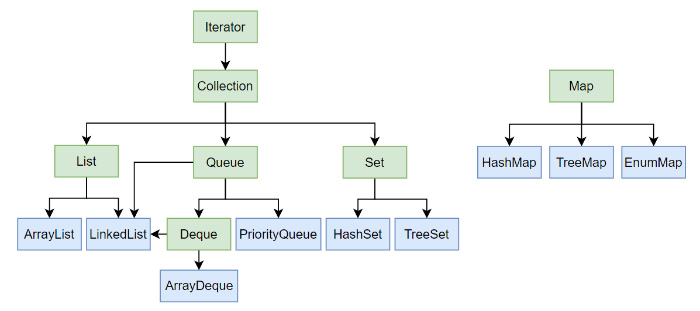

## 集合的继承结构



## List

### 特点

　　`List`是一个接口，它和数组的特点一样，每个元素都有索引。它相比于数组的优点是，数组在增删元素时很麻烦，因为要手动移动元素，而`List`将增删操作封装到了方法中，更方便使用。

　　`List`的实现类包括`ArrayList`和`LinkedList`，**`ArrayList`底层用数组存储元素，因此查找、修改元素比较快；`LinkedList`底层用链表存储元素，因此添加、删除元素比较快。**

### 常用方法

|                                | 作用                                                         | 例子                                                         |
| ------------------------------ | ------------------------------------------------------------ | ------------------------------------------------------------ |
| `boolean add(E e)`             | 向`List`的末尾添加元素                                       |                                                              |
| `boolean  add(int index, E e)` | 向`List`的指定位置添加元素，后面的元素往后移动一位           |                                                              |
| `E get(int index)`             | 获取指定位置的元素                                           |                                                              |
| `int size()`                   | 获取`List`中元素的个数                                       |                                                              |
| `E set(int index, E e)`        | 修改`List`中指定位置的元素，并返回旧元素                     |                                                              |
| `E remove(int index)`          | 删除`List`中指定位置的元素，并返回旧元素                     |                                                              |
| `T[] toArray(T[] array)`       | 将`List`转换为数组，数组长度最好和`List`相同，这样能提高效率 | `String[] array = list.toArray(new String[3]);`              |
| `List Arrays.asList(T ... a)`  | （版本<`JDK11`）将数组转换为`List`，注意这里返回的是另一个内部类`ArrayList`对象，这个对象不能增删，只能读改 | `List<String> list = Arrays.asList(new String[]{"a","b","c"});` |

### 遍历List

　　在遍历`List`元素时，可以使用最基本的`for`循环进行遍历，但效率可能不高，**最好的遍历方法是使用`List`中自带的迭代器`Iterator`**，它是`List`的内部类，其中定义了一些遍历元素的方法，这些方法的效率很高。下面是使用`Iterator`遍历集合元素的一个例子：

```java
Iterator<String> iterator = list.iterator();
while (iterator.hasNext()) {
    String next = iterator.next();
    System.out.println(next);
}
```

　　更简单的写法是：

```java
for(String next : list) {
    System.out.println(next);
}
```

　　上面的两种写法本质上是一样的，编译器自动将第二种写法转换成了第一种写法。

　　如果集合中定义了`forEach()`方法，也可以用这个方法进行遍历，`forEach()`方法的内部使用了第二种写法：

```java
list.forEach(System.out::println);
```

## Map

### 特点

　　`Map`是一个接口，它是一种键值映射表，主要实现类是`HashMap`，除此之外还有`EnumMap`、`TreeMap`、`Hashtable`等。

　　`Map`的常用方法有：

|                         | 作用                          | 例子 |
| ----------------------- | ----------------------------- | ---- |
| `V put(K key, V value)` | 添加或更新键值对，返回旧value |      |
| `V get(Object key)`     | 获取指定key对应的value        |      |

### HashMap

* #### 原理

　　`HashMap`采用哈希表的数据结构存放键值对，具体的做法是：**每个`HashMap`对象都持有一个`Node<K, V>`数组，用来存放键值对，当添加键值对时，会先计算出key的哈希值，然后将key和value封装到一个`Node`对象中，最后将`Node`对象放进`Node`数组中索引为key的哈希值的位置。**

　　因此`HashMap`具有以下特点：

　　1、不能出现两个相同的key；

　　2、键值对是无序的。

* #### hashCode()和equals()

　　`HashMap`中的key所属类型，必须正确重写`hashCode()`方法和`equals()`方法。

　　**`hashCode()`方法的作用是计算key的哈希值，从而确定键值对在数组中的位置**。一个正确的`hashCode()`方法应满足：

　　1、保证相同key所生成的哈希值相同；

　　2、尽量使不同key所生成的哈希值不同，降低哈希碰撞的概率，同时让哈希值均匀分布。

　　**`equals()`方法的作用是比较key是否相同，比如在更新键值对或者取出键值对时，都需要保证传入的key和键值对中的key相同**。仅凭哈希值或者地址，无法比较两个key是否相同。

* #### 数组扩容

　　`HashMap`内部的`Node<K, V>`数组初始长度是16，每次扩容一倍。扩容时会导致已有的键值对重新分布，因此频繁的扩容会影响性能。因此最好在创建`HashMap`对象时就确定好初始容量：

```java
HashMap<Integer, String> map = new HashMap<>(20);
```

　　由于`Node`数组的长度总是2的倍数，因此上面代码中map的实际容量是32，而非20。

### 遍历Map

　　`Map`接口中有两个方法`keySet()`和`entrySet()`，它们可以用来遍历Map。

　　`keySet()`的作用是获取包含所有key的Set集合：

```java
Set<String> set = map.keySet();
for(String key : set){
    Object value = map.get(key);
}
```

　　`entrySet()`的作用是获取包含所有key-value对的Set集合：

```java
Set<Map.Entry<Integer, String>> entries = map.entrySet();
for (Map.Entry<Integer, String> kv : entries) {
    Integer key = kv.getKey();
    String value = kv.getValue();
}
```

### 其它Map

* #### EnumMap

　　如果key是Enum类型，那么可以使用Java集合库提供的一种`EnumMap`，它在内部以一个非常紧凑的数组存储value，并且根据Enum类型的key直接定位到内部数组的索引，并不需要计算哈希值，不但效率最高，而且没有额外的空间浪费。

* #### TreeMap

　　`TreeMap`采用树形结构存储键值对，因此它不要求key所属类型重写`hashCode()`方法。`TreeMap`会默认对key进行排序，前提是`key`所属类型要正确重写`compareTo()`方法。

　　我们也可以在创建`TreeMap`对象时传入一个`Comparator`函数，用这个函数中的逻辑进行比较、排序：

```java
TreeMap<String, String> map = new TreeMap<>((k1, k2) -> k2.compareTo(k1)); // 降序排序
map.put("a", "1");
map.put("c", "3");
map.put("b", "2");
```

　　在调用`get()`方法时，也是用`compareTo()`方法或者`compare()`方法来比较key的，而不是`equals()`方法，因此要保证这两个方法的逻辑正确。

## Set

### 特点

　　Set是一个接口，用于存储不重复的元素集合，相当于存储Map中的key。

　　Set的实现类主要有`HashSet`、`TreeSet`，它们的底层是通过`HashMap`、`TreeMap`实现的。比如`HashSet`的`add()`方法是这样的：

```java
public boolean add(E e) {
    // map的类型是HashMap，PRESENT是一个简单的Object对象
    return map.put(e, PRESENT)==null;
}
```

　　由于Set底层是通过Map实现的，因此`HashSet`也要正确重写`hashCode()`和`equals()`方法，`TreeSet`也要正确重写`compareTo()`方法。

### 常用方法

|                              | 作用                 | 例子 |
| ---------------------------- | -------------------- | ---- |
| `boolean add(E e)`           | 添加元素             |      |
| `boolean remove(Object e)`   | 删除元素             |      |
| `boolean contains(Object e)` | 判断是否包含某个元素 |      |

## Queue

### 普通队列

* #### 特点

　　Queue实际上是实现了一个先进先出（`FIFO：First In First Out`）的有序表。它和List的区别在于，List可以在任意位置添加、获取、删除元素，而Queue只能在一端添加，在另一端获取和删除。

　　`Queue`是一个接口，它的一个实现类是`LinkedList`，当通过`Queue`引用它时，它就是一个普通队列：

```java
Queue<String> queue = new LinkedList<>();
```

* #### 常用方法

|                      | 作用                                                 | 例子 |
| -------------------- | ---------------------------------------------------- | ---- |
| `int size()`         | 获取队列长度                                         |      |
| `boolean add(E e)`   | 向队尾添加元素                                       |      |
| `boolean offer(E e)` | 向队尾添加元素，和`add()`方法没有区别                |      |
| `E remove()`         | 返回并删除队首元素，如果队首元素为null，则抛出异常   |      |
| `E poll()`           | 返回并删除队首元素，如果队首元素为null，则返回null   |      |
| `E element()`        | 返回但不删除队首元素，如果队首元素为null，则抛出异常 |      |
| `E peek()`           | 返回但不删除队首元素，如果队首元素为null，则返回null |      |

### 双端队列

* #### 特点

　　双端队列允许在队列的两端添加、获取、删除元素。

　　`Deque`是一个接口，它继承了`Queue`，它的实现类有`ArrayDeque`和`LinkedList`，前者通过数组实现，后者通过链表实现。

* #### 常用方法

|                                             | 作用                                                 | 例子 |
| ------------------------------------------- | ---------------------------------------------------- | ---- |
| `void addFirst(E e) / void offerFirst(E e)` | 向队首添加元素，`add`和`offer`没有区别               |      |
| `void addLast(E e) / void offerLast(E e)`   | 向队尾添加元素                                       |      |
| `E removeFirst()`                           | 返回并删除队首元素，如果队首元素为null，则抛出异常   |      |
| `E pollFirst()`                             | 返回并删除队首元素，如果队首元素为null，则返回null   |      |
| `E removeLast()`                            | 返回并删除队尾元素，如果队尾元素为null，则抛出异常   |      |
| `E pollLast()`                              | 返回并删除队尾元素，如果队尾元素为null，则返回null   |      |
| `E getFirst()`                              | 返回但不删除队首元素，如果队首元素为null，则抛出异常 |      |
| `E peekFirst()`                             | 返回但不删除队首元素，如果队首元素为null，则返回null |      |
| `E getLast()`                               | 返回但不删除队尾元素，如果队尾元素为null，则抛出异常 |      |
| `E peekLast()`                              | 返回但不删除队尾元素，如果队尾元素为null，则返回null |      |

### 优先队列

　　PriorityQueue实现了优先队列，优先队列是一种特殊的队列，**它的队尾元素一定是优先级最高的，因此可以用PriorityQueue模拟大顶堆、小顶堆**。普通队列的特点是先进先出，而优先队列先进不一定先出，它的出队顺序和元素的优先级有关，优先级可以由用户自定义。

　　和`TreeMap`一样，PriorityQueue中的元素必须正确实现Comparable接口：

```java
PriorityQueue<String> priorityQueue = new PriorityQueue<>(); 

priorityQueue.add("c");
priorityQueue.add("a");
priorityQueue.add("b");

System.out.println(priorityQueue.peek()); // 默认堆顶元素是最小的，即a
```

　　或者在创建PriorityQueue对象的时候传入`compare()`方法：

```java
PriorityQueue<String> priorityQueue = new PriorityQueue<>((a, b) -> b.compareTo(a));

priorityQueue.add("c");
priorityQueue.add("a");
priorityQueue.add("b");

System.out.println(priorityQueue.peek()); // 堆顶元素是最大的，即c
```

### 栈

　　栈的特点是先进后出，可以用`Stack`类实现栈的功能。Stack的常用方法有：

|               | 作用                         | 例子 |
| ------------- | ---------------------------- | ---- |
| `E push(E e)` | 向栈顶添加元素，并返回该元素 |      |
| `E pop()`     | 返回并删除栈顶元素           |      |
| `E peek()`    | 返回但不删除栈顶元素         |      |
| `int size()`  | 获取栈中元素的数量           |      |

　　Stack是一个遗留类，它的功能完全可以用Deque实现，Deque提供了和Stack同名的方法：

```java
Deque<String> stack = new LinkedList<>();

stack.push("a");
stack.push("b");
stack.push("c");

System.out.println(stack.pop()); // c
System.out.println(stack.peek()); // b
System.out.println(stack.size()); // 2
```

## Collections工具类

　　Collections是JDK提供的工具类，同样位于`java.util`包中。它提供了一系列静态方法，能更方便地操作各种集合。

　　Collections中的常用静态方法有：

|                                                              | 作用                                   | 例子 |
| ------------------------------------------------------------ | -------------------------------------- | ---- |
| `boolean addAll(Collection<? super T> c, T... elements)`     | 向Collection类型的集合中添加多个元素   |      |
| `List<T> emptyList() / Map<K, V> emptyMap() / Set<T> emptySet()` | 创建空集合，并且这些集合是不可变的     |      |
| `List<T> singletonList(T o) / Map<K, V> singletonMap(K key, V value) / Set<T> singleton(T o)` | 创建单元素集合，并且这些集合是不可变的 |      |
| `void sort(List<T> list)`                                    | 对List中的元素进行排序                 |      |

