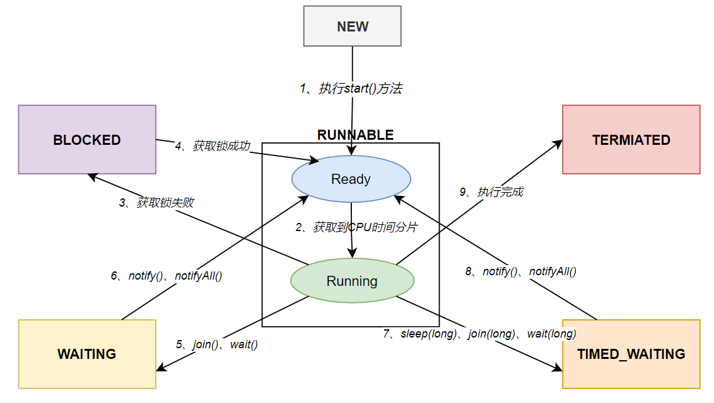
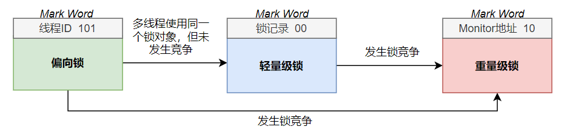

## 一、多线程基础

### 进程与线程

　　我们把操作系统中的任务叫做进程，把每个进程内部的子任务叫做线程。进程是操作系统分配资源的基本单位，而线程是CPU分配时间片的基本单位。每个进程所拥有的内存空间是独立的，而一个进程内的每个线程既拥有独立的内存空间，比如栈内存，也共享内存空间，比如堆内存和方法区。

### 创建新线程

　　Java中创建新线程的方法包括继承`Thread`类和实现`Runnable`接口两种方式。实际上这两种方式只是在代码层面不同，底层都是通过JVM调用本地方法，然后再调用重写的`run()`方法实现的。

```java
// 继承Thread类并重写run()方法
Thread t1 = new Thread(){
    @Override
    public void run() {
        System.out.println(Thread.currentThread().getName());
    }
};
// 启动线程
t1.start();

// 实现Runnable接口并重写run()方法
Thread t2 = new Thread(()->{
    System.out.println(Thread.currentThread().getName());
});
// 启动线程
t2.start();
```

### 线程的六种状态

　　Java线程有六种状态，可以看到在`Thread`类中有一个内部枚举类`State`，里面就包含了这六种状态：

```java
public enum State {
    NEW, RUNNABLE, BLOCKED, WAITING, TIMED_WAITING, TERMINATED;
}
```

　　这六种状态之间的转换关系如下图所示：



　　线程的六种状态之间的转换过程是：

　　1、新创建的线程处于**`NEW`**状态；

　　2、线程对象执行了`start()`方法后处于`Ready`状态，如果线程获取到了CPU时间分片，那么就会进入`Running`状态，`Ready`和`Running`统称为**`RUNNABLE`**状态；

　　3、`Running`状态的线程如果获取不到锁，就会进入**`BLOCKED`**状态；如果`BLOCKED`状态下的线程获取到了锁，就会恢复到`Ready`状态；

　　4、`Running`状态的线程如果调用了`join()`、`wait()`方法，就会进入**`WAITING`**状态；如果`WAITING`状态下的线程被`notify()`、`notifyAll()`唤醒，就会恢复到`Ready`状态；

　　5、`Running`状态的线程如果调用了`sleep(long time)`、`join(long time)`、`wait(long time)`方法，就会进入**`TIMED_WAITING`**状态；如果`TIMED_WAITING`状态下的线程被`notify()`、`notifyAll()`唤醒，或者超时，就会恢复到`Ready`状态；

　　6、线程执行结束后会进入**`TERMIATED`**状态。

### 守护线程

　　守护线程是指为其他线程服务的线程。在JVM中，所有非守护线程都执行完毕后，无论有没有守护线程，虚拟机都会自动退出。

　　将一个线程标记为守护线程的方法是：

```java
Thread t1 = new Thread(()->{
    try {
        Thread.sleep(100000l);
    } catch (InterruptedException e) {
        throw new RuntimeException(e);
    }
});

// 将线程标记为守护线程，如果没有这一句，JVM需要很久才能结束运行
t1.setDaemon(true);
t1.start();
```

## 二、synchronized锁

### 基本使用

　　Java中可以使用`synchronized`关键字将一个对象变成锁，加锁的代码块只能同时被一个线程执行。

　　`synchronized`可以用来修饰代码块，此时需要显式指定一个共享对象作为锁：

```java
Object lock = new Object();
synchronized(lock) {
    // 同步代码块
}
```

　　也可以用`synchronized`修饰实例方法，此时锁对象实际上是`this`：

```java
public synchronized void add(int n) {
    count += n;
}
```

　　还可以用`synchronized`修饰静态方法，此时锁对象实际上是类的`Class`实例：

```java
public static synchronized void add(int n) {
    count += n;
}
```

### wait()和notify()

* #### 作用

　　`wait()`和`notify()`的底层是本地方法。

　　在一个`Running`状态的线程中，如果对`synchronized`锁对象调用了`wait()`方法，会释放锁，让当前线程变成`WAITING`状态。

　　在一个`Running`状态的线程中，如果对`synchronized`锁对象调用了`notify()`方法，会让等待该锁的随机一个线程变成`Ready`状态；如果调用的是`notifyAll()`方法，会让等待该锁的所有线程变成`Ready`状态。

> info "注意！"
>
> `wait()`和`notify()`的使用范围是`sunchronized`语句块内，调用者是`synchronized`锁对象。

* #### 实现阻塞队列

　　**阻塞队列的特点是，当队列为空时，获取队列元素的线程会进入WAITING状态，当队列不为空时会恢复运行；当队列已满时，添加队列元素的线程会进入WAITING状态，当队列未满时会恢复运行。**阻塞队列常用于生产者和消费者的场景，生产者是往队列里添加元素的线程，消费者是从队列里拿元素的线程。

　　使用`wait()`和`notifyAll()`可以实现一个简单的阻塞队列：

```java
public class Test {
    static Queue<String> taskQueue = new LinkedList<>();
    
    // 生产者
    static synchronized void provide(String task) throws Exception {
        // 当队列已满时，生产线程进入WAITING状态，同时唤醒消费线程
        while (taskQueue.size() >= 5) {
            Test.class.notifyAll();
            Test.class.wait();
        }
        taskQueue.add(task);
        System.out.println("provide-"+task);
        Test.class.notifyAll();
    }

    // 消费者
    static synchronized String consume() throws Exception {
        // 当队列为空时，消费线程进行WAITING状态，同时唤醒生产线程
        while (taskQueue.isEmpty()) {
            Test.class.wait();
        }
        String task = taskQueue.poll();
        System.out.println("consume"+task);
        Test.class.notifyAll();
        return task;
    }
}
```

* #### wait(long timeout)

　　`wait()`的作用是让当前线程无限期等待，直到被唤醒。而`wait(long timeout)`的作用是让当前线程等待一段时间，如果超过时间还没有被唤醒，就自动恢复运行。

### sleep(long timeout)

　　`sleep(long timeout)`方法是`Thread`类中的静态方法，它是一个本地方法，作用是让当前线程暂停执行一段时间，和`wait()`方法不同的是，`sleep(long timeout)`不会让当前线程释放锁。

### join()

* #### 作用

　　`join()`方法可以让线程B等待线程A执行结束后再执行，具体用法如下：

```java
Thread tA = new Thread(()->{
    System.out.println("tA");
    try {
        Thread.sleep(2000);
    } catch (InterruptedException e) {
        throw new RuntimeException(e);
    }
});

Thread tB = new Thread(()->{
    try {
        tA.join();
        System.out.println("tB");
    } catch (InterruptedException e) {
        throw new RuntimeException(e);
    }
});

t1.start();
t2.start();
```

* #### 原理

　　`join()`方法的原理是，在线程B的内部增加了一个`synchronized`代码块，锁对象是线程A的对象，当线程B运行到`synchronized`块中时，会不断检测线程A是否已经死亡，如果还没有死亡，就会调用锁对象的`wait()`方法，从而使线程B进入WAITING状态。如果线程A结束运行，JVM会自动调用线程A对象的`notifyAll()`方法，唤醒正在等待的线程B，使线程B恢复运行。

　　`join()`方法实际上相当于：

```java
synchronized(tA) {
    while(tA.isAlive()) {
        tA.wait();
    }
}
```

* #### join(long timeout)

　　`join(long timeout)`的作用是让线程A等待线程B一段时间，如果超过时间后线程B还没有结束，那么线程A会停止等待，恢复执行。

### interrupt()

　　使用`interrupt()`方法可以打断一个线程，下面分析一下打断不同状态下的线程，会造成什么影响。对线程对象调用`isInterrupted()`方法会返回一个布尔值，用于判断打断状态，初始值是false，即未打断。

　　1、打断运行状态的线程，`isInterrupted()`方法会返回true，即已打断。

　　2、打断等待状态的线程(即调用了`sleep()、wait()、join()`方法的线程)，`isInterrupted()`方法会返回false，即未打断，并且会抛出`InterruptedException`。

　　**由此可知，在运行状态的线程中，我们需要通过`isInterrupted()`方法来判断线程是否被打断，而在等待状态的线程中，我们需要通过是否抛出了`InterruptedException`来判断线程是否被打断。**

### synchronized锁升级过程

　　`synchronized`锁升级的过程如下图所示：



　　1、锁对象的初始状态是偏向锁；

　　2、当出现多个线程使用同一个锁对象，但是没有发生竞争时，偏向锁升级为轻量级锁；

　　3、当出现锁竞争时，轻量级锁升级为重量级锁。

### 自旋锁

　　在多核CPU的场景下，为了避免出现频繁的线程上下文切换，竞争锁失败的线程不会直接进入阻塞状态，而是会先进入空循环，也叫做自旋。当循环超过一定次数时，才会进入阻塞状态。

　　在JDK6之后引入了**自适应自旋锁**，如果在上一次自旋中成功获取到了锁，那么JVM会认为当前自旋中也很有可能获取到锁，于是就会增加自旋次数，反之会减少次数。

　　在JDK7之后不能控制是否开启自旋功能。

## 三、volatile关键字

### Java内存模型

　　线程之间共享主内存，每个线程也有自己的工作内存，线程访问共享变量时，实际上访问的是变量在工作内存中的副本，当副本变量被修改后，会更新回主内存，但更新的时间是不确定的。

### 可见性

　　可见性指的是，一个线程修改了共享变量的值，其它线程会立刻得到最新的值。由于Java内存模型的原因，普通的共享变量不具有可见性，**而被`volatile`修饰的共享变量具有可见性，共享变量被修改后会立刻更新到主内存，访问共享变量时会去主内存中获取最新值。**

　　在下面的代码中，`flag`是一个普通的共享变量，t2线程修改了它的值，t1线程有可能获取不到修改后的新值，导致一直循环下去：

```java
static class VolatileTest {
    boolean flag = false;

    Thread t1 = new Thread(()->{
        while (!flag) {}
    });

    Thread t2 = new Thread(()->{
        flag = true;
    });

    void startTest() {
        t1.start();
        t2.start();
    }
}

public static void main(String[] args) throws Exception {
    // 测试50次，提高出现死循环的概率
    for(int i=0;i<50;i++) {
        VolatileTest volatileTest = new VolatileTest();
        volatileTest.startTest();
    }
}


```

　　如果给`flag`加上`volatile`关键字，t1线程会始终得到共享变量的最新值，不会再出现死循环。

### 有序性

　　指令重排指的是，CPU为了提高效率，有可能会打乱指令的顺序，只要保证最终的结果不变，这种做法在单线程下是安全的，但是在多线程下是不安全的。**`volatile`关键字可以禁止指令重排，保证了共享变量的有序性。**

　　`volatile`保证共享变量有序性的一个典型例子是单例模式的双重检验锁(DCL)写法：

```java
class Singleton {
    private static volatile Singleton singleton = null;

    private Singleton() {}

    public static Singleton getSingleton() {
        // 位置一
        if(singleton == null) {
            synchronized (Singleton.class) {
                if(singleton == null) {
                    // 位置二
                    singleton = new Singleton();
                }
            }
        }
        return singleton;
    }
}
```

　　对于`Singleton singleton = new Singleton()`这句代码来说，它的字节码指令大概分为三步：

　　1、给对象分配内存空间；

　　2、执行构造方法进行初始化；

　　3、把对象赋值给singleton变量。

　　第2、3步可能会发生指令重排，即singleton变量可能会指向一个没有初始化的对象。当线程A执行到代码中的位置二时，发生了指令重排，并且还没来得及执行第3步的初始化指令，此时线程B执行到了代码中的位置一，发现singleton不等于null，最终返回一个没有被初始化的对象。

> info "注意"
>
> `volatile`是通过读写屏障来实现共享变量的可见性和有序性的。

## 四、CAS

### 原理

　　CAS是一种使用无锁方式保证共享变量的线程安全的方法。

　　CAS的伪代码如下所示：

```java
// 共享变量
volatile Num num = new Num(0);

// 自增1
public final int incrementAndGet(Num num) {
    int result = 0;
    do {
        int n = num.getNum();
        result = n + 1;
    } while(!compareAndSet(num, n, result));

    return result;
}
```

　　CAS的核心逻辑是：**通过`compareAndSet()`方法保证在计算的过程中，共享变量的值没有被其它线程所修改，`compareAndSet()`方法是一个原子操作**。由于CAS操作要求获取共享变量的最新值，因此共享变量必须用`volatile`修饰。

　　CAS会使线程不断重试，避免了频繁的线程上下文切换，适用于多核CPU、线程数量较少的情况。

### <font color='red'>应用</font>

　　`java.util.concurrent.atomic`包内提供了一些原子包装类，实现了线程安全。

　　基本类型的原子包装类包括`AtomicInteger`、`AtomicLong`、`AtomicBoolean`三种，它们提供的方法几乎一模一样，比如`AtomicInteger`就主要提供了以下方法，这些方法都是通过CAS实现线程安全的：

|                            | 作用                         | 例子 |
| -------------------------- | ---------------------------- | ---- |
| `int incrementAndGet()`    | 自增1并返回新值，相当于`++i` |      |
| `int getAndIncrement()`    | 自增1并返回旧值，相当于`i++` |      |
| `int addAndGet(int delta)` | 增加指定数值并返回新值       |      |
| `int get()`                | 获取最新值                   |      |

　　此外，`AtomicStampedReference`、`AtomicMarkableReference`可以解决ABA问题，原子数组可以保证数组内元素的线程安全，原子更新器可以保证对象中某个属性的线程安全，原子累加器可以保证数值计算的线程安全，它比`AtomicInteger`等原子类效率更高。以上这些类都是通过CAS来实现线程安全的。

## 五、AQS

### AQS简介

　　AQS指的是`AbstractQueuedSynchronizer`，它是通过Java代码来实现锁和同步器的一系列框架，`ReentrantLock`、`CountDownLatch`等都是通过AQS来实现的。

### ReentrantLock锁

* #### 基本用法

　　`ReentrantLock`的基本用法和`synchronized`一样，例如下面这两段代码都能实现`add()`方法的同步：

```java
Obejct lock = new Object();
synchronized(lock) {
    add();
}

ReentrantLock lock = new ReentrantLock();
lock.lock();
add();
lock.unlock();
```

　　`ReentrantLock`比`synchronized`多了一些新功能，包括打断阻塞线程、阻塞超时、公平锁、多条件变量。

* #### 打断阻塞线程

　　使用`ReentrantLock`锁的线程，如果处于阻塞状态，可以被其它线程调用`interrupt()`方法打断，抛出`InterruptedException`，这在`synchronized`锁中是无法实现的。

```java
ReentrantLock lock = new ReentrantLock();
// 注意，加锁时需要调用lockInterruptibly()方法，而不是lock()方法
// 当线程处于阻塞状态时，如果对线程对象调用了interrupt()方法，lockInterruptibly()方法就会抛出InterruptedException
lock.lockInterruptibly();
add();
lock.unlock();
```

* #### 阻塞超时

　　使用`ReentrantLock`锁的线程，在获取锁时可以设置阻塞的时间，如果阻塞时间超过了预设值，线程会自动结束。而在`synchronized`锁中，阻塞线程会一直等待下去，不会自动结束。

```java
try {
    // 如果进入阻塞状态超过5秒，就会返回false
    if(!lock.tryLock(5, TimeUnit.SECONDS)) {
        return;
    }
} catch (InterruptedException e) {
    throw new RuntimeException(e);
} finally {
    lock.unlock();
}
```

* #### 公平锁

　　公平锁的意思是，多个线程在竞争同一把锁时，会按照申请锁的先后顺序获得锁。`synchronized`锁是非公平锁，`ReentrantLock`默认也是非公平锁，但是可以设置为公平锁：

```java
// 公平锁
ReentrantLock lock = new ReentrantLock(true);
```

* #### 多条件变量

　　条件变量指的是同步线程之间的等待和唤醒，是一种线程间的通信行为，比如`synchronized`锁中的`wait()`和`notify()`就是一种条件变量，`wait()`方法会让当前线程进入等待状态，而`notify()`方法会随机唤醒一个等待线程，`notifyAll()`方法会唤醒所有等待线程。可以看出，`synchronized`锁无法唤醒指定的线程，因此它的条件变量是一种单条件变量。

　　而`ReentrantLock`锁可以实现多条件变量，它可以唤醒指定的等待线程，对应的等待和唤醒方法是`Condition.await()`和`Condition.signal()`、`Condition.signalAll()`。例如下面的代码：

```java
public static void main(String[] args) throws Exception {

    ReentrantLock lock = new ReentrantLock();
    // 条件变量c1
    Condition c1 = lock.newCondition();
    // 条件变量c2
    Condition c2 = lock.newCondition();

    Thread t1 = new Thread(()->{
        lock.lock();
        try {
            // 让线程t1在条件变量c1上等待
            c1.await();
            System.out.println("t1");
        } catch (InterruptedException e) {
            throw new RuntimeException(e);
        }
        lock.unlock();
    });

    Thread t2 = new Thread(()->{
        lock.lock();
        try {
            // 让线程t2在条件变量c1上等待
            c1.await();
            System.out.println("t2");
        } catch (InterruptedException e) {
            throw new RuntimeException(e);
        }
        lock.unlock();
    });

    Thread t3 = new Thread(()->{
        lock.lock();
        try {
            System.out.println("t3");
            Thread.sleep(2000);
            // 唤醒在条件变量c1上等待的所有线程。如果把c1换成c2，那么t1和t2线程不会被唤醒。
            c1.signalAll();
        } catch (InterruptedException e) {
            throw new RuntimeException(e);
        }
        lock.unlock();
    });

    t1.start();
    t2.start();
    Thread.sleep(1000);
    t3.start();
}
```

### ReentrantReadWriteLock锁

　　`ReentrantReadWriteLock`锁分为读锁和写锁，它和普通锁的区别是，持有读锁的线程可以和其它持有读锁的线程同时运行，但是不能和其它持有写锁的线程同时运行，持有写锁的线程不能和其它持有读锁、写锁的线程同时运行。简言之，**可以同时读，不能读时写、写时读。**

　　`ReentrantReadWriteLock`锁的用法如下：

```java
ReentrantReadWriteLock lock = new ReentrantReadWriteLock();
Lock readLock = lock.readLock();
Lock writeLock = lock.writeLock();

Thread t1 = new Thread(()->{
    readLock.lock();
    read();
    readLock.unlock();
});

Thread t2 = new Thread(()->{
    writeLock.lock();
    write();
    writeLock.unlock();
});

t1.start();
t2.start();
```

### StampedLock锁

　　`StampedLock`对`ReentrantReadWriteLock`做了改进，它在后者的基础上实现了乐观读锁，持有读锁的线程默认不加锁，但是会检查读取过程中是否获取了写锁，如果是则说明可能发生了读时写入，此时乐观读锁升级为悲观读锁。简言之，**可以同时读，不能读时写、写时读，但使用类似CAS的方式对读时写进行了优化，提高了读的效率。**

　　`StampedLock`锁的用法如下：

```java
StampedLock stampedLock = new StampedLock();

Thread t1 = new Thread(()->{
    // 优先使用无锁方式进行读取
    long stamp = stampedLock.tryOptimisticRead();
    read();
    // 如果验证失败，说明可能发生了读时写入，此时无锁升级为有锁，然后重新进行读取
    if(!stampedLock.validate(stamp)) {
        stampedLock.readLock();
        read();
        stampedLock.unlock(stamp);
    }
});

Thread t2 = new Thread(()->{
    long stamp = stampedLock.writeLock();
    write();
    stampedLock.unlock(stamp);
});

t1.start();
t2.start();
```

### Semaphore锁

　　一般的锁同时只能执行一个线程，而`Semaphore`锁可以同时执行指定数量线程，从而控制并发数量。

　　`Semaphore`锁的用法如下：

```java
// 最多3个线程可以同时持有锁
Semaphore semaphore = new Semaphore(3);

for(int i=0;i<5;i++) {
    new Thread(()->{
        try {
            // 加锁
            semaphore.acquire();
            System.out.println(Thread.currentThread().getName());
            Thread.sleep(1000);
        } catch (InterruptedException e) {
            throw new RuntimeException(e);
        } finally {
            // 解锁
            semaphore.release();
        }
    }).start();
}
```

### CountDownLatch条件变量

　　`CountDownLatch`是一种条件变量，它的`await()`方法可以让当前线程进入WAITING状态，它的`countDown()`方法可以让计数减1，当计数减少到0后，所有等待中的线程会被唤醒。因此可以利用`CountDownLatch`执行一些前置任务，只有当前置任务都执行完后，主线任务才会恢复执行。

　　`CountDownLatch`条件变量的用法如下：

```java
CountDownLatch countDownLatch = new CountDownLatch(3);
new Thread(()->{
    try {
        countDownLatch.await();
        System.out.println("t1");
    } catch (InterruptedException e) {
        throw new RuntimeException(e);
    }
}).start();

for (int i=0;i<3;i++) {
    new Thread(()->{
        countDownLatch.countDown();
    }).start();
}
```

### CyclicBarrier条件变量

　　`CyclicBarrier`和`CountDownLatch`很像，它的`await()`方法可以让当前线程进入WAITING状态，并且会让计数减1，当计数减少到0时，所有等待中的线程会被唤醒。

　　`CyclicBarrier`条件变量的用法如下：

```java
CyclicBarrier cyclicBarrier = new CyclicBarrier(3);

for (int i=0;i<3;i++) {
    new Thread(()->{
        try {
            cyclicBarrier.await();
            System.out.println(Thread.currentThread().getName());
        } catch (InterruptedException e) {
            throw new RuntimeException(e);
        } catch (BrokenBarrierException e) {
            throw new RuntimeException(e);
        }
    }).start();
}
```

　　`CyclicBarrier`使用时要注意，线程数量要等于计数，如果小于计数，那么所有线程都会阻塞。`CyclicBarrier`的计数归零后，会自动初始化为原值，因此可以重复使用。

## 六、线程池

### 线程池参数

　　Java线程池指的是`ThreadPoolExecutor`类，它的构造方法有7个参数，如下：

```java
public ThreadPoolExecutor(
    int corePoolSize,                    // 1、核心线程数量最大值
    int maximumPoolSize,                 // 2、总线程数量最大值，总线程数量包括了核心线程和非核心线程
    long keepAliveTime,                  // 3、非核心线程等待时间
    TimeUnit unit,                       // 4、时间单位
    BlockingQueue<Runnable> workQueue,   // 5、阻塞队列，用来存放等待执行的Runnable任务
    ThreadFactory threadFactory,         // 6、创建线程的工厂
    RejectedExecutionHandler handler)    // 7、拒绝策略
```

　　这7个参数和线程池的工作原理息息相关。线程池工作的过程如下：

　　1、当线程数量没有超过`corePoolSize`时，每调用`execute()`方法提交一次任务，线程池都会创建新的核心线程来执行任务；核心线程一旦创建，就会不断地从阻塞队列中获取任务来执行，如果获取不到任务就会无限等待，因此在线程池关闭前，核心线程永远不会结束；

　　2、当线程数量超过`corePoolSize`时，每调用`execute()`方法提交一次任务，就会往阻塞队列中添加一个任务；

　　3、当阻塞队列已满时，每调用`execute()`方法提交一次任务，就会创建新的非核心线程来执行任务；非核心线程也会不断地从阻塞队列中获取任务来执行，但如果获取不到任务，不会无限等待，而是会等待`keepAliveTime`时间后恢复运行，直到线程结束；

　　4、当阻塞队列已满，并且没有多余的线程执行新任务时，就会执行拒绝策略中的方法。Java线程池自带4钟拒绝策略，分别是`AbortPolicy`（丢弃新任务并抛出异常，默认策略）、`DiscardPolicy`（丢弃新任务但不抛出异常）、`DiscardOldestPolicy`（丢弃阻塞队列中最早的任务，接受新任务）、`CallerRunsPolicy`（把新任务交给主线程执行）。

### 常用配置

　　`Excutors`类提供了一些线程池的常用配置，通过静态方法来获取这些线程池：

　　**1、只有核心线程的线程池**

```java
ExecutorService executorService = Executors.newFixedThreadPool(2);
```

　　只有核心线程，阻塞队列长度无限。适用于数量已知、比较耗时的任务。

　　**2、没有核心线程的线程池**

```java
ExecutorService executorService = Executors.newCachedThreadPool();
```

　　没有核心线程，只有不限数量的非核心线程，并且等待时间是60s，阻塞队列长度为0。适用于数量较多、耗时较短的任务。

　　**3、只有一个核心线程的线程池**

　　只有一个核心线程，没有非核心线程，阻塞队列长度无限。单线程线程池的作用是，保证始终有一个可用的线程，如果是自定义一个单线程，当发生异常时这个线程就不可用了。

### 线程数量的经验公式

　　线程池中线程数量的经验公式是：


### FutureTask

　　使用`FutureTask`可以获取线程的返回结果，具体用法如下：

```java
ExecutorService executorService = Executors.newFixedThreadPool(2);

Future<Integer> future = executorService.submit(() -> {
    System.out.println("t1");
    return 1;
});

int result = future.get();
```

　　`FutureTask`仍然调用了`void run()`方法，但是在方法内部又调用了`Object call()`方法，并暂存了返回值。如果线程没有执行结束，`get()`方法会导致主线程阻塞。

### ThreadLocal

　　可以把`ThreadLocal`看成一个全局`Map<Thread, Object>`，`ThreadLocal`相当于给每个线程都开辟了一个独立的存储空间，各个线程的`ThreadLocal`关联的实例互不干扰。

　　`ThreadLocal`的用法如下：

```java
for (int i=0;i<5;i++) {
    new Thread(()->{
        threadLocal.set(Thread.currentThread().getName());

        String s = threadLocal.get();
    }).start();
}
```

　　`ThreadLocal`用完后最好调用`remove()`清除掉里面的数据，防止线程回到线程池执行其它代码时，把上一次的状态带进去。

## 七、线程安全的集合

### CopyOnWriteArrayList

　　线程安全的`ArrayList`包括`Vector`和`CopyOnWriteArrayList`，`Vector`通过对每个读、写方法使用`synchronized`锁来实现线程安全，但是效率太低，而`CopyOnWriteArrayList`使用了读写分离的思想，只对`add()`、`remove()`等写方法加锁，而不对`get()`读方法加锁，大大提高了读方法的效率，并且在写方法内部，使用写时复制的方法来修改数组，这样保证了在写入的过程中也能正常读取，但缺点是写时复制需要消耗额外的内存，并且如果在读取过程中发生了写入，很难感知到数据的变化。

　　总结：`CopyOnWriteArrayList`使用了**读写分离**和**写时复制**的方法实现线程安全，这种做法的优缺点如下表所示：

| 优点                                      | 缺点                                                         |
| ----------------------------------------- | ------------------------------------------------------------ |
| 1、只对写方法加锁，提高了写入和读取效率。 | 1、更加消耗内存；<br />2、读取到的数据可能不是最新的数据，降低了数据一致性。 |

> info "注意"
>
> 　　使用`CopyOnWriteArrayList`时要注意两点：
>
> 　　1、`CopyOnWriteArrayList`适用于读多写少的场景；
>
> 　　2、不要在循环中对`CopyOnWriteArrayList`进行`add/remove`操作，因为要复制大量数组，还需要频繁地加锁、解锁。如果要批量添加、删除元素，应该使用`addAll/removeAll`方法。

### CopyOnWriteArraySet

　　`CopyOnWriteArraySet`的底层是用`CopyOnWriteArrayList`实现的，因此它们的原理是一样的。

### <font color='red'>ConcurrentHashMap</font>

　　线程安全的`Map`包括`Hashtable`和`ConcurrentHashMap`，`Hashtable`是通过`synchronized`锁实现线程安全的，效率比较低，`ConcurrentHashMap`实现原理比较复杂，JDK7和JDK8还不一样，以后有需要了再看吧。

### ArrayBlockingQueue和LinkedBlockingQueue

　　`ArrayBlockingQueue`和`LinkedBlockingQueue`都是通过对读、写方法加锁实现线程安全的。

### LinkedBlockingDeque

　　`LinkedBlockingDeque`是通过对读、写方法加锁实现线程安全的。
