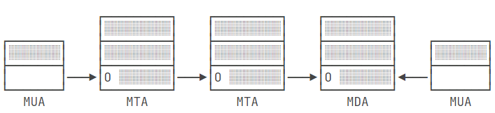

## 一、TCP编程

### Socket

　　`Socket`指的是`IP`+`port`，计算机之间通过`Socket`建立网络连接，`Socket`内部通过`TCP/IP`协议把数据传输到网络。使用`Socket`进行网络编程时，本质上就是两个进程之间的网络通信。其中一个进程必须充当服务器端，它会主动监听某个指定的端口，另一个进程必须充当客户端，它必须主动连接服务器的IP地址和指定端口，如果连接成功，服务器端和客户端就成功地建立了一个TCP连接，双方后续就可以随时发送和接收数据。

　　Socket、TCP和部分IP的功能都是由操作系统提供的，不同的编程语言只是提供了对操作系统调用的简单的封装。例如，Java提供的几个Socket相关的类就封装了操作系统提供的接口。

### 案例

　　Server：

```java
// 服务端Server
public class Server {
    public static void main(String[] args) throws IOException {
        // 监听6666端口
        ServerSocket serverSocket = new ServerSocket(6666);
        while (true) {
            // 每当有一个客户端连接服务端，就会创建一个Socket，同时创建一个新线程来处理客户端请求
            Socket socket = serverSocket.accept();
            Handler handler = new Handler(socket);
            handler.start();
        }
    }
}

class Handler extends Thread {
    Socket socket;

    public Handler(Socket socket) {
        this.socket = socket;
    }

    @Override
    public void run() {
        try(InputStream input = socket.getInputStream();
            OutputStream output = socket.getOutputStream()) {

            BufferedReader reader = new BufferedReader(new InputStreamReader(input, StandardCharsets.UTF_8));
            BufferedWriter writer = new BufferedWriter(new OutputStreamWriter(output, StandardCharsets.UTF_8));

            writer.write("connected\n");
            writer.flush();

            while (true) {
                String request = reader.readLine();
                System.out.println("Request from Client: "+request);
                if(request.equals("bye")) {
                    writer.write("bye\n");
                    writer.flush();
                    break;
                }
                writer.write("OK: "+request+"\n");
                writer.flush();
            }
        } catch (IOException e) {
            throw new RuntimeException(e);
        } finally {
            try {
                socket.close();
            } catch (IOException e) {
                throw new RuntimeException(e);
            }
        }
    }
}
```

　　Client：

```java
// 客户端Client
public class Client {
    public static void main(String[] args) throws IOException {
        // 连接localhost:6666端口
        Socket socket = new Socket("localhost", 6666);
        try(InputStream input = socket.getInputStream();
            OutputStream output = socket.getOutputStream()) {

            BufferedReader reader = new BufferedReader(new InputStreamReader(input, StandardCharsets.UTF_8));
            BufferedWriter writer = new BufferedWriter(new OutputStreamWriter(output, StandardCharsets.UTF_8));

            Scanner scanner = new Scanner(System.in);
            while (true) {
                String response = reader.readLine();
                System.out.println("Response from Server: "+response+"\n");
                if(response.equals("bye")) {
                    break;
                }

                System.out.println("Please enter the request:");
                String request = scanner.nextLine()+"\n";
                writer.write(request);
                writer.flush();

            }
        }

        socket.close();
        System.out.println("disconnected");

    }
}
```

## 二、UDP编程

### 概述

　　`UDP`和`TCP`的区别是，`UDP`是无连接的协议，因此不需要创建连接。在Java中使用UDP编程，仍然需要使用Socket，因为应用程序在使用UDP时必须指定网络接口（IP）和端口号。注意：UDP端口和TCP端口虽然都使用0~65535，但他们是两套独立的端口，即一个应用程序用TCP占用了端口1234，不影响另一个应用程序用UDP占用端口1234。

### 案例

　　Server：

```java
// 服务端Server
public class Server {
    public static void main(String[] args) throws IOException {
        // 监听6666端口
        DatagramSocket ds = new DatagramSocket(6666);
        while (true) {
            
            // 接收
            byte[] buffer = new byte[1024];
            DatagramPacket dp = new DatagramPacket(buffer, buffer.length);
            ds.receive(dp);
            String request = new String(dp.getData(), dp.getOffset(), dp.getLength(), StandardCharsets.UTF_8);
            System.out.println("Request from Client: "+request);

            // 发送
            byte[] response = "ACK".getBytes(StandardCharsets.UTF_8);
            dp.setData(response);
            ds.send(dp);

        }
    }
}
```

　　Client：

```java
// 客户端Clinet
public class Client {
    public static void main(String[] args) throws IOException {
        DatagramSocket ds = new DatagramSocket();
        ds.setSoTimeout(1000);
        // 向localhost:6666进程发送数据
        ds.connect(InetAddress.getByName("localhost"), 6666);

        // 发送
        byte[] request = "Hello".getBytes(StandardCharsets.UTF_8);
        DatagramPacket dp = new DatagramPacket(request, request.length);
        ds.send(dp);

        // 接收
        byte[] buffer = new byte[1024];
        dp = new DatagramPacket(buffer, buffer.length);
        ds.receive(dp);
        String response = new String(dp.getData(), dp.getOffset(), dp.getLength(), StandardCharsets.UTF_8);
        System.out.println("Response from Server: "+response);

        ds.disconnect();
        ds.close();
    }
}
```

## 三、Email

### 概述

　　电子邮件的发送、接收过程如下图所示：



　　`MUA`(Mail User Agent，邮件用户代理)指的是类似QQ邮箱、Gmail邮箱这样的邮件软件；`MTA`(Mail Transfer Agent，邮件传输代理)指的是用来传输邮件的服务器；`MDA`(Mail Delivery Agent，邮件投递代理)指的是邮件传输过程中的最后一个服务器，电子邮件通常就存储在MDA服务器的硬盘上，然后等收件人通过软件或者登陆浏览器查看邮件。

　　电子邮件的发送、接收过程是：

　　1、发送方`MUA`向邮件服务器`MTA`发送邮件，这个过程中使用的是`SMTP`协议，标准端口是25，加密端口是465或587；

　　2、邮件通过`MTA`进行传输，最终到达最后一个服务器`MDA`；

　　3、接收方`MUA`查看`MDA`上的邮件，这个过程中使用的是`POP3`协议，标准端口是143，加密端口是993。

### 发送邮件

　　以QQ邮箱为例，介绍一下从`MUA`发送邮件到`MTA`的过程：

　　首先要添加依赖

```xml
<dependency>
    <groupId>com.sun.mail</groupId>
    <artifactId>javax.mail</artifactId>
    <version>1.6.2</version>
</dependency>
<dependency>
    <groupId>javax.mail</groupId>
    <artifactId>javax.mail-api</artifactId>
    <version>1.6.2</version>
</dependency>
```

　　然后创建Sender

```java
public class Sender {
    // QQ邮箱MTA服务器地址
    private static final String QQ_MTA_HOST = "smtp.qq.com";
    // MTA服务器端口
    private static final String QQ_MTA_PORT = "587";
    // 发送方用户名
    private static final String USERNAME = "123@qq.com";
    // 发送方授权码
    private static final String PASSWORD = "xxxxxxxxxxxxx";

    public static void main(String[] args) throws Exception {
        Properties properties = new Properties();
        properties.put("mail.smtp.host", QQ_MTA_HOST);
        properties.put("mail.smtp.port", QQ_MTA_PORT);
        properties.put("mail.smtp.auth", true);
        properties.put("mail.smtp.starttls.enable", true);

        Session session = Session.getInstance(properties, new Authenticator() {
            protected PasswordAuthentication getPasswordAuthentication() {
                return new PasswordAuthentication(USERNAME, PASSWORD);
            }
        });
        // 设置debug模式便于调试
        session.setDebug(true);

        MimeMessage message = new MimeMessage(session);
        // 发送方
        message.setFrom(new InternetAddress("123@qq.com"));
        // 接收方
        message.setRecipient(Message.RecipientType.TO, new InternetAddress("456@qq.com"));
        // 邮件主题
        message.setSubject("Hello", "UTF-8");
        // 邮件正文
        message.setText("hi,你好啊，2915", "UTF-8");
        Transport.send(message);
    }
}
```

### 接收邮件

　　以QQ邮箱为例，介绍一下`MUA`从`MDA`查询邮件的过程：

```java
public class Receiver {
    // QQ邮箱MDA服务器地址
    private static final String QQ_MDA_HOST = "pop.qq.com";
    // MDA服务器端口
    private static final String QQ_MDA_PORT = "995";
    // 接收方用户名
    private static final String USERNAME = "456@qq.com";
    // 接收方授权码
    private static final String PASSWORD = "xxxxxxxxxxxxx";

    public static void main(String[] args) throws Exception {
        Properties properties = new Properties();
        properties.put("mail.store.protocol", "pop3");
        properties.put("mail.pop3.host", QQ_MDA_HOST);
        properties.put("mail.pop3.port", QQ_MDA_PORT);
        properties.put("mail.smtp.socketFactory.class", "javax.net.ssl.SSLSocketFactory");
        properties.put("mail.smtp.socketFactory.port", QQ_MDA_PORT);

        URLName url = new URLName("pop3", QQ_MDA_HOST, Integer.parseInt(QQ_MDA_PORT), "", USERNAME, PASSWORD);
        Session session = Session.getInstance(properties, null);
        session.setDebug(true);
        Store store = new POP3SSLStore(session, url);
        store.connect();

        Folder folder = store.getFolder("INBOX");
        folder.open(Folder.READ_WRITE);
        System.out.println("Total messages: " + folder.getMessageCount());
        System.out.println("New messages: " + folder.getNewMessageCount());
        System.out.println("Unread messages: " + folder.getUnreadMessageCount());
        System.out.println("Deleted messages: " + folder.getDeletedMessageCount());

        Message[] messages = folder.getMessages();
        Message latestMsg = messages[messages.length-1];

        for (Address address : latestMsg.getFrom()) {
            System.out.println("发件人是："+address);
        }

        String subject = latestMsg.getSubject();
        System.out.println("主题是："+subject);

        Object content = latestMsg.getContent();
        System.out.println("正文是："+content.toString());
    }
}
```

## 四、HTTP编程

### 概述

　　HTTP是基于TCP协议的一种应用层协议。当浏览器访问网站时，浏览器和服务器之间会建立TCP连接，标准端口是80，加密端口是443，然后浏览器向服务器发送一个HTTP请求，服务器收到请求后，返回一个HTTP响应，并且在响应中包含了html的网页内容，浏览器解析、渲染网页内容后展示给用户。

### HTTP报文格式

* #### 请求报文

　　HTTP请求报文由**请求行、`Header`(请求头)**和**`Body`(请求体)**三部分组成，一个典型的HTTP请求报文如下：

```
POST /login HTTP/1.1
Host: www.example.com
Content-Type: application/x-www-form-urlencoded
Content-Length: 30
User-Agent: Mozilla/5.0 (compatible; MSIE 11; Windows NT 5.1)
Accept: */*
Accept-Language: zh-CN,zh;q=0.9

username=hello&password=123456
```

　　请求行(第1行)包括**请求方式**(`POST`)，**请求路径**(`/login`)，**协议类型**(`HTTP/1.1`)。

　　请求头(第2-7行)的每一行都是固定的`Header: value`格式，服务器依靠某些特定的Header来识别客户端请求，比如`Host: www.example.com`表示请求的域名，`Content-Type`表示请求体的类型，`Content-Length`表示请求体的长度，`User-Agent: */*`表示浏览器的标识信息，`Accept: */*`表示浏览器能处理的HTTP响应格式，`Accept-Language: zh-CN,zh;q=0.9`表示浏览器接收的语言，等等。

　　请求体(第9行)和请求头之间隔着一个空行。

* #### 响应报文

　　HTTP响应报文由**状态行、`Header`(响应头)**和**`Body`(响应体)**三部分组成，一个典型的HTTP响应报文如下：

```
HTTP/1.1 200 OK
Content-Type: text/html
Content-Length: 133251

<!DOCTYPE html>
<html><body>
<h1>Hello</h1>
...
```

　　状态行(第1行)包括**协议类型**(`HTTP/1.1`)、**响应状态码**(`200`)、**状态码解释短语**(`OK`)。

　　响应头(第2-3行)的每一行也是固定的`Header: value`格式，比如`Content-Type: text/html`表示响应体的类型，`Content-Length: 133251`表示响应体的长度。

　　响应体(第5-7)行和响应头之间隔着一个空行。

### 案例

* #### HTTP客户端

```java
public class Browser {
    public static void main(String[] args) throws Exception {
        URL url = new URL("http://localhost:80");
        HttpURLConnection connection = (HttpURLConnection) url.openConnection();
        connection.setRequestMethod("GET");
        connection.setUseCaches(false);
        connection.setConnectTimeout(5000);

        // 设置请求头
        connection.setRequestProperty("Accept", "*/*");
        connection.setRequestProperty("User-Agent", "Mozilla/5.0 (compatible; MSIE 11; Windows NT 5.1)");
        
        // 连接并发送HTTP请求
        connection.connect();

        if(connection.getResponseCode() != 200) {
            throw new RuntimeException("bad response!");
        }

        // 获取响应头
        Map<String, List<String>> headerFields = connection.getHeaderFields();
        for(String key : headerFields.keySet()) {
            System.out.println(key+" : "+headerFields.get(key));
        }

        // 获取响应体内容
        try (InputStream inputStream = connection.getInputStream()) {
            BufferedReader reader = new BufferedReader(new InputStreamReader(inputStream, StandardCharsets.UTF_8));
            String response = reader.readLine();
            System.out.println("响应："+response);
        }
    }
}
```

* #### HTTP服务端

　　服务端代码只需要在`TCP`编程的基础上，用Reader读取HTTP请求，用Writer发送HTTP响应即可。

```java
public class Server {
    public static void main(String[] args) throws IOException {
        ServerSocket serverSocket = new ServerSocket(80);
        while (true) {
            Socket socket = serverSocket.accept();
            Handler handler = new Handler(socket);
            handler.start();
        }
    }
}

class Handler extends Thread {
    Socket socket;

    public Handler(Socket socket) {
        this.socket = socket;
    }

    @Override
    public void run() {
        try(InputStream input = socket.getInputStream();
            OutputStream output = socket.getOutputStream()) {

            BufferedReader reader = new BufferedReader(new InputStreamReader(input, StandardCharsets.UTF_8));
            BufferedWriter writer = new BufferedWriter(new OutputStreamWriter(output, StandardCharsets.UTF_8));

            boolean requestOk = false;
            // 获取请求行
            String first = reader.readLine();
            if(first.startsWith("GET / HTTP/1.")) {
                requestOk = true;
            }

            while (true) {
                // 获取请求头
                String header = reader.readLine();
                if(header.isEmpty()) {
                    break;
                }
                System.out.println(header);
            }

            // 写入响应
            if(requestOk) {
                String responseData = "<h1>hello world</h>";
                int length = responseData.getBytes(StandardCharsets.UTF_8).length;
                writer.write("HTTP/1.0 200 OK\r\n");
                writer.write("Connection: close\r\n");
                writer.write("Content-Type: text/html\r\n");
                writer.write("Content-Length: " + length + "\r\n");
                writer.write("\r\n");
                writer.write(responseData);
                writer.flush();
            }else {
                writer.write("HTTP/1.0 404 Not Found\r\n");
                writer.write("Content-Length: 0\r\n");
                writer.write("\r\n");
                writer.flush();
            }
        } catch (IOException e) {
            throw new RuntimeException(e);
        } finally {
            try {
                socket.close();
            } catch (IOException e) {
                throw new RuntimeException(e);
            }
        }
    }
}
```

