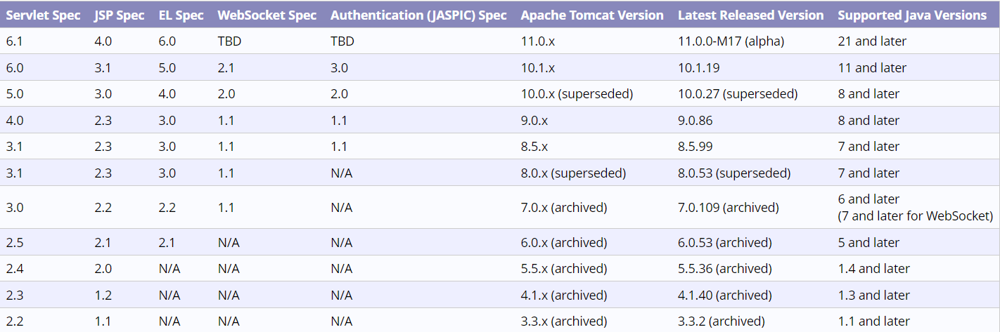

## 一、概述

### Servlet简介

　　我们知道，编写一个简单的HTTP服务器很简单，只需要先编写基于多线程的TCP服务，然后在一个TCP连接中读取HTTP请求、发送HTTP响应即可。但是如果要编写一个功能完善的HTTP服务器，需要考虑的问题就很多了，比如要识别正确的HTTP请求、复用TCP连接、复用线程等等，这些基础工作需要耗费大量的时间，并且需要长期测试才能稳定运行。

　　好在Web服务器可以帮我们完成这些繁琐的工作，我们只需要把自己的应用程序交给Web服务器去执行，这里的应用程序的核心就是`Servlet`，我们编写的`Servlet`需要实现`servlet-api`，我们在`Servlet`中对HTTP请求和响应进行处理。

　　一个简单的`Servlet`如下：

```java
@WebServlet("/login")
public class MyServlet extends HttpServlet {
    @Override
    protected void doGet(HttpServletRequest req, HttpServletResponse resp) throws IOException {
        resp.setContentType("text/html");
        PrintWriter writer = resp.getWriter();
        writer.write("<h1>hello world</h>");
        writer.flush();
    }
}
```

　　当然，使用`Servlet`之前必须引入`servlet-api`依赖：

```xml
<dependency>
    <groupId>jakarta.servlet</groupId>
    <artifactId>jakarta.servlet-api</artifactId>
    <version>6.0.0</version>
    <scope>provided</scope>
</dependency>
```

　　这里的`<scope>provided</scope>`表示jar包只会在编译时使用，而不会在程序打包后使用，因为程序打包后会交给Web服务器去运行，而Web服务器中已经包含了`servlet-api`相关jar包。

### Servlet版本

　　`servlet-api`、Web服务器、JDK等的版本对应关系如下图所示([Servlet版本对应关系](https://tomcat.apache.org/whichversion.html))：



　　要务必注意`servlet-api`的版本。4.0及之前的`servlet-api`由Oracle官方维护，引入的依赖项是`javax.servlet:javax.servlet-api`，编写代码时引入的包名为：

```java
import javax.servlet.*;
```

　　而5.0及以后的`servlet-api`由Eclipse开源社区维护，引入的依赖项是`jakarta.servlet:jakarta.servlet-api`，编写代码时引入的包名为：

```java
import jakarta.servlet.*;
```

### Web服务器

　　常用的Web服务器有：

　　1、[Tomcat](https://tomcat.apache.org/)：由Apache开发的开源免费服务器；

　　2、[Jetty](https://www.eclipse.org/jetty/)：由Eclipse开发的开源免费服务器；

　　3、[GlassFish](https://javaee.github.io/glassfish/)：一个开源的全功能JavaEE服务器。

　　用户编写的`Servelt`必须交给Web服务器去运行，Web服务器会创建`Servlet`实例，并将HTTP请求对象和响应对象交给`Servelt`中的方法去执行。对于Tomcat服务器来说，运行`Servelt`的方法有两种，第一种方法需要先安装Tomcat，然后将Web项目打成war包，最后将jar包放到Tomcat的指定目录中，启动Tomcat即可；第二种方法不需要安装Tomcat，但需要引入Tomcat依赖，然后在Web项目的main方法中启动Tomcat。第二种方法比较方便调试。

### 使用main方法启动Tomcat

　　使用main方法启动Tomcat并运行Servlet的步骤如下：

　　1、添加`servlet-api`和Tomcat依赖：

```xml
<!-- JDK21 -->
<dependencies>
    <!-- 由于Tomcat中包含了servlet-api，因此实际上可以不添加servlet-api依赖 -->
    <dependency>
        <groupId>jakarta.servlet</groupId>
        <artifactId>jakarta.servlet-api</artifactId>
        <version>6.0.0</version>
    </dependency>
    <dependency>
        <groupId>org.apache.tomcat.embed</groupId>
        <artifactId>tomcat-embed-core</artifactId>
        <version>10.1.1</version>
    </dependency>
    <dependency>
        <groupId>org.apache.tomcat.embed</groupId>
        <artifactId>tomcat-embed-jasper</artifactId>
        <version>10.1.1</version>
    </dependency>
</dependencies>
```

　　2、创建一个JavaWeb项目，并创建一个Servlet

```java
@WebServlet("/login")
public class MyServlet extends HttpServlet {
    @Override
    protected void doGet(HttpServletRequest req, HttpServletResponse resp) throws IOException {
        resp.setContentType("text/html");
        PrintWriter writer = resp.getWriter();
        writer.write("<h1>hello world</h>");
        writer.flush();
    }
}
```

　　3、编写main方法启动Tomcat

```java
public class Main {
    public static void main(String[] args) throws Exception {
        // 启动Tomcat:
        Tomcat tomcat = new Tomcat();
        tomcat.setPort(8080);
        tomcat.getConnector();
        // 创建webapp:
        Context ctx = tomcat.addWebapp("", new File("src/main/webapp").getAbsolutePath());
        WebResourceRoot resources = new StandardRoot(ctx);
        resources.addPreResources(
                new DirResourceSet(resources, "/WEB-INF/classes", new File("target/classes").getAbsolutePath(), "/"));
        ctx.setResources(resources);
        tomcat.start();
        tomcat.getServer().await();
    }
}
```

## 二、进阶

### Servlet原理

* #### HttpServlet

　　我们在编写Servlet时，一般都是继承`HttpServlet`类，`HttpServlet`是`Servlet`接口的一个实现类，它为不同的请求类型提供了不同的处理方法，比如`doGet()`方法是专门用来处理`GET`请求的。

　　一个典型的`HttpServlet`如下：

```java
@WebServlet("/login")
public class MyServlet extends HttpServlet {
    @Override
    protected void doGet(HttpServletRequest req, HttpServletResponse resp) throws IOException {
        resp.setContentType("text/html");
        PrintWriter writer = resp.getWriter();
        writer.write("<h1>hello world</h>");
        writer.flush();
    }

    @Override
    protected void doPost(HttpServletRequest req, HttpServletResponse resp) throws IOException, ServletException {
        resp.setContentType("text/html");
        PrintWriter writer = resp.getWriter();
        writer.write("<h1>hi</h>");
        writer.flush();
    }
    
    ...
}
```

　　HTTP请求会首先到达`HttpServlet`中的`service()`方法，这个方法会根据不同的请求类型，将请求分发到不同的`doGet()`、`doPost()`方法中，`HttpServlet`类中的`doGet()`、`doPost()`方法只会返回错误信息，因此必须在子类中重写这些方法，才能正确处理请求和响应。

* #### 路径映射

　　Servlet的路径映射规则用伪代码表示如下：

```java
// 当请求路径是/abc时，请求被转发到标注了@WebServlet("/abc")的Servlet
if(path.equals("/abc")) {
    dispatchTo(abcServlet);
// 当请求路径是/def时，请求被转发到标注了@WebServlet("/def")的Servlet
} else if(path.equals("/def")) {
    dispatchTo(defServlet);
// 当请求路径无法匹配到一个确定的Servlet时，就会被转发到标注了@WebServlet("/")或者@WebServlet("/*")的Servlet，/*的优先级更高
} else {
    dispatchTo(otherServlet);
}
```

* #### HttpServletRequest

　　`HttpServletRequest`封装了一个HTTP请求，通过`HttpServletRequest`提供的接口方法可以拿到HTTP请求的几乎全部信息，常用的方法有：

|                                        | 作用                                                         | 例子 |
| -------------------------------------- | ------------------------------------------------------------ | ---- |
| `String getMethod()`                   | 获取请求方式，比如`GET`、`POST`                              |      |
| `StringBuffer getRequestURL()`         | 获取请求完整链接，比如`http://localhost:8080/login`          |      |
| `String getRequestURI()`               | 获取请求路径，不包括`host:port`，比如`/login`                |      |
| `String getQueryString()`              | 获取请求路径中的参数key和value，比如`name=jack&age=18`       |      |
| `String getParameter(String var1)`     | 获取请求参数中key对应的value，GET请求从URL中获取，POST请求从Body中获取 |      |
| `String getContentType()`              | 获取请求Body的类型，即`Content-Type`                         |      |
| `String getContextPath()`              | 获取当前Webapp挂载的路径                                     |      |
| `Cookie[] getCookies()`                | 获取请求携带的所有Cookie                                     |      |
| `String getHeader(String var1)`        | 获取请求Header中key对应的的value，key不区分大小写            |      |
| `Enumeration<String> getHeaderNames()` | 获取请求Header中所有的key                                    |      |
| `BufferedReader getReader()`           | 获取一个读取Body内容的输入流                                 |      |
| `String getRemoteAddr()`               | 获取客户端的IP地址                                           |      |
| `String getProtocol()`                 | 获取协议类型，比如`HTTP/1.1`                                 |      |

　　此外，`HttpServletRequest`还有两个方法：`setAttribute()`和`getAttribute()`，可以给当前`HttpServletRequest`对象附加多个Key-Value，相当于把`HttpServletRequest`当作一个`Map<String, Object>`使用。

* #### HttpServletResponse

　　`HttpServletResponse`封装了一个HTTP响应。由于HTTP响应必须先发送Header，再发送Body，所以，操作`HttpServletResponse`对象时，必须先调用设置Header的方法，最后调用发送Body的方法。

　　常用的设置Header的方法有：

|                                            | 方法                                | 例子 |
| ------------------------------------------ | ----------------------------------- | ---- |
| `void setStatus(int var1)`                 | 设置响应代码，默认是200             |      |
| `void setContentType(String var1)`         | 设置响应Body的类型，比如`text/html` |      |
| `void setCharacterEncoding(String var1)`   | 设置字符编码类型，比如`utf-8`       |      |
| `void setHeader(String var1, String var2)` | 设置一个Header的值                  |      |
| `void addHeader(String var1, String var2)` | 设置一个Header的值                  |      |
| `void addCookie(Cookie var1)`              | 给响应添加一个Cookie                |      |

　　写入响应时，需要通过`getOutputStream()`获取写入流，或者通过`getWriter()`获取字符流，二者只能获取其中一个。

　　写入响应前，无需设置`setContentLength()`，因为底层服务器会根据写入的字节数自动设置，如果写入的数据量很小，实际上会先写入缓冲区，如果写入的数据量很大，服务器会自动采用Chunked编码让浏览器能识别数据结束符而不需要设置Content-Length头。

　　但是，写入完毕后调用`flush()`却是必须的，因为大部分Web服务器都基于HTTP/1.1协议，会复用TCP连接。如果没有调用`flush()`，将导致缓冲区的内容无法及时发送到客户端。此外，**写入完毕后千万不要调用`close()`**，原因同样是因为会复用TCP连接，如果关闭写入流，将关闭TCP连接，使得Web服务器无法复用此TCP连接。

> info "提示"
>
> 有了`HttpServletRequest`和`HttpServletResponse`这两个高级接口，我们就不需要直接处理HTTP协议。注意到具体的实现类是由各服务器提供的，而我们编写的Web应用程序只关心接口方法，并不需要关心具体实现的子类。

* #### Servlet多线程模型

　　一个Servlet类在服务器中只有一个实例，但对于每个HTTP请求，Web服务器会使用多线程执行请求。因此，一个Servlet的`doGet()`、`doPost()`等处理请求的方法是多线程并发执行的。**如果Servlet中定义了字段，要注意多线程并发访问的问题**。

　　对于每个请求，Web服务器会创建唯一的`HttpServletRequest`和`HttpServletResponse`实例，因此，`HttpServletRequest`和`HttpServletResponse`实例只有在当前处理线程中有效，它们总是局部变量，不存在多线程共享的问题。

### 转发和重定向

　　转发指的是当一个Servlet处理请求的时候，它可以决定自己不继续处理，而是转发给另一个Servlet处理。

　　转发的写法是：

```java
@WebServlet("/hi")
public class ForwardServlet extends HttpServlet {
    protected void doGet(HttpServletRequest req, HttpServletResponse resp) throws ServletException, IOException {
        req.getRequestDispatcher("/hello").forward(req, resp);
    }
}
```

　　重定向指的是当浏览器请求一个URL时，服务器返回一个重定向指令，告诉浏览器地址已经变了，麻烦使用新的URL再重新发送新请求。重定向的响应码有两种，一种是302响应，称为临时重定向，一种是301响应，称为永久重定向。两者的区别是，如果服务器发送301永久重定向响应，浏览器会缓存`/hi`到`/hello`这个重定向的关联，下次请求`/hi`的时候，浏览器就直接发送`/hello`请求了。

　　重定向的写法是：

```java
@WebServlet("/hi")
public class RedirectServlet extends HttpServlet {
    protected void doGet(HttpServletRequest req, HttpServletResponse resp) throws ServletException, IOException {
        resp.sendRedirect("/hello");
    }
}
```

> info "提示"
>
> 转发和重定向的区别是：转发是服务器的内部行为，浏览器只发送了一个请求，而重定向是服务器的外部行为，浏览器发送了两次请求。

### Cookie和Session

　　由于HTTP协议是无状态的，所以需要使用Cookie和Session保存用户信息。

* #### Cookie

　　Cookie的构造方法是`public Cookie(String name, String value)`，因此每个Cookie对象能够存储一个`String-String`键值对。当浏览器访问Servlet时，我们可以将用户信息保存在Cookie对象中，然后把这些Cookie对象发送给浏览器，这样浏览器下次访问服务器时，就可以自动携带着这些Cookie，服务器通过这些Cookie就可以识别出用户信息。

　　Cookie的使用方法是：

```java
@WebServlet("/login")
public class MyServlet1 extends HttpServlet {
    @Override
    protected void doGet(HttpServletRequest req, HttpServletResponse resp) throws IOException, ServletException {
        String username = req.getParameter("username");
        // 将用户名保存到Cookie对象中
        Cookie cookie = new Cookie("username", username);
        // 浏览器会根据这个路径判断是否发送Cookie，/表示匹配所有请求路径，/abc表示只有当请求路径以它开头时才会发送Cookie
        cookie.setPath("/");
        // 设置Cookie在浏览器中的过期时间，单位是秒
        cookie.setMaxAge(60);
        // 将Cookie对象放入响应
        resp.addCookie(cookie);
        
        // 重定向
        resp.sendRedirect("/");
    }
}


@WebServlet("/")
public class MyServlet2 extends HttpServlet {
    @Override
    protected void doGet(HttpServletRequest req, HttpServletResponse resp) throws IOException, ServletException {
        resp.setContentType("text/html");
        PrintWriter writer = resp.getWriter();
        // 重定向的请求中将携带Cookie，通过这些Cookie就可以识别出用户信息
        for (Cookie cookie : req.getCookies()) {
            String name = cookie.getName();
            String value = cookie.getValue();
            if(name.equals("username") && value.equals("jack")) {
                writer.write("welcome, "+value);
            }
        }
        writer.flush();
}
```

* #### Session

　　每个浏览器在服务器上都可以有一个Session对象，这个对象中可以存放用户信息。当浏览器请求Servlet时，如果对请求对象`HttpServletRequest`调用了`getSession()`方法，并且服务器上还没有为该浏览器创建Session对象时，此时就会为该浏览器创建一个Session对象，并生成一个SessionId作为唯一标识，我们可以在Session对象中保存用户信息。当返回响应时，响应中会携带一个Cookie对象，对象的key是一个名为`JSESSIONID`的字符串，value就是浏览器的`SessionId`，这样当浏览器下一次请求Servlet时，就可以携带这个Cookie，服务器会解析这个Cookie并拿到对应的Session对象，从而获得其中保存的用户信息。

　　Session的使用方法是：

```java
@WebServlet("/login")
public class MyServlet1 extends HttpServlet {
    @Override
    protected void doGet(HttpServletRequest req, HttpServletResponse resp) throws IOException, ServletException {
        String username = req.getParameter("username");
        System.out.println(username);
        // 当第一次请求时，getSession()会创建一个Session对象，并生成浏览器的唯一标识SessionId
        HttpSession session = req.getSession();
        // 将用户信息存放到Session对象中
        session.setAttribute("username", username);
        // 设置在无任何操作的情况下，Session对象在服务器上的保存时间，单位是秒，负数代表永不过期
        session.setMaxInactiveInterval(-1);

        // 重定向
        resp.sendRedirect("/login1");
    }
}


@WebServlet("/")
public class MyServlet2 extends HttpServlet {
    @Override
    protected void doGet(HttpServletRequest req, HttpServletResponse resp) throws IOException, ServletException {
        resp.setContentType("text/html");
        PrintWriter writer = resp.getWriter();

        // 当第二次请求时，服务器会通过Cookie中的SessionId，拿到该浏览器对应的Session对象
        HttpSession session = req.getSession();
        // 获取Session对象中保存的用户信息
        String username = (String) session.getAttribute("username");
        if(username != null && username.equals("jack")) {
            writer.write("welcome, "+username);
        }
        writer.flush();
}
```

> warning "提醒"
>
> Session机制会使Web Server集群很难扩展，原因是集群节点之间需要对Session进行同步，会消耗内存和带宽。因此，Session适用于中小型Web应用程序。**对于大型Web应用程序来说，通常需要避免使用Session机制。**

### Filter

　　为了把一些公用逻辑从各个Servlet中抽离出来，JavaEE的Servlet规范还提供了一种Filter组件，即过滤器，它的作用是，在HTTP请求到达Servlet之前，可以被一个或多个Filter预处理，类似打印日志、登录检查等逻辑，完全可以放到Filter中。

　　使用Filter将输入输出的编码格式设置为UTF-8：

```java
// /*表示可以匹配所有请求路径
@WebFilter("/*")
public class MyFilter implements Filter {
    @Override
    public void doFilter(ServletRequest servletRequest, ServletResponse servletResponse, FilterChain filterChain) throws IOException, ServletException {
        
        servletRequest.setCharacterEncoding("utf-8");
        servletResponse.setCharacterEncoding("utf-8");

        // 最后必须调用doFilter()方法，请求才能被转发
        filterChain.doFilter(servletRequest, servletResponse);
    }
}
```

　　如果要对多个过滤器进行排序，需要在`webapp/WEB-INF/web.xml`中进行配置：

```xml
<!-- 将会按照标签定义顺序，从上往下执行过滤器 -->
<filter>
   <filter-name>myFilter1</filter-name><!--过滤器名-->
   <filter-class>com.zyg.MyFilter1</filter-class><!--过滤器的全限定名-->
</filter> 
<filter>
   <filter-name>myFilter2</filter-name>
   <filter-class>com.zyg.MyFilter2</filter-class>
</filter> 
```

### Listener

　　除了Servlet和Filter外，JavaEE的Servlet规范还提供了第三种组件：Listener(监听器)。监听器 Listener 是一个实现特定接口的 Java 程序，这个程序专门用于监听另一个 Java 对象的方法调用或属性改变，当被监听对象发生上述事件后，监听器某个方法将立即自动执行。

　　一个简单的Listener如下，它的作用是监听ServletContext对象的创建和销毁：

```java
@WebListener
public class AppListener implements ServletContextListener {
    //创建ServletContext对象后执行
    public void contextInitialized(ServletContextEvent sce) {
        System.out.println("创建了ServletContext对象");
    }
 
    //销毁ServletContext对象后执行
    public void contextDestroyed(ServletContextEvent sce) {
        System.out.println("销毁了ServletContext对象");
    }
}
```

　　Servlet 规范中定义了 8 个监听器接口，可以用于监听 ServletContext、HttpSession 和 ServletRequest对象的生命周期和属性变化事件。
