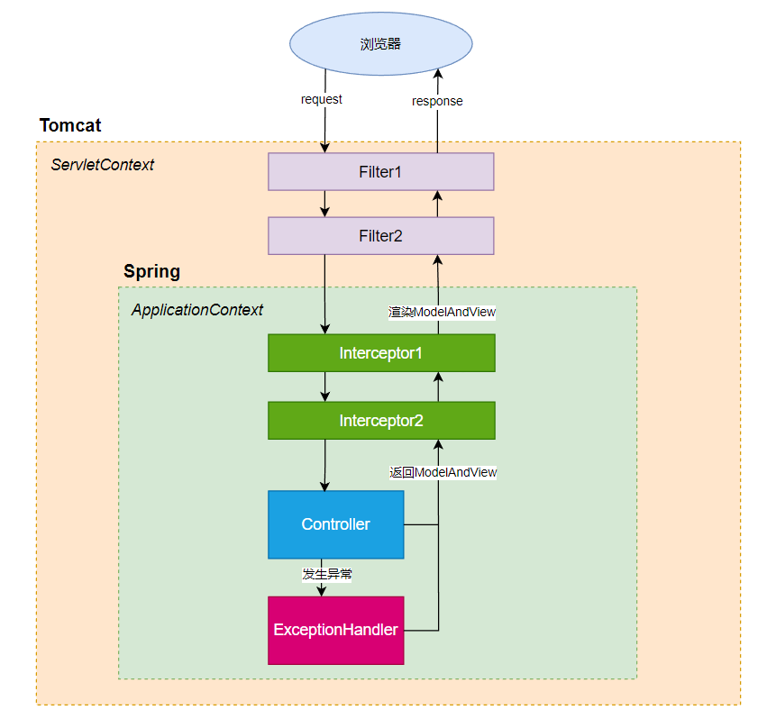

## 一、SpringMVC的原理

### 创建一个简单的SpringMVC项目

　　SpringMVC项目中的主要组件包括`Filter`(过滤器)、`Interceptor`(拦截器)、`Controller`(控制器)、`ExceptionHandler`(异常处理器)。下面编写一个基本的SpringMVC项目，并在项目中使用这些组件。

　　步骤：

　　1、创建一个JavaWeb项目，并添加下面的依赖

```xml
<!-- JDK8 -->
<dependencies>
    <!-- tomcat依赖 -->
    <dependency>
        <groupId>org.apache.tomcat.embed</groupId>
        <artifactId>tomcat-embed-core</artifactId>
        <version>9.0.68</version>
    </dependency>
    <dependency>
        <groupId>org.apache.tomcat.embed</groupId>
        <artifactId>tomcat-embed-jasper</artifactId>
        <version>9.0.68</version>
    </dependency>
    <!-- spring依赖 -->
    <dependency>
        <groupId>org.springframework</groupId>
        <artifactId>spring-context</artifactId>
        <version>5.2.3.RELEASE</version>
    </dependency>
    <dependency>
        <groupId>org.springframework</groupId>
        <artifactId>spring-webmvc</artifactId>
        <version>5.2.3.RELEASE</version>
    </dependency>
</dependencies>
```

　　2、声明配置类`AppConfig`，在配置类中创建一些必要的Bean实例

```java
@Configuration
@ComponentScan("com.zyg")
// 开启SpringMVC
@EnableWebMvc
public class AppConfig {

    // 视图解析器，可以对view层视图文件的所在目录和后缀进行配置
    @Bean
    ViewResolver viewResolver(@Autowired ServletContext servletContext) {
        InternalResourceViewResolver viewResolver = new InternalResourceViewResolver();
        viewResolver.setPrefix("/WEB-INF/jsp/");
        viewResolver.setSuffix(".jsp");
        return viewResolver;
    }

    @Bean
    WebMvcConfigurer webMvcConfigurer(@Autowired HandlerInterceptor[] handlerInterceptors) {
        return new WebMvcConfigurer() {
            // 对静态资源进行配置
            @Override
            public void addResourceHandlers(ResourceHandlerRegistry registry) {
                registry.addResourceHandler("/static/**")
                        .addResourceLocations("/static/");
            }

            // 如果定义了拦截器，需要在这里添加才会生效
            @Override
            public void addInterceptors(InterceptorRegistry registry) {
                for (HandlerInterceptor interceptor : handlerInterceptors) {
                    registry.addInterceptor(interceptor)
                            .addPathPatterns("/*");
                }
            }
        };
    }
}

```

　　3、在`/webapp/WEB-INF/web.xml`文件中声明`DispatcherServlet`，并指定`IOC`容器和`AppConfig`配置类

```xml
<?xml version="1.0" encoding="UTF-8"?>
<web-app xmlns="http://xmlns.jcp.org/xml/ns/javaee"
         xmlns:xsi="http://www.w3.org/2001/XMLSchema-instance"
         xsi:schemaLocation="http://xmlns.jcp.org/xml/ns/javaee http://xmlns.jcp.org/xml/ns/javaee/web-app_4_0.xsd"
         version="4.0">
    <servlet>
        <servlet-name>dispatcher</servlet-name>
        <servlet-class>org.springframework.web.servlet.DispatcherServlet</servlet-class>
        <init-param>
            <param-name>contextClass</param-name>
            <param-value>org.springframework.web.context.support.AnnotationConfigWebApplicationContext</param-value>
        </init-param>
        <init-param>
            <param-name>contextConfigLocation</param-name>
            <param-value>com.zyg.config.AppConfig</param-value>
        </init-param>
    </servlet>

    <servlet-mapping>
        <servlet-name>dispatcher</servlet-name>
        <url-pattern>/</url-pattern>
    </servlet-mapping>
</web-app>
```

　　4、创建`Filter`、`Interceptor`、`Controller`、`ExceptionHandler`类

　　`Filter`：

```java
// 过滤所有请求
@WebFilter("/*")
public class MyFilter implements Filter {
    @Override
    public void doFilter(ServletRequest request, ServletResponse response, FilterChain chain) throws IOException, ServletException {
        System.out.println("进入Filter");
        chain.doFilter(request, response);
        System.out.println("离开Filter");
    }
}
```

　　`Interceptor`：

```java
@Order(1)
@Component
public class MyInterceptor1 implements HandlerInterceptor {
    @Override
    public boolean preHandle(HttpServletRequest request, HttpServletResponse response, Object handler) throws Exception {
        System.out.println("进入interceptor1");
        return true;
    }

    @Override
    public void postHandle(HttpServletRequest request, HttpServletResponse response, Object handler, ModelAndView modelAndView) throws Exception {
        System.out.println("离开interceptor1");
    }
}

@Order(2)
@Component
public class MyInterceptor2 implements HandlerInterceptor {
    @Override
    public boolean preHandle(HttpServletRequest request, HttpServletResponse response, Object handler) throws Exception {
        System.out.println("进入interceptor2");
        return true;
    }

    @Override
    public void postHandle(HttpServletRequest request, HttpServletResponse response, Object handler, ModelAndView modelAndView) throws Exception {
        System.out.println("离开interceptor2");
    }
}
```

　　`Controller`：

```java
@Controller
public class MyController {

    @RequestMapping("/login")
    public ModelAndView login() {
        System.out.println("login");
        return new ModelAndView("login");
    }
}
```

　　`ExceptionHandler`：

```java
@Component
public class MyExceptionHandler implements HandlerExceptionResolver {
    @Override
    public ModelAndView resolveException(HttpServletRequest request, HttpServletResponse response, Object handler, Exception ex) {
        System.out.println("发生异常");
        ModelAndView mv = new ModelAndView();
        mv.addObject("msg", ex);
        mv.setViewName("error");
        return mv;
    }
}
```

　　5、在`/webapp/WEB-INF/jsp/`目录下创建`login.jsp`、`error.jsp`文件，用于渲染Controller的返回结果

```jsp
<%@ page contentType="text/html;charset=UTF-8" language="java" %>
<html>
<head>
    <title>login</title>
</head>
<body>
<h1>欢迎</h1>
</body>
</html>
```

　　6、在main方法中启动tomcat

```java
public class Main {
    public static void main(String[] args) throws Exception {
        // 启动Tomcat:
        Tomcat tomcat = new Tomcat();
        tomcat.setPort(8080);
        tomcat.getConnector();
        // 创建webapp:
        Context ctx = tomcat.addWebapp("", new File("src/main/webapp").getAbsolutePath());
        WebResourceRoot resources = new StandardRoot(ctx);
        resources.addPreResources(
                new DirResourceSet(resources, "/WEB-INF/classes", new File("target/classes").getAbsolutePath(), "/"));
        ctx.setResources(resources);
        tomcat.start();
        tomcat.getServer().await();
    }
}
```

### 执行流程

　　SpringMVC的执行流程如下图所示：



　　1、启动tomcat后，tomcat会实例化`DispatcherServlet`，并执行它的`init()`方法，执行过程中会创建`IOC`容器，并从配置类开始扫描，为所有Bean创建实例，交给`IOC`容器管理；

　　2、浏览器发送请求，请求会先到达`Filter`，并执行它的`doFilter()`方法；

　　3、请求到达`DispatcherServlet`的`doDispatch()`方法，在这个方法中会先执行`Interceptor`的`preHandle()`方法，再执行`Controller`中的目标方法，如果发生了异常，就会执行`ExceptionHandler`中的方法，如果没有发生异常，就会把返回结果`ModelAndView`对象保存下来，然后执行`Interceptor`中的`postHandle()`方法，最后会用`jsp`文件渲染返回结果，并响应给浏览器。

> info "注意"
>
> 如果`Interceptor`匹配到了多个`Controller`方法，那么在每个`Controller`方法执行的前后，都会执行`preHandle()`和`postHandle()`方法。

　　`doDispatch()`方法如下：

```java
protected void doDispatch(HttpServletRequest request, HttpServletResponse response) throws Exception {
    HttpServletRequest processedRequest = request;
    HandlerExecutionChain mappedHandler = null;
    boolean multipartRequestParsed = false;

    WebAsyncManager asyncManager = WebAsyncUtils.getAsyncManager(request);

    try {
        ModelAndView mv = null;
        Exception dispatchException = null;

        try {
            processedRequest = checkMultipart(request);
            multipartRequestParsed = (processedRequest != request);

            // 1、获取Controller中的目标方法
            mappedHandler = getHandler(processedRequest);
            if (mappedHandler == null) {
                noHandlerFound(processedRequest, response);
                return;
            }

            HandlerAdapter ha = getHandlerAdapter(mappedHandler.getHandler());

            String method = request.getMethod();
            boolean isGet = "GET".equals(method);
            if (isGet || "HEAD".equals(method)) {
                long lastModified = ha.getLastModified(request, mappedHandler.getHandler());
                if (new ServletWebRequest(request, response).checkNotModified(lastModified) && isGet) {
                    return;
                }
            }

            // 2、执行Interceptor中的preHandle()方法
            if (!mappedHandler.applyPreHandle(processedRequest, response)) {
                return;
            }

            // 3、执行Controller中的目标方法，并暂存返回结果
            mv = ha.handle(processedRequest, response, mappedHandler.getHandler());

            if (asyncManager.isConcurrentHandlingStarted()) {
                return;
            }

            applyDefaultViewName(processedRequest, mv);
            // 4、执行Interceptor中的postHandle()方法
            mappedHandler.applyPostHandle(processedRequest, response, mv);
        }
        catch (Exception ex) {
            dispatchException = ex;
        }
        catch (Throwable err) {
            dispatchException = new NestedServletException("Handler dispatch failed", err);
        }
        // 5、用jsp文件渲染返回结果
        processDispatchResult(processedRequest, response, mappedHandler, mv, dispatchException);
    }
}
```

## 二、SpringMVC中的请求和响应

### 请求路径映射

　　`@RequestMapping`作用于Controller类或方法上，用于路径映射。它的常用属性有：

　　1、`value`：请求路径；

　　2、`method`：支持的请求方式，比如GET、POST；

　　3、`params`： 请求中必须携带的参数key与value；

　　4、`headers`：请求中必须携带的请求头key与value；

　　5、`consumes`：支持的请求Body类型，比如`application/json`、`text/html`；

　　6、`produces`：支持的响应Body类型，比如`application/json`、`text/html`，但即使这里的声明与实际返回的类型不同，似乎也不会报错。

　　一个完整的`@RequestMapping`如下所示：

```java
@RequestMapping(value = "/login", method = RequestMethod.POST, params = {"name=jack"},
                headers = {"Accept=text/html"}, consumes = {"application/json"}, 
                produces = {"application/json;charset=utf-8"})
public ModelAndView login() {...}
```

　　可以使用`@GetMapping`和`@PostMapping`代替`@RequestMapping`，它们分别只接收GET和POST请求。

### 请求参数绑定

* #### HttpServletRequest、HttpServletResponse、 HttpSession参数绑定

　　对于这些Servlet自带的参数，只需要在方法参数中声明即可获取到：

```java
@RequestMapping("/login")
public ModelAndView login(HttpServletRequest request, HttpServletResponse response, HttpSession session) {}
```

* #### 普通参数绑定

　　通过普通参数绑定时，需要保证请求中的key和方法参数名称相同。还要注意的是，如果参数是基本类型，在方法参数中要尽量使用它的包装类型，因为如果参数为空，基本类型是无法转换成null的，从而导致抛出异常。

```java
@RequestMapping("/login")
public ModelAndView login(String name, Integer age) {}
```

* #### Bean参数绑定

　　通过Bean绑定时，需要保证请求中的key和Bean中的属性名称相同，并且属性要有对应的`setter`方法。

```java
@RequestMapping("/login")
public ModelAndView login(Student student) {}
```

* #### URL路径参数绑定

　　也可以通过`@PathVariable`绑定请求路径中的参数：

```java
@RequestMapping("/login/{path}")
public ModelAndView login(@PathVariable String path) {}
```

* #### 参数名称不一致的绑定

　　当请求中的参数名称和方法的参数名称不一致时，可以使用`@RequestParam`进行绑定。它有三个属性：`value`表示请求中的参数名称，`required`表示请求是否必须携带这个参数，`defaultValue`表示参数的默认值。

```java
@RequestMapping("/login")
public ModelAndView login(@RequestParam(value = "name", required = true, defaultValue = "tom") String stuName) {}
```

　　当`required = true`时，如果请求中没有这个参数，并且没有设置默认值，就会抛出异常。

* #### JSON数据绑定

　　`@RequestBody`作用在方法参数上。当请求Body是JSON类型时，可以使用`@RequestBody`将请求参数绑定到方法Bean上，但是必须先添加jackson依赖，并且要求Bean中的属性都有对应的`getter`、`setter`方法：

```xml
<dependency>
  <groupId>com.fasterxml.jackson.core</groupId>
  <artifactId>jackson-databind</artifactId>
  <version>2.9.4</version>
</dependency>
```

　　然后在方法参数前加上`@RequestBody`就可以绑定了：

```java
@RequestMapping("/login")
public ModelAndView login(@RequestBody Student student) {}
```

### 返回响应

* #### 返回ModelAndView

　　最基础的响应方式是返回`ModelAndView`对象，可以向该对象中添加数据和`jsp`文件名，`jsp`文件会获取到数据并进行渲染，最后服务器会将`jsp`文件中的内容响应给浏览器。

```java
@RequestMapping("/login")
public ModelAndView login(Student student){
    ModelAndView mv = new ModelAndView();
    mv.addObject("person", student); //添加要响应的数据
    mv.setViewName("login"); //指定要响应的jsp页面
    return mv;
}
```

* #### 没有返回值

　　当使用原生的Servlet进行转发时，或者直接通过`HttpServletResponse`输出IO流时，不需要返回值。

```java
@RequestMapping("/login")
public void login(User user,HttpServletRequest request,HttpServletResponse response) throws Exception {
    request.setAttribute("user", user);
    //因为使用servlet中的api，所以视图解析就不能使用了
    request.getRequestDispatcher("/WEB-INF/jsp/login.jsp").forward(request,response);//跳转到login.jsp
}

@RequestMapping("/login")
public void login(User user,HttpServletResponse response) throws Exception {
    PrintWriter writer = response.getWriter();
    writer.write("你好");//直接将“你好”响应给客户端，不进行跳转
}
```

* #### 转发和重定向

　　使用转发或重定向时，实际上返回的也是`ModelAndView`对象：

```java
@RequestMapping("/login")
public ModelAndView login() {
    // 转发到路径为/login2的Controller方法上
    return new ModelAndView("forward:/login2");
}

@RequestMapping("/login")
public ModelAndView login() {
    // 重定向到新的URL
    return new ModelAndView("redirect:https://www.baidu.com");
}
```

* #### 返回JSON数据

　　`@ResponseBody`作用于方法上，它可以将返回的对象自动转换为JSON格式，然后响应给浏览器：

```java
@RequestMapping("/login")
@ResponseBody
public Person login(@RequestBody Person person){
    return person; //浏览器会收到JSON格式的Person对象
}
```

　　当方法返回值是字符串时，如果不加`@ResponseBody`，会去寻找相同名称的视图文件，如果加上`@ResponseBody`，会直接返回该字符串：

```java
@RequestMapping("/login")
@ResponseBody
public Person login(@RequestBody Person person){
    return "hello"; //不会去寻找hello.jsp，而是返回"hello"字符串
}
```

　　Spring还额外提供了一个`@RestController`注解，使用`@RestController`替代`@Controller`后，它的所有方法就默认加上了`@ResponseBody`，我们无需再手动添加`@ResponseBody`。

　　当返回实体Bean时，我们有时候不希望一些属性被返回，此时可以在属性上使用`@JsonProperty`，将其设置为只读或只写：

```java
public class Person {
    private String name;
    private int age;
 
    @JsonProperty(access = JsonProperty.Access.WRITE_ONLY) //将password设置为只写后，方法只能接收password，不能返回password
    private String password;
```

　　当然，使用`@ResponseBody`之前同意要添加jackson依赖。