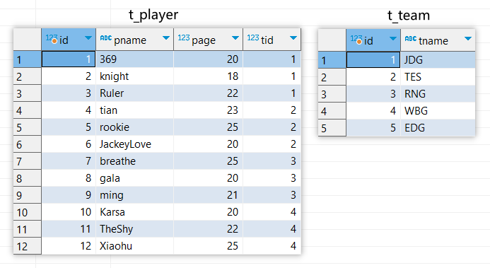

## 一、概述

　　MyBatis是一个开源、轻量级的数据持久化框架，是 JDBC 和 Hibernate 的替代方案。MyBatis 内部封装了 JDBC，简化了加载驱动、创建连接、创建 statement 等繁杂的过程，开发者只需要关注 SQL 语句本身。MyBatis 支持定制化 SQL、存储过程以及高级映射，可以在实体类和 SQL 语句之间建立映射关系，是一种半自动化的 ORM 实现。

　　MyBatis 的主要思想是将程序中的大量 SQL 语句剥离出来，使用 XML 文件或注解的方式实现 SQL 的灵活配置，将 SQL 语句与程序代码分离，在不修改程序代码的情况下，直接在配置文件中修改 SQL 语句。

## 二、MyBatis的基本使用

### 第一个MyBatis程序

　　创建一个简单的MyBatis程序：

　　1、添加MyBatis依赖、JDBC驱动依赖、JDBC连接池依赖

```xml
<!-- JDK8 -->
<dependency>
    <groupId>org.mybatis</groupId>
    <artifactId>mybatis</artifactId>
    <version>3.5.9</version>
</dependency>
<dependency>
    <groupId>mysql</groupId>
    <artifactId>mysql-connector-java</artifactId>
    <version>5.1.49</version>
    <scope>runtime</scope>
</dependency>
<dependency>
    <groupId>com.zaxxer</groupId>
    <artifactId>HikariCP</artifactId>
    <version>2.7.1</version>
</dependency>
```

　　2、在项目类路径下创建MyBatis的配置文件`mybatis-config.xml`，在配置文件中对MyBatis的运行参数进行配置

```xml
<?xml version="1.0" encoding="UTF-8" ?>
<!DOCTYPE configuration
        PUBLIC "-//mybatis.org//DTD Config 3.0//EN"
        "http://mybatis.org/dtd/mybatis-3-config.dtd">
<configuration>
    <environments default="development"> <!--配置mybatis运行环境-->
        <environment id="development">
            <transactionManager type="JDBC"/> <!--使用JDBC的事务管理-->
            <dataSource type="POOLED"> <!--配置数据源-->
                <property name="driver" value="com.mysql.jdbc.Driver"/>
                <property name="url" value="jdbc:mysql://192.168.220.128:3306/test?useSSL=false&amp;characterEncoding=utf8&amp;serverTimezone=Asia/Shanghai"/>
                <property name="username" value="root"/>
                <property name="password" value="123456"/>
            </dataSource>
        </environment>
    </environments>
    <mappers>
        <mapper resource="StudentMapper.xml"/> <!--添加映射文件-->
    </mappers>
</configuration>
```

　　3、创建MyBatis的映射接口

```java
public interface StudentMapper {
    Student selectStudentById(Integer id);
}
```

　　4、在类路径下为映射接口创建对应的映射文件`StudentMapper.xml`，在映射文件中定义了要执行的SQL

```xml
<?xml version="1.0" encoding="UTF-8" ?>
<!DOCTYPE mapper
        PUBLIC "-//mybatis.org//DTD Mapper 3.0//EN"
        "http://mybatis.org/dtd/mybatis-3-mapper.dtd">

<!-- namespace是映射接口的全限定名，SQL语句的id是对应的方法名 -->
<mapper namespace="com.zyg.dao.StudentMapper">
    <select id="selectStudentById" resultType="com.zyg.bean.Student">
        SELECT id,name,age FROM t_student WHERE id = #{id}
    </select>
</mapper>
```

　　5、在main方法中通过MyBatis执行SQL语句

```java
public static void main(String[] args) throws Exception {
    // 1、读取MyBatis配置文件
    InputStream inputStream = Resources.getResourceAsStream("mybatis-config.xml");
    // 2、获取SqlSessionFactory
    SqlSessionFactory sqlSessionFactory = new SqlSessionFactoryBuilder().build(inputStream);
    // 3、获取SqlSession，SqlSession用完后要及时关闭
    try(SqlSession sqlSession = sqlSessionFactory.openSession()) {
        // 4、创建StudentMapper接口的代理对象
        StudentMapper mapper = sqlSession.getMapper(StudentMapper.class);
        // 5、通过代理对象执行SQL
        Student student = mapper.selectStudentById(1);
    }
}
```

> warning "提醒"
>
> MyBatis默认是关闭数据库自动提交事务的，所以在执行完修改操作后，必须调用`SqlSession`对象的`commit()`方法来手动提交事务，否则修改不会生效。也可以通过`openSession(true)`开启自动提交事务。

### MyBatis中的重要对象

　　Mybatis程序执行过程中，一些重要对象的作用域和生命周期如下：

| 对象类型                   | 对象的作用                      | 作用域和生命周期                                     |
| -------------------------- | ------------------------------- | ---------------------------------------------------- |
| `SqlSessionFactoryBuilder` | 用来创建`SqlSessionFactory`对象 | 作用域是方法内部，方法结束后就可以销毁了             |
| `SqlSessionFactory`        | 用来获取`SqlSession`对象        | 作用域是应用全局，因为可能要多次获取`SqlSession`对象 |
| `SqlSession`               | 用来获取映射接口的代理对象      | 作用域是线程内部，因为`SqlSession`是线程不安全的     |
| 映射接口的代理对象         | 用来执行SQL                     | 作用域一般是方法内部                                 |

### 使用注解代替SQL标签

　　可以在映射接口的方法上使用注解，来代替映射文件中的SQL标签：

```java
public interface StudentMapper {
    @Select("select id,name,age from t_student where id = #{id}")
    Student selectStudentById(int id);
}
```

## 三、MyBatis配置文件

### 配置文件的结构

　　MyBatis配置文件的结构如下：

```xml
<?xml version="1.0" encoding="utf-8"?>
<!DOCTYPE configuration PUBLIC "-//mybatis.org//DTD Config 3.0//EN"
"http://mybatis.org/dtd/mybatis-3-config.dtd">

<configuration><!-- 配置 -->
    <properties /><!-- 属性 -->
    <settings /><!-- 设置 -->
    <typeAliases /><!-- 类型别名 -->
    <typeHandlers /><!-- 类型处理器 -->
    <objectFactory /><!-- 对象工厂 -->
    <plugins /><!-- 插件 -->
    <environments><!-- 环境配置 -->
        <environment><!-- 环境变量 -->
            <transactionManager /><!-- 事务管理器 -->
            <dataSource /><!-- 数据源 -->
        </environment>
    </environments>
    <databaseIdProvider /><!-- 数据库厂商标识 -->
    <mappers /><!-- 映射器 -->
</configuration>
```

　　下面介绍几个比较重要的配置。

### \<settings>标签

　　这是 MyBatis 中极为重要的调整设置，它们会改变 MyBatis 的运行时行为，**比如开启缓存、开启延时加载、设置数据库响应超时时间等等**。一个配置完整的 settings 元素的示例如下：

```xml
<settings>
  <setting name="cacheEnabled" value="true"/> <!--全局性地开启或关闭所有映射器配置文件中已配置的任何缓存-->
  <setting name="lazyLoadingEnabled" value="true"/> <!--延迟加载的全局开关。当开启时，所有关联对象都会延迟加载。 特定关联关系中可通过设置 fetchType 属性来覆盖该项的开关状态-->
  <setting name="multipleResultSetsEnabled" value="true"/> <!--开启时，任一方法的调用都会加载该对象的所有延迟加载属性。 否则，每个延迟加载属性会按需加载-->
  <setting name="useColumnLabel" value="true"/> 
  <setting name="useGeneratedKeys" value="false"/> 
  <setting name="autoMappingBehavior" value="PARTIAL"/> <!--指定 MyBatis 应如何自动映射列到字段或属性。 NONE 表示关闭自动映射；PARTIAL 只会自动映射没有定义嵌套结果映射的字段。 FULL 会自动映射任何复杂的结果集（无论是否嵌套）-->
  <setting name="autoMappingUnknownColumnBehavior" value="WARNING"/> 
  <setting name="defaultExecutorType" value="SIMPLE"/> <!--配置默认的执行器。SIMPLE 就是普通的执行器；REUSE 执行器会重用预处理语句（PreparedStatement）； BATCH 执行器不仅重用语句还会执行批量更新-->
  <setting name="defaultStatementTimeout" value="25"/> <!--设置超时时间，它决定数据库驱动等待数据库响应的秒数-->
  <setting name="defaultFetchSize" value="100"/> 
  <setting name="safeRowBoundsEnabled" value="false"/> 
  <setting name="mapUnderscoreToCamelCase" value="false"/> <!--是否开启驼峰命名自动映射，即从经典数据库列名 A_COLUMN 映射到经典 Java 属性名 aColumn-->
  <setting name="localCacheScope" value="SESSION"/>
  <setting name="jdbcTypeForNull" value="OTHER"/> 
  <setting name="lazyLoadTriggerMethods" value="equals,clone,hashCode,toString"/> 
</settings>
```

### \<environments>标签

　　MyBatis 可以配置成适应多种环境，这种机制有助于将 SQL 映射应用于多种数据库之中，例如，开发、测试和生产环境需要有不同的配置。environments 元素定义了如何配置环境：

```xml
<!-- 默认使用dev环境的配置 -->
<environments default="dev">
    <environment id="dev">
        <transactionManager type="JDBC"/>
        <dataSource type="POOLED">
            <property name="driver" value="com.mysql.jdbc.Driver"/>
            <property name="url" value="jdbc:mysql://192.168.220.128:3306/test?useSSL=false&amp;characterEncoding=utf8&amp;serverTimezone=Asia/Shanghai"/>
            <property name="username" value="root"/>
            <property name="password" value="123456"/>
        </dataSource>
    </environment>
    <environment id="prod">
        <transactionManager type="JDBC"/>
        <dataSource type="POOLED">
            <property name="driver" value="com.mysql.jdbc.Driver"/>
            <property name="url" value="jdbc:mysql://192.168.220.128:3306/test1?useSSL=false&amp;characterEncoding=utf8&amp;serverTimezone=Asia/Shanghai"/>
            <property name="username" value="root"/>
            <property name="password" value="123456"/>
        </dataSource>
    </environment>
</environments>
```

　　这样，在创建`SqlSessionFactory`对象时就可以指定使用哪个环境的配置：

```java
// 使用prod环境的配置
SqlSessionFactory sqlSessionFactory = new SqlSessionFactoryBuilder().build(inputStream, "prod");
```

### \<transactionManager>标签

　　transactionManager 元素位于 environment 元素内部，它用来配置数据库事务管理器。在 MyBatis 中有两种类型的事务管理器：JDBC和MANAGED。JDBC类型直接使用了 JDBC 的提交和回滚功能，MANAGED类型从不提交或回滚一个连接，而是让容器来管理事务的整个生命周期，默认情况下它会关闭连接。**如果你正在使用 Spring + MyBatis，则没有必要配置事务管理器，因为 Spring 模块会使用自带的管理器来覆盖前面的配置**。

### \<dataSource>标签

* #### MyBatis自带数据源

　　dataSource 元素使用标准的 JDBC 数据源接口来配置 JDBC 连接对象的资源。MyBatis自带三种数据源：

　　1、**UNPOOLED**：这个数据源不使用数据库连接池，每次请求时都会打开和关闭连接，性能比较低。它对应的数据源是`org.apache.ibatis.datasource.unpooled.UnpooledDataSource`，UNPOOLED是它的缩写。

　　2、**POOLED**：这种数据源的实现利用“池”的概念将 JDBC 连接对象组织起来，避免了创建新的连接实例时所必需的初始化和认证时间。它对应的数据源是`org.apache.ibatis.datasource.pooled.PooledDataSource`，POOLED是它的缩写。

　　3、**JNDI**：这个数据源实现是为了能在如 EJB 或应用服务器这类容器中使用，容器可以集中或在外部配置数据源，然后放置一个 JNDI 上下文的数据源引用。

　　使用UNPOOLED数据源：

```xml
<environment id="prod">
    <!-- 使用org.apache.ibatis.datasource.unpooled.UnpooledDataSource数据源 -->
    <dataSource type="UNPOOLED">
        <!-- 数据源的属性 -->
        <property name="driver" value="com.mysql.jdbc.Driver"/>
        <property name="url" value="jdbc:mysql://192.168.220.128:3306/test1?useSSL=false&amp;characterEncoding=utf8&amp;serverTimezone=Asia/Shanghai"/>
        <property name="username" value="root"/>
        <property name="password" value="123456"/>
    </dataSource>
</environment>
```

* #### 第三方数据源

　　以HikariCP数据源为例，配置第三方数据源的步骤如下：

　　1、自定义一个`HikariCPPooledDataSourceFactory`类，继承`PooledDataSourceFactory`类，在其构造方法中创建HikariCP数据源，并赋值给`this.dataSource`

```java
public class HikariCPPooledDataSourceFactory extends PooledDataSourceFactory {
    public HikariCPPooledDataSourceFactory() {
        HikariConfig hikariConfig = new HikariConfig();
        hikariConfig.setDriverClassName("com.mysql.jdbc.Driver");
        hikariConfig.setJdbcUrl("jdbc:mysql://192.168.220.128:3306/test?useSSL=false&characterEncoding=utf8&serverTimezone=Asia/Shanghai");
        hikariConfig.setUsername("root");
        hikariConfig.setPassword("123456");
        this.dataSource = new HikariDataSource(hikariConfig);
    }
}
```

　　2、在dataSource元素中使用`HikariCPPooledDataSourceFactory`的全限定名代替`POOLED`

```xml
<environment id="prod">
    <!-- 使用自定义的HikariDataSource数据源 -->
    <dataSource type="com.zyg.HikariCPPooledDataSourceFactory">
    </dataSource>
</environment>
```

### \<mappers>标签

　　mappers 元素用来告诉MyBatis在哪可以找到映射接口或者xml映射文件。

　　1、配置xml映射文件的位置和名称：

```xml
<mappers>
    <!-- 映射文件是类路径下的StudentMapper.xml -->
    <mapper resource="StudentMapper.xml"/>
</mappers>
```

　　2、配置映射接口的全限定名：

```xml
<mappers>
    <!-- 映射接口是com.zyg.dao.StudentMapper -->
    <mapper class="com.zyg.dao.StudentMapper"/>
</mappers>
```

　　此时如果在映射接口中的方法上声明了SQL，就不需要xml映射文件了。

　　3、配置映射接口所在的目录，该目录下的所有接口都会被注册为映射接口

```xml
<mappers>
    <!-- com.zyg.dao目录下的所有接口都会被注册为映射接口 -->
    <package name="com.zyg.dao"/>
</mappers>
```

## 四、MyBatis映射文件

### 基本结构

　　MyBatis映射文件的基本结构如下：

```xml
<?xml version="1.0" encoding="UTF-8" ?>
<!DOCTYPE mapper
        PUBLIC "-//mybatis.org//DTD Mapper 3.0//EN"
        "http://mybatis.org/dtd/mybatis-3-mapper.dtd">

<!-- 每个映射文件都对应一个映射接口 -->
<mapper namespace="com.zyg.dao.StudentMapper">
    <!-- 每个SQL元素都对应一个映射接口中的方法，Java代码通过调用接口方法就可以执行下面的SQL语句 -->
    <select id="selectStudentById" resultType="com.zyg.bean.Student">
        SELECT id,name,age FROM t_student WHERE id = #{id}
    </select>
    ...
</mapper>
```

### SQL标签的基本属性

　　常见的SQL标签有四种：`<select>`、`<insert>`、`<update>`、`<delete>`，分别对应着查询、插入、更新、删除语句。

* #### \<select>标签

　　`<select>`标签中的常用属性有：

```xml
<select id="selectStudentById" resultType="com.zyg.bean.Student" resultMap="studentMap"
        useCache="true" flushCache="false" timeout="10">
    SELECT id,name,age FROM t_student WHERE id = #{id}
</select>
```

　　1、`id`属性：SQL标签的唯一标识，必须和映射接口中对应的方法名相同。

　　2、`resultType`属性：SQL语句的返回值类型，包括基本类型、String类型、引用类型、List类型、Map类型，其中只有List类型包含了多条查询结果，其它类型只能返回一条结果。这四种类型对应的属性值如下：

```xml
<!-- 返回int类型 -->
<select id="selectId" resultType="java.lang.Integer">
    SELECT id FROM t_student WHERE name = #{name}
</select>

<!-- 返回String类型 -->
<select id="selectName" resultType="java.lang.String">
    SELECT name FROM t_student WHERE id = #{id}
</select>

<!-- 返回引用类型Student -->
<select id="selectName" resultType="com.zyg.bean.Student">
    SELECT id, name, age FROM t_student WHERE id = #{id}
</select>

<!-- 返回List<Student>类型 -->
<select id="selectName" resultType="com.zyg.bean.Student">
    SELECT id, name, age FROM t_student
</select>

<!-- 返回Map<String, Object>类型，Map的key是字段名，value是字段值 -->
<select id="selectAllStudentInMap" resultType="map">
    SELECT id, name, age FROM t_student WHERE id = #{id}
</select>
```

　　3、`resultMap`属性：结果映射，它是 MyBatis 最强大的特性，如果你对其理解透彻，许多复杂的映射问题都能迎刃而解。 resultType 和 resultMap 之间只能同时使用一个。后面会对resultMap进行详细介绍。

　　4、`useCache`属性：设置是否使用MyBatis二级缓存保存每次查询结果。

　　5、`flushCache`属性：设置是否在每次查询时清除MyBatis一级、二级缓存。

　　6、`timeout`属性：在没有发生异常时，等待数据库返回结果的最长时间，单位是秒。

* #### \<insert>标签

　　`<insert>`标签中的常用属性有：

```xml
<insert id="insertStudent" flushCache="false" timeout="10" 
        useGeneratedKeys="true" keyColumn="id" keyProperty="id">
    INSERT INTO t_student (name, age) VALUES (#{name}, #{age})
</insert>
```

　　1、`id`、`flushCache`、`timeout`属性：和在`<select>`标签中的作用一样，因为修改操作只会返回修改的条数，所以没有resultType、resultMap、useCache属性。

　　2、`useGeneratedKeys`属性：设置是否返回数据库表自动生成的字段值，一般都是自增主键。

　　3、`keyColumn`属性：需要返回的自增主键在数据库表中的字段名。

　　4、`keyProperty`属性：接收返回的自增主键值的对象的字段名，一般这个对象由SQL参数传入，当查询返回后，MyBatis会字段把自增主键值注入该对象。例如：

```java
// 查询前对象的id是默认值0
Student student = new Student("赵六", 30);
Integer n = mapper.insertStudent(student);
// 查询后对象的id就变成了数据库自动生成的id值
int id = student.getId();
```

* #### \<update>标签

　　`<update>`标签中的常用属性有：

```xml
<update id="updateStudent" flushCache="false" timeout="10">
    UPDATE t_student SET name = #{name}, age = #{age} WHERE id = #{id}
</update>
```

　　1、`id`、`flushCache`、`timeout`属性：和在`<select>`标签中的作用一样，因为修改操作只会返回修改的条数，所以没有resultType、resultMap、useCache属性。

* #### \<delete>标签

　　`<delete>`标签中的常用属性有：

```xml
<delete id="deleteStudentById" flushCache="false" timeout="10">
    DELETE FROM t_student WHERE id = #{id}
</delete>
```

　　1、`id`、`flushCache`、`timeout`属性：和在`<select>`标签中的作用一样，因为修改操作只会返回修改的条数，所以没有resultType、resultMap、useCache属性。

* #### #{}和${}

　　当使用`#{}`向SQL中传入参数时，MyBatis会使用`PreparedStatement `来防止SQL注入，而使用`${}`传入参数时，不能防止SQL注入。

* #### \<sql>标签

　　`<sql>`元素可以用来定义可重用的 SQL 代码片段，以便在其它语句中使用：

```xml
<sql id="studentColumns">
    select id,name,age from t_student where id = #{id}
</sql>
 
<select id="selectStudentById" resultType="Student">
    <include refid="studentColumns"/>
</select>
```

### \<resultMap>标签

　　`resultMap`属性是`<select>`标签中的一个属性，用来定义SQL返回值的类型，并将数据库返回结果和Java对象属性进行映射。

* #### 简单映射

　　当SQL查询结果中的字段名和Java对象的字段名不一致时，可以使用`<resultMap>`进行映射。

```xml
<select id="selectPersonById" resultMap="personMap">
    SELECT pid, pname, page FROM t_person WHERE pid = #{id}
</select>

<resultMap id="personMap" type="com.zyg.bean.Person">
    <!-- property是Java对象中的字段名，column是SQL查询结果中的字段名 -->
    <id property="id" column="pid"/>
    <result property="name" column="pname"/>
    <result property="age" column="page"/>
</resultMap>
```

> info "提示"
>
> `<resultMap>`标签中包含`<id>`和`<result>`两种元素，它们的唯一区别是，`<id>`元素对应的属性会被标记为对象的标识符，在比较对象实例时使用。 这样可以提高整体的性能。

* #### 一对一关联映射

　　一对一关联指的是查询A表中的一条数据，这条数据又和B表中的一条数据存在关联。假设有两张表t_player和t_team，t_player中存放的是选手的基本信息，包括id、name、age、tid，其中tid是该选手所属队伍的id，t_team中存放的是队伍的基本信息，包括id、name。两张表中的数据如下图所示：



　　举一个一对一关联查询的例子：查询369选手的基本信息和所属队伍信息，查询SQL如下：

```sql
SELECT
	p.id,
	p.pname,
	p.page,
	t.id,
	t.tname
FROM
	t_player p
INNER JOIN t_team t
ON
	p.tid = t.id
WHERE p.pname = '369';
```

　　两张表对应的JavaBean分别是：

```java
public class Player {
    private Integer id;
    private String name;
    private Integer age;
    private Team team;
    // 省略getter、setter方法
}

public class Team {
    private Integer id;
    private String name;
    // 省略getter、setter方法
}
```

　　MyBatis映射文件的写法是：

```xml
<select id="selectPlayerByName" resultMap="playerMap">
    SELECT
        p.id,
        p.pname,
        p.page,
        t.id AS tid,
        t.tname
    FROM
        t_player p
    INNER JOIN t_team t ON
        p.tid = t.id
    WHERE p.pname = #{name}
</select>

<resultMap id="playerMap" type="com.zyg.bean.Player">
    <id property="id" column="id"/>
    <result property="name" column="pname"/>
    <result property="age" column="page"/>
    <!-- 注意这里是<association>标签，javaType表示JavaBean中字段的类型 -->
    <association property="team" javaType="com.zyg.bean.Team">
        <id property="id" column="tid"/>
        <result property="name" column="tname"/>
    </association>
</resultMap>
```

* #### 多对一关联映射

　　多对一关联指的是查询A表中的多条数据，每条数据又各自与B表中的一条数据存在关联。多对一关联其实是在一对一关联的基础上，查询多条数据，二者本质上是一样的。

　　举一个多对一关联查询的例子：查询369、tian、Karsa三位选手的基本信息和所属队伍信息，查询SQL如下：

```sql
SELECT
	p.id,
	p.pname,
	p.page,
	t.id,
	t.tname
FROM
	t_player p
INNER JOIN t_team t
ON
	p.tid = t.id
WHERE
	p.pname IN ('369', 'tian', 'Karsa');
```

　　MyBatis映射文件的写法和一对一关联映射中的写法一样，只是需要把方法返回值类型换成`List<Player>`。

* #### 一对多关联映射

　　一对多关联指的是查询A表中的一条数据，这条数据和B表中的多条数据存在关联。

　　举一个一对多关联的例子：查询JDG战队的基本信息和它的所有选手的信息，查询SQL如下：

```sql
SELECT
	t.id,
	t.tname,
	p.id AS pid,
	p.pname,
	p.page
FROM
	t_team t
LEFT JOIN t_player p
ON
	t.id = p.tid
WHERE
	t.tname = 'JDG';
```

　　两张表对应的JavaBean分别是：

```java
public class Player {
    private Integer id;
    private String name;
    private Integer age;
    // 省略getter、setter方法
}

public class Team {
    private Integer id;
    private String name;
    private List<Player> players;
    // 省略getter、setter方法
}
```

　　MyBatis映射文件的写法是：

```xml
<select id="selectTeamByName" resultMap="teamMap">
    SELECT
        t.id,
        t.tname,
        p.id AS pid,
        p.pname,
        p.page
    FROM
        t_team t
    LEFT JOIN t_player p
    ON
        t.id = p.tid
    WHERE
        t.tname = 'JDG';
</select>

<resultMap id="teamMap" type="com.zyg.bean.Team">
    <id property="id" column="id"/>
    <result property="name" column="tname"/>
    <!-- 注意这里是<collection>标签，ofType表示集合中的元素类型 -->
    <collection property="players" ofType="com.zyg.bean.Player">
        <id property="id" column="pid"/>
        <result property="name" column="pname"/>
        <result property="age" column="page"/>
    </collection>
</resultMap>
```

* #### 多对多关联映射

　　多对多关联映射指的是查询A表中的多条数据时，每条数据又各自和B表中的多条数据关联。多对多关联其实是在一对多关联的基础上，查询多条数据，二者本质上是一样的。

　　举一个多对多关联的例子：查询JDG、RNG、WBG三个战队的基本信息和它们的所有选手的信息，查询SQL如下：

```sql
SELECT
	t.id,
	t.tname,
	p.id AS pid,
	p.pname,
	p.page
FROM
	t_team t
LEFT JOIN t_player p
ON
	t.id = p.tid
WHERE
	t.tname IN ('JDG', 'RNG', 'WBG');
```

　　MyBatis映射文件的写法和一对多关联映射中的写法一样，只是需要把方法返回值类型换成`List<Team>`。

* #### 关联查询在映射文件中的写法

　　在SQL语法中，我们一般使用`left join`、`inner join`等来实现关联查询，而在MyBatis映射文件中还可以这么写：

　　多对多关联映射：查询JDG、RNG、WBG三个战队的基本信息和它们的所有选手的信息。

　　SQL：

```sql
SELECT
	t.id,
	t.tname,
	p.id AS pid,
	p.pname,
	p.page
FROM
	t_team t
LEFT JOIN t_player p
ON
	t.id = p.tid
WHERE
	t.tname IN ('JDG', 'RNG', 'WBG');
```

　　MyBatis映射文件的写法：

```xml
<select id="selectTeamsByNames" resultMap="teamMap">
    SELECT id, tname FROM t_team
    WHERE tname IN
    <foreach collection="list" item="name" open="(" close=")" separator=",">
        #{name}
    </foreach>
</select>

<resultMap id="teamMap" type="com.zyg.bean.Team">
    <id property="id" column="id"/>
    <result property="name" column="tname"/>
    <!-- 用查询出来的结果作为参数，去另一个SQL中进行查询 -->
    <collection property="players" ofType="com.zyg.bean.Player"
                column="id" select="selectPlayersByTid"/>
</resultMap>

<select id="selectPlayersByTid" resultMap="playerMap">
    SELECT id, pname, page FROM t_player
    WHERE tid = #{id}
</select>

<resultMap id="playerMap" type="com.zyg.bean.Player">
    <id property="id" column="id"/>
    <result property="name" column="pname"/>
    <result property="age" column="page"/>
</resultMap>
```

### 延迟加载

* #### 概述

　　MyBatis中的延迟加载，也称为懒加载，是指在进行表的关联查询时，按照设置延迟规则推迟对关联对象的select查询。例如在进行一对多查询的时候，只查询出一方，当程序中需要多方的数据时，mybatis再发出sql语句进行查询，这样子延迟加载就可以的减少数据库压力。MyBatis 的延迟加载只是对关联对象的查询有迟延设置，对于主加载对象都是直接执行查询语句的。

　　**注意，延时加载针对的是MyBatis映射文件中关联查询的特殊写法，关联表必须通过`<association select=""\>  `或`<collection select=""\>`来进行查询，延迟加载才会生效，对于SQL语法`left join`、`inner join`等，延迟加载是不生效的。**

* #### 分类

　　MyBatis根据对关联对象查询的select语句的执行时机，分为三种类型：**直接加载、侵入式延迟加载与深度延迟加载**。

　　**直接加载**：执行完对主加载对象的 select 语句，马上执行对关联对象的 select 查询。

　　**侵入式延迟加载**： 执行对主加载对象的查询时，不会执行对关联对象的查询。但当要访问主加载对象的任意属性时，就会马上执行关联对象的select查询。

　　**深度延迟加载**： 执行对主加载对象的查询时，不会执行对关联对象的查询。访问主加载对象的详情时也不会执行关联对象的select查询。只有当真正访问关联对象的详情时，才会执行对关联对象的 select 查询。

　　延迟加载的开关位于mybatis-config.xml文件中的`<setting>`元素：

```xml
<settings>
    <!--延迟加载总开关-->
    <setting name="lazyLoadingEnabled" value="true"/>
    <!--true代表开启侵入式延迟加载，false代表开启深度延迟加载-->
    <setting name="aggressiveLazyLoading" value="true"/>
</settings>
```

