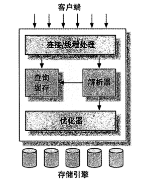
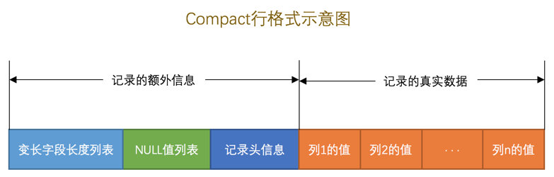
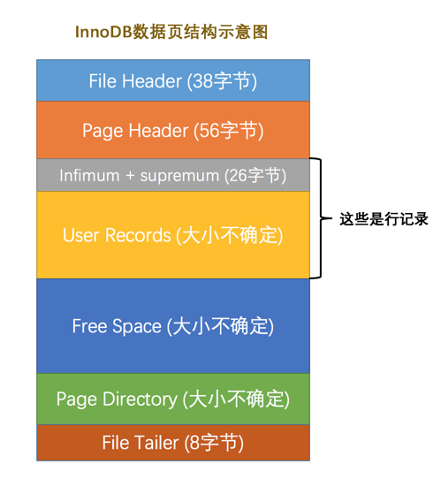
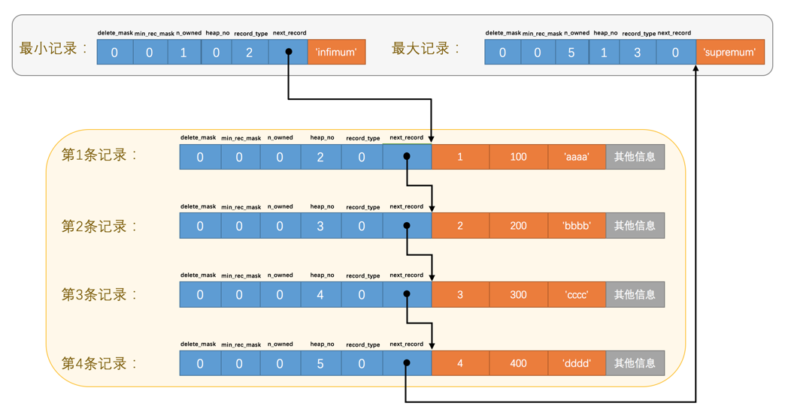
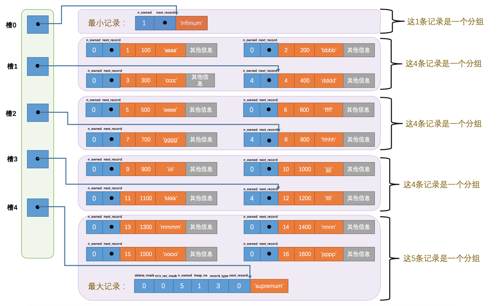
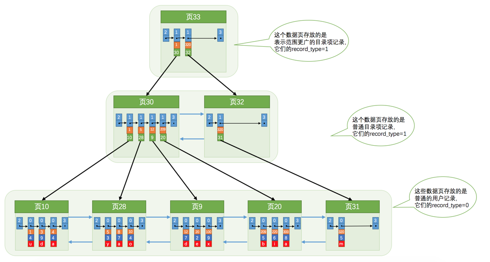

## 一、MySQL概述

### 逻辑架构

　　MySQL的逻辑架构如下图所示：



　　第一层架构包括`连接/线程处理`，主要功能是连接处理、授权认证、安全等。

　　第二层架构包括`查询缓存`、`解析器`、`优化器`，大多数MySQL的核心功能都在这一层，包括查询解析、分析优化、缓存以及所有的内置函数，所有跨存储引擎的功能都在这一层实现：存储过程、触发器、视图等。

　　第三层架构包括`存储引擎`，存储引擎负责MySQL中数据的存储和提取。MySQL服务器通过API和存储引擎通信，这些接口屏蔽了不同存储引擎之间的差异，使得这些差异对上层的查询过程透明。不同的存储引擎之间不会互相通信，而只是简单地响应上层服务器的请求。

### 并发控制

* #### 读写锁

　　在处理并发读或并发写时，可以通过实现一个由两种数据类型的锁组成的锁系统来解决问题，这两种类型的锁通常被称为**共享锁(shared lock)**和**排他锁(exclusive lock)**，也叫**读锁(read lock)**和**写锁(write lock)**。

　　读写锁的特点是：**多个线程可以同时读取，但不可以读取时写入，也不可以写入时读取、写入时写入。**

* #### 锁粒度

　　在给定的资源上，锁定的数据量越少，系统的并发程度越高，因此要尽量只锁定需要修改的数据，而不是所有资源，从而在锁的开销和数据的安全性之间达到平衡。

　　MySQL提供了多种锁策略，其中**表锁(table lock)**和**行级锁(row lock)**是最重要的两个策略。表锁指的是使用读写锁锁定整张表，它是MySQL中最基本的锁策略，并且是开销最小的锁策略。而行级锁指的是使用读写锁锁定一行，行级锁的并发程度最高，但锁开销也最大。

> info "提示"
>
> 表锁在MySQL服务器层和存储引擎层都可以实现，而行级锁只在存储引擎层实现。

* #### 数据库事务

　　数据库事务指的是一组原子性的SQL，事务内的SQL要么全部执行成功，要么全部执行失败。一个运行良好的事务处理系统，必须有以下四个特性(**ACID特性**)：

　　**1、原子性(atomicity)**：事务中的操作要么全部成功提交，要么全部失败回滚。

　　**2、一致性(consistency)**：数据库总是从一个一致性的状态转换到另一个一致性的状态。

　　**3、隔离性(isolation)**：通常来说，一个事务在提交之前，它对数据库的修改对其它事务是不可见的。事务不同的隔离级别会影响它的隔离性。

　　**4、持久性(durability)**：一旦事务提交，它所做的修改就会永久保存到数据库中。

　　事务的ACID特性可以保证银行不会弄丢你的钱，一个兼容ACID的数据库系统，需要做很多复杂但可能用户并没有察觉到的工作，才能确保ACID的实现。

* #### 隔离级别

　　数据库事务的隔离级别指的是，不同事务之间的数据共享程度。**隔离级别越低，系统的并发程度越高，开销也越低，但是数据安全性也越低。**MySQL数据库的四种隔离级别，按照从低到高的顺序如下：

　　**1、READ UNCOMMITED(未提交读)**：一个事务中还没有提交的修改，在另一个事务中是可见的。这会导致**脏读**的出现，即读取到还没有提交的数据。一般这种隔离级别很少使用。

　　**2、READ COMMITED(提交读)**：一个事务中只有提交后的修改，在另一个事务中才是可见的。提交读不会出现脏读，但是会导致**不可重复读**，即在一个事务中进行两次读取，如果有另一个事务在这两次读取之间修改并提交了数据，会导致一个事务中的两次读取结果不一致。这种隔离级别是很多数据库的默认隔离级别，比如Oracle，但MySQL不是。

　　**3、REPEATABLE READ(可重复读)**：一个事务中即使是提交后的修改，更准确地说是更新(UPDATE)操作，在另一个事务中也是不可见的。这种隔离级别解决了不可重复读的问题，但是可能会出现**幻读**的问题。幻读指的是一个事务中提交后的插入、删除，在另一个事务中仍然是可见的。**MySQL的InnoDB引擎通过多版本并发控制(MVCC，Multiversion Concurrency Control)解决了幻读的问题。**可重复读是**MySQL数据库的默认隔离级别**。

　　**4、SERIALIZABLE(串行化)**：这是最高的隔离级别，它通过强制事务串行执行，避免了幻读的问题。这种隔离级别很少使用。

> info "提示"
>
> 可以认为MVCC是行级锁的一个变种，但是它在很多情况下避免了加锁操作，因此开销更低，虽然实现机制有所不同，但大都实现了非阻塞的读操作，写操作也只锁定必要的行。

### InnoDB存储引擎简介

　　InnoDB是MySQL的默认事务型存储引擎，也是最重要、使用最广泛的存储引擎。它被设计用来处理大量的短期事务，短期事务大部分情况下是正常提交的，很少会被回滚。InnoDB的性能和自动崩溃恢复特性，使得它在非事务型存储的需求中也很流行。除非有非常特别的原因需要使用其它的存储引擎，否则应该优先考虑InnoDB引擎。

## 二、InnoDB引擎的数据结构

### 数据页简介

　　InnoDB引擎读取磁盘上的数据时，是以数据页为基本单位进行读取的，每个数据页的大小为16KB左右。

### 行格式

　　每个数据页中有若干行，每一行对应着表中的一条记录。目前有四种行格式，分别是Compact、Redundant、Dynamic、Compressed。以Compact为例，它的行格式是：



　　**1、变长字段长度列表**：存放着该行中变长类型字段的每一列实际占用的字节数。

　　**2、NULL值列表**：标记了该行中哪些列的值是NULL，每一列占用一个bit位。

　　**3、记录头信息**：包含了该行的一些描述信息，主要的一些信息如下表所示：

| 名称          | 作用                                                         |
| ------------- | ------------------------------------------------------------ |
| `delete mask` | 标记该行是否被删除                                           |
| `record_type` | 表示当前记录的类型， 0 表示普通记录(用户行记录)， 1 表示B+树非叶子节点记录， 2 表示最小记录， 3 表示最大记录 |
| `next_record` | 表示下一条记录的相对位置                                     |

### 数据页格式

　　一个数据页的结构如下图所示：



　　**1、Page Header**：存放着页号、上一页的页号、下一页的页号以及其它信息。如果一个表特别大，那么表中的行记录可能分布在多个页中，此时就需要把这些页关联起来，上一页的页号和下一页的页号的作用就是进行关联。**因此，页与页之间构成了双向链表。**

　　**2、Infimum +Supremum**： `Infimum`和`Supremum`分别是最小行记录和最大行记录，它们不存储真实数据，而只是作为标记使用，表中的真实数据存放在`User Records`(用户行记录)中。数据页中的行记录以`Infimum`为头部、`Supremum`为尾部、`User Records`为中间，构成了一个单向链表，**其中`User Records`是按照主键大小升序排列的**，如下图所示：



　　**3、Page Driectory**：为了提高数据页中行记录的查询效率，将行记录分成了多个小组，每个小组内的记录数不超过8条。将每个小组中最后一条记录的地址偏移量单独拿出来，组成`Page Driectory`(页目录)，偏移量也叫做槽，因此每个页目录都是由一组槽构成的。如下图所示：



　　这样在查询行记录时，就可以先使用二分法找到对应的槽，然后找到对应的分组，最后遍历分组中的行记录即可，大大提高了查询效率。

### B+树索引

* #### B+树索引原理

　　当一个表很大时，它的行记录会分布在很多个页中，为了能够快速定位到目标页，将每一页中最小的主键和该页的页号拿出来，放到一个新的页中，这种页叫做索引页，而存放用户行记录的页叫做数据页。索引页中的行记录只存放着对应页的页号和最小主键。当表特别大时，会生成多个索引页，当索引页非常多时，遍历它们的效率会变得很低，此时要为这些索引页生成新的索引页，新的索引页中存放的是旧索引页的页号以及页中最小的主键。

　　以上就是B+树索引的原理，如下图所示：



　　假设每个数据页中可以存放100条记录，每个索引页中可以存放1000条记录，那么一个4层的B+树索引能够存放`10^11`条记录，远超一个表中的最大记录数，因此B+树索引的层数一般不会超过4层，查询一条记录最多只需要查询4个页面，即3个索引页和1个数据页，在数据页内部还可以通过`Page Directory`来快速定位。

* #### 聚簇索引

　　聚簇索引的特点是：

　　1、记录和页使用主键排序；

　　2、B+树的非叶子节点存放的是下层的页号和页中最小的主键；

　　3、B+树的叶子节点存放的是完整的用户记录。

* #### 二级索引

　　可以给非主键列建立二级索引，二级索引的特点是：

　　1、记录和页使用非主键列排序；

　　2、B+树的非叶子节点存放的是下层的页号和页中最小的非主键列的值；

　　3、B+树的叶子节点存放的是非主键列的值和对应的主键值。

* #### 联合索引

　　还可以给多个列建立联合索引，联合索引的特点是：

　　1、记录和页使用联合索引列排序，对于`index(c1, c2, c3)`，排序规则是：优先使用`c1`排序，如果`c1`相同则使用`c2`排序，如果`c2`相同则使用`c3`排序；

　　2、B+树的非叶子节点存放的是下层的页号和页中最小的联合索引列的值；

　　3、B+树的叶子节点存放的是联合索引列的值和对应的主键值。

　　联合索引本质上也是二级索引。

## 三、索引的用法

### 索引的适用条件

* #### 全值匹配

　　如果查询条件中的字段和索引列完全一致，称为全值匹配。比如在`t_student`表中建立联合索引`index(c1, c2, c3)`，那么下面的查询就是全值匹配：

```sql
SELECT * FROM t_student WHERE c1 = 'a' AND c2 = 'b' AND c3 = 'c';
```

　　对于全值匹配来说，即使查询条件中的字段顺序和索引列不一致，也不影响使用联合索引，因为MySQL优化器会对字段重新排序。

* #### 匹配联合索引左边的列

　　对于联合索引，如果查询条件中包含了索引列左边的几个列，那么也会使用到联合索引。比如在`t_student`表中建立联合索引`index(c1, c2, c3)`，那么下面的查询也会用到联合索引：

```sql
SELECT * FROM t_student WHERE c1 = 'a' AND c2 = 'b';
```

　　在上面的SQL中，会使用`c1`、`c2`两列索引去查询记录。

* #### 匹配字符串索引前缀

　　如果索引列是字符串类型，那么在进行右模糊查询时，也可以使用到索引，因为字符串也是通过一个个字符排序的，就像是一种特殊的联合索引。比如在`t_student`表中有一列`c1`是字符串类型，为它建立索引`index(c1)`，那么下面的查询也会用到索引：

```sql
SELECT * FROM t_student WHERE c1 LIKE 'hello%';
```

* #### 匹配范围值

　　如果是单列索引，并且是范围查询时，会使用到索引，比如下面的查询：

```sql
SELECT * FROM t_student WHERE c1 > 'a' AND c1 < 's';
```

　　如果是联合索引，并且是范围查询时，查询条件中只有联合索引中最左边的一列可以使用到索引，比如下面的查询，对于`index(c1, c2)`，只有`c1`索引列能够生效：

```sql
SELECT * FROM t_student WHERE c1 > 'a' AND c1 < 's' AND c2 > 'A' AND c2 < 'S';
```

　　之所以只有最左边的索引列生效，是因为只有当最左边的索引列相同时，它右边的索引列才是有序的，否则是无序的。

* #### 精确匹配某一列并范围匹配另一列

　　如果是联合索引，并且联合索引最左边的一列是精确匹配，而它右边的一列是范围匹配，这种情况下也可以用到联合索引。比如下面的查询，对于`index(c1, c2)`，`c1`和`c2`索引列都能生效：

```sql
SELECT * FROM t_student WHERE c1 = 'hello' AND c2 > 'A' AND c2 < 'S';
```

* #### 排序

　　使用`ORDER BY`进行排序时，如果排序条件是索引列，那么也会使用索引，因为索引列本来就是有序的，所以可以极大地提高排序的效率。比如：

```sql
SELECT * FROM t_student ORDER BY c1;
```

　　如果是联合索引，在对记录进行排序时，要么排序条件和联合索引完全一致，要么和联合索引的左边几列一致，要么先精确匹配联合索引的左边几列，再对随后的几个索引列进行排序，只有在这些情况下，才会使用到索引。比如对于联合索引`index(c1, c2, c3)`，下面的查询会使用到索引：

```sql
SELECT * FROM t_student WHERE c1 = 'a' ORDER BY c2, c3;
```

* #### 分组

　　使用`GROUP BY`进行分组时，也会使用到索引，规则和排序一样。比如：

```sql
SELECT c1, c2, COUNT(*) FROM t_student GROUP BY c1, c2;
```

### 回表

* #### 什么是回表

　　对于二级索引，它的叶子节点存放的是索引列的值和对应的主键值，在进行查询时，会先从二级索引中查询出主键值，然后用主键值去聚簇索引中查询出用户记录。**用主键值去聚簇索引中查询用户记录的这个过程叫做回表。**

　　二级索引+回表查询的缺点是：

　　1、对于范围查询，在二级索引中是**顺序IO**，因为索引列都是有序的，但是在回表时很可能是**随机IO**，因为主键大概率是无序的，而随机IO的效率比顺序IO的效率低很多，所以回表的效率比较低；

　　2、需要回表的数据越多，使用二级索引的性能越低。

　　查询优化器会对SQL进行分析，如果使用二级索引+回表查询的代价大于全表扫描，就会使用全表扫描进行查询。

* #### 覆盖索引

　　为了避免回表带来的性能消耗，建议将要查询的列包含在索引列中，这样就不需要回表了，这叫做覆盖索引。

### 怎样创建索引

　　为了能够高效地利用索引进行查询，建立索引时应该尽量遵守下面的规则：

　　1、只为用于查询、排序、分组的列创建索引；

　　2、尽量为基数大(不重复值的数量)的列创建索引；

　　3、索引列的类型尽量小，因为这样一个索引页中才能容纳更多的索引列，从而减少磁盘IO的次数，而且类型越小，CPU计算的越快；

　　4、因为字符串比较长，所以当索引列是字符串类型时，尽量只将它的前几个字符作为索引；

　　5、不要在查询条件中对索引列进行四则运算、函数运算，这会导致索引失效；

　　6、插入记录时，最好让主键自增，因为如果主键是无序插入，会导致频繁的页分裂，影响性能；

　　7、不要创建多余的索引。

## 四、EXPLAIN执行计划

### 单表访问方法

　　单表查询指的是`FROM`关键字后面只有一张表的查询，这是最简单的一种查询方式。单表查询常见的访问方法包括以下几种：

　　**1、`const`：**常数级别访问。当查询条件是主键或者唯一二级索引和一个常数的等值比较时，它的访问方法就是`const`，MySQL会认为这种方式的查询效率是常数级别的。比如对于主键id，下面的查询就是`const`类型的：

```sql
SELECT * FROM t_student WHERE id = 1;
```

　　**2、`ref`：**非唯一二级索引访问。当查询条件是非唯一二级索引，并且回表的记录比较少，没有走全表扫描时，它的访问方法就是`ref`。`ref`的效率比`const`低了一些，原因是可能会匹配到多条记录。

　　**3、`ref_or_null`：**包含null值的二级索引访问。当查询条件是二级索引，并且包含了与null值的比较时，没有走全表扫描时，它的访问方法就是`ref_or_null`。

　　**4、`range`：**范围访问。当查询条件是范围匹配时，如果走了聚簇索引或者二级索引，而没有走全表扫描时，它的访问方法就是`range`。

　　**5、`index`：**只访问叶子节点。对于联合索引`index(c1, c2, c3)`，如下所示的查询的访问方法就是`index`：

```sql
SELECT c1, c2, c3 FROM t_student WHERE c2 = 'hello';
```

　　虽然`c2`不是联合索引最左边的列，无法用它遍历非叶子节点，但是因为要查询的列`c1 c2 c3`都是索引列，所以只需要遍历叶子节点然后使用`c2`进行过滤即可，也不需要回表。这种访问方法叫做`index`。

　　**6、`all`：**全表扫描。这种方法直接扫描聚簇索引，并且不会使用主键进行查询。

### 概述

　　一条查询语句在经过 MySQL 查询优化器的各种基于成本和规则的优化会后生成一个所谓的 执行计划 ，这个执行
计划展示了接下来具体执行查询的方式，比如多表连接的顺序是什么，对于每个表采用什么访问方法来具体执行
查询等等。MySQL为我们提供了 EXPLAIN 语句来帮助我们查看某个查询语句的具体执行计划，

　　比如执行下面的语句：

```sql
EXPLAIN SELECT * FROM t_student WHERE c1 = 'hello';
```

　　就会生成下面的结果：


### 执行计划中的各个列

　　一条大的查询语句里边可以包含若干个 `SELECT` 关键字，每个 `SELECT` 关键字代表着一个小的查询语句，而每个 `SELECT` 关键字的 `FROM` 子句中都可以包含若干张表（这些表用来做连接查询），每一张表都对应着执行计划输出中的一条记录，对于在同一个 `SELECT` 关键字中的表来说，它们的 id 值是相同的。

　　执行计划中各个列的含义如下：

　　**1、`id`：**SQL中的每一个`SELECT`关键字都会被分配一个唯一的`id；

　　**2、`select_type`：**SQL中的每一个`SELECT`关键字都对应一个`select_type`，它的值如下表所示：

| select_type          | 含义                                                         |
| -------------------- | ------------------------------------------------------------ |
| `SIMPLE`             | 查询语句中不含`UNION`或子查询                                |
| `PRIMARY`            | 对于包含`UNION`、`UNION ALL`或子查询的大查询，它是由几个小查询组成的，最左边的一个小查询的`select_type`值就是`PRIMARY` |
| `UNION`              | 对于包含`UNION`、`UNION ALL`或子查询的大查询，它是由几个小查询组成的，除了最左边的一个小查询，其它小查询的`select_type`值就是`UNION` |
| `UNION RESULT`       | MySQL使用临时表来对`UNION`查询去重，针对该临时表查询的`select_type`就是`UNION_RESULT` |
| `SUBQUERY`           | 如果包含子查询的查询语句不能够转为对应的 semi-join 的形式，并且该子查询是不相关子查询，并且查询优化器决定采用将该子查询物化的方案来执行该子查询时，该子查询的第一个 `SELECT` 关键字代表的那个查询的 `select_type` 就是 `SUBQUERY` |
| `DEPENDENT SUBQUERY` | 如果包含子查询的查询语句不能够转为对应的 semi-join 的形式，并且该子查询是相关子查询，则该子查询的第一个 `SELECT` 关键字代表的那个查询的 `select_type` 就是 `DEPENDENT SUBQUERY` |
| `DEPENDENT UNION`    | 在包含 `UNION` 或者 `UNION ALL` 的大查询中，如果各个小查询都依赖于外层查询的话，那除了最左边的那个小查询之外，其余的小查询的 `select_type` 的值就是 `DEPENDENT UNION` |
| `DERIVED`            | 对于采用物化的方式执行的包含派生表的查询，该派生表对应的子查询的 `select_type` 就是 `DERIVED` |
| `MATERIALIZED`       | 当查询优化器在执行包含子查询的语句时，选择将子查询物化之后与外层查询进行连接查询时，该子查询对应的 `select_type` 属性就是 `MATERIALIZED` |
|                      |                                                              |

　　**3、`table`**：表名。

　　**4、`partitions`：**未知。

　　**5、`type`：**对该表的访问方法，除了`const`、`ref`、`ref_or_null`、`range`、`index`、`all`这几种外，还包含以下几种：

| `type`            | 含义                                                         |
| ----------------- | ------------------------------------------------------------ |
| `system`          | 当表中只有一条记录并且该表使用的存储引擎的统计数据是精确的，比如MyISAM、Memory，那么对该表的访问方法就是 system |
| `eq_ref`          | 在连接查询时，如果被驱动表是通过主键或者唯一二级索引列等值匹配的方式进行访问的（如果该主键或者唯一二级索引是联合索引的话，所有的索引列都必须进行等值比较），则对该被驱动表的访问方法就是eq_ref |
| `fulltext`        | 全文索引                                                     |
| `index_merge`     | 索引合并                                                     |
| `unique_subquery` | 类似于两表连接中被驱动表的 eq_ref 访问方法， unique_subquery 是针对在一些包含 IN 子查询的查询语句中，如果查询优化器决定将 IN 子查询转换为 EXISTS 子查询，而且子查询可以使用到主键进行等值匹配的话，那么该子查询执行计划的 type 列的值就是 unique_subquery |
| `index_subquery`  | index_subquery 与 unique_subquery 类似，只不过访问子查询中的表时使用的是普通的索引 |

　　**6、`possible keys`和`key`：**在 EXPLAIN 语句输出的执行计划中， possible_keys 列表示在某个查询语句中，对某个表执行单表查询时可能用到的索引有哪些， key 列表示经过查询优化器计算使用不同索引的成本后，实际用到的索引有哪些。

　　需要注意的一点是，possible_keys列中的值并不是越多越好，可能使用的索引越多，查询优化器计算查询成本时就得花费更长时间，所以如果可以的话，尽量删除那些用不到的索引。

　　**7、`key_len`：**key_len 列表示当优化器决定使用某个索引执行查询时，该索引记录的最大长度。

　　**8、`ref`：**当使用索引列等值匹配的条件去执行查询时，也就是在访问方法是 const 、 eq_ref 、 ref 、 ref_or_null 、
unique_subquery 、 index_subquery 其中之一时， ref 列展示的就是与索引列作等值匹配的东西是什么，比如只是一个常数或者是某个列。

　　**9、`rows`：**如果查询优化器决定使用全表扫描的方式对某个表执行查询时，执行计划的 rows 列就代表预计需要扫描的行数，如果使用索引来执行查询时，执行计划的 rows 列就代表预计扫描的索引记录行数。

　　**10、`filtered`：**如果使用的是全表扫描的方式执行的单表查询，那么计算驱动表扇出时需要估计出满足搜索条件的记录到底有多少条。如果使用的是索引执行的单表扫描，那么计算驱动表扇出的时候需要估计出满足除使用到对应索引的搜索条件外的其他搜索条件的记录有多少条。

　　**11、`Extra`：**附加信息。