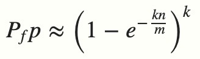
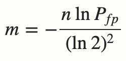

## 一、安装Redis

### 使用Docker安装Redis

　　1、拉取镜像

```shell
docker pull redis:7
```

　　2、创建并运行redis容器

```shell
docker run -p 6379:6379 --name redis \
-v /mydata/redis/data:/data \
--restart=always \
-d redis:7 redis-server
```

　　3、使用redis客户端连接服务端

```shell
docker exec -it redis redis-cli
```

## 二、Redis的数据类型

### key

　　Redis使用`key-value`存储数据，`key`一般是字符串类型，`value`包含以下多种类型：`string`、`list`、`hash`、`set`、`zset`等。**在一个Redis数据库中，`key`是唯一的。**关于`key`的一些命令如下表所示：

| 关于key的命令       | 介绍                                                         |
| ------------------- | ------------------------------------------------------------ |
| `SET key value`     | 创建或更新一个`key-value`                                    |
| `GET key`           | 查询`key`对应的`value`值                                     |
| `EXISTS key`        | 判断`key`是否存在，如果存在返回`1`，不存在返回`0`            |
| `KEYS key*`         | 查询所有符合正则表达式的`key`的名字                          |
| `RENAME key newkey` | 修改`key`的名字                                              |
| `DEL key`           | 删除`key-value`                                              |
| `EXPIRE key 60`     | 设置`key-value`的过期时间，单位是秒                          |
| `TTL key`           | 查询`key-value`剩余的过期时间，单位是秒。如果已经过期返回`-2`，如果永不过期返回`-1` |

> info "提示"
>
> 虽然`value`包含多种类型，但这些类型内部的元素类型只能是字符串、整数或浮点数，比如`list`只能存储字符串、整数或浮点数类型的元素，这一点和Java语言是不同的。

### string类型

　　`string`是最简单的一种`value`类型，关于它的一些命令如下表所示：

| 关于string类型value的命令                  | 介绍                                                         |
| ------------------------------------------ | ------------------------------------------------------------ |
| `SET key value`                            | 创建或更新一个`key-value`                                    |
| `MSET key1 value1 key2 value2 key3 value3` | 批量创建或更新`key-value`                                    |
| `GET key`                                  | 查询`key`对应的`value`值                                     |
| `MGET key1 key2 key3`                      | 批量查询`key`对应的`value`值                                 |
| `GETSET key newvalue`                      | 更新`key`对应的`value`值，并返回旧的`value`                  |
| `STRLEN key`                               | 查询`key`对应的`value`所占用的字节数                         |
| `GETRANGE key 0 1`                         | 截取`key`对应的`value`中的`[0, 1]`之间的字符，`0`代表第一个字符，`-1`代表最后一个字符，`-2`代表倒数第二个字符 |
| `SETRANGE key 0 str`                       | 使用指定的字符串`str`，替换`value`中从`0`开始的子串          |

### list类型

　　`list`有点像Java中的`LinkedList`，它既可以作为一个数组，也可以作为一个双端队列，也可以作为一个阻塞队列。关于它的一些命令如下表所示：

| 关于list类型value的命令                   | 介绍                                                         |
| ----------------------------------------- | ------------------------------------------------------------ |
| `LPUSH key value1 value2 value3`          | 从队列左边添加元素                                           |
| `RPUSH key value1 value2 value3`          | 从队列右边添加元素                                           |
| `LINSERT key BEFORE/AFTER value newvalue` | 从队列左边开始，找到第一个值为`value`的元素，在它的前面/后面插入`newvalue` |
| `LRANGE key 0 -1`                         | 从队列左边开始，查询队列指定索引范围内的`value`，`0`代表第一个元素，`-1`代表最后一个元素 |
| `LINDEX key 0`                            | 从队列左边开始，查询队列指定索引处的`value`                  |
| `LPOP key`                                | 从队列左边弹出第一个元素                                     |
| `RPOP key`                                | 从队列右边弹出第一个元素                                     |
| `BLPOP key 60`                            | 从队列左边弹出第一个元素，如果队列为空则进入阻塞状态，直到队列不为空，或者超过等待时间，单位是秒 |
| `BRPOP key 60`                            | 从队列右边弹出第一个元素，如果队列为空则进入阻塞状态，直到队列不为空，或者超过等待时间，单位是秒 |
| `LSET key 0 newvalue`                     | 从队列左边开始，更新指定索引处的`value`                      |
| `LREM key 2 value`                        | 从队列左边开始，删除n个与`value`相同的元素，n是0代表有多少删除多少 |
| `LLEN key`                                | 查询队列长度                                                 |

### hash类型

　　`hash`类似于Java中的`HashMap`，它的`k`是不能重复的，并且`k-v`对之间是无序的，关于它的一些命令如下表所示：

| 关于hash类型value的命令      | 介绍                         |
| ---------------------------- | ---------------------------- |
| `HSET key k1 v1 k2 v2 k3 v3` | 向`hash`中添加或修改`k-v`    |
| `HGET key k1`                | 查询`hash`中某个`k`对应的`v` |
| `HMGET key k1 k2 k3`         | 查询`hash`中多个`k`对应的`v` |
| `HKEYS key`                  | 查询`hash`中的所有`k`        |
| `HVALS key`                  | 查询`hash`中的所有`v`        |
| `HGETALL key`                | 查询`hash`中的所有`k-v`      |
| `HEXISTS key k1`             | 判断`hash`中是否存在`k1`     |
| `HLEN key`                   | 查询`hash`中`k-v`的数量      |
| `HDEL key k1 k2`             | 删除`hash`中指定的`k`        |

### set类型

　　`set`类似于Java中的`HashSet`，它的元素是不能重复的，关于它的一些命令如下表所示：

| 关于set类型value的命令 | 介绍                                                        |
| ---------------------- | ----------------------------------------------------------- |
| `SADD key k1 k2 k3`    | 向`set`中添加元素                                           |
| `SMEMBERS key`         | 查询`set`中的所有元素                                       |
| `SISMEMBER key k1`     | 判断`set`中是否存在指定元素                                 |
| `SCARD key`            | 查询`set`中元素的个数                                       |
| `SREM key k1`          | 删除`set`中指定的元素                                       |
| `SDIFF key1 key2`      | 查询两个`set`之间的差集，即`key1`中有，但`key2`中没有的元素 |
| `SINTER key1 key2`     | 查询两个`set`之间的交集，即`key1`和`key2`中都有的元素       |
| `SUNION key1 key2`     | 查询两个`set`之间的并集，即`key1`和`key2`中全部的元素       |

### zset类型

　　`zset`类似于Java中的`TreeSet`，它里面的元素是不能重复的，并且是有序的。但和`TreeSet`不同的是，`zset`元素的排序是通过和元素关联的一个`double`类型的分数实现的，分数越小越靠前，关于它的一些命令如下表所示：

| 关于zset类型value的命令         | 介绍                                                         |
| ------------------------------- | ------------------------------------------------------------ |
| `ZADD key 1.2 k1 1.3 k2 0.9 k3` | 向`zset`中添加元素，同时为每个元素绑定一个分数，作为排序的依据 |
| `ZRANGE key 0 -1`               | 查询`set`中指定索引范围内的元素                              |
| `ZRANGEBYSCORE key 1.1 1.8`     | 查询`set`中指定分数范围内的元素                              |
| `ZCARD key`                     | 查询`set`中元素的个数                                        |
| `ZREM key k1 k2`                | 删除`set`中的指定元素                                        |

### 其它类型

* #### HyperLoglog基数统计

　　`HyperLoglog`是`Redis-2.8.9`中新增的数据类型，`HyperLoglog`类型用于估计不重复元素的个数(基数)，误差率是`0.81%`，适用于对精度要求不是很高的大批量统计。关于它的一些命令如下表所示：

| 关于HyperLoglog的命令    | 介绍                                        |
| ------------------------ | ------------------------------------------- |
| `PFADD key v1 v2 v3`     | 向`HyperLoglog`中添加元素                   |
| `PFCOUNT key`            | 查询`HyperLoglog`中不重复元素的个数(估计值) |
| `PFMERGE key1 key2 key3` | 合并多个`HyperLoglog`                       |

* #### GEO地理位置

　　`GEO`是`Redis-3.2`中新增的数据类型，它是一个集合，用来存放地理位置，底层用`zset`实现。`GEO`中的地名相当于`zset`中的元素值，经纬度相当于元素对应的分数。关于它的一些命令如下表所示：

| 关于GEO的命令                                            | 介绍                                                         |
| -------------------------------------------------------- | ------------------------------------------------------------ |
| `GEOADD city 116.20 39.56 beijing 120.52 30.40 shanghai` | 向`GEO`集合中添加地理位置                                    |
| `ZREM city beijing`                                      | 删除`GEO`集合中的地理位置                                    |
| `GEODIST city beijing shanghai M/KM/FT/MI`               | 计算两个地点的距离，`M/KM/FT/MI`代表距离单位`米/千米/英尺/英里` |
| `GEORADIUS city beijing 1500 KM WITHCOORD WITHDIST`      | 以某个地点或某个经纬度为中心，查询某个半径内的所有地点       |

## 三、布隆过滤器

* #### 原理

　　布隆过滤器是`Redis-4.0`版本提供的新功能，它的作用是可以判断过滤器中是否存在某个元素。布隆过滤器的原理是，当一个元素被加入集合时，通过K个散列函数将这个元素映射成一个位数组中的K个点，把它们置为1。检索时，我们只要看看这些点是不是都是1就（大约）知道集合中有没有它了：如果这些点有任何一个0，则被检元素一定不在；如果都是1，则被检元素很可能在。这就是布隆过滤器的基本思想。布隆过滤器不能删除元素。

* #### 误判率

　　由于可能会发生哈希碰撞，因此布隆过滤器的统计结果可能会出现误差，幸运的是，布隆过滤器有一个可预测的误判率（FPP）：



　　`n`代表已经添加元素的个数，`k`代表散列函数的个数，`m`代表布隆过滤器的总长度。可以看出，当布隆过滤器中的元素越多、散列函数的个数越多、过滤器的总长度越短，则误判的概率越高。极端情况下，当布隆过滤器已满时(即哈希表中的每一位都是1)，无论再添加什么元素，布隆过滤器都会判断该元素已存在。

　　为了让误判率低一点，需要调整布隆过滤器的长度、散列函数的个数、添加元素的个数。我们通过上面的公式可以反推出下面的公式：



* #### 使用布隆过滤器

　　在Redis中安装布隆过滤器的步骤是：

　　1、拉取`redislabs/rebloom`镜像，它包含了Redis和布隆过滤器

```shell
docker pull redislabs/rebloom:latest
```

　　2、创建并运行容器

```shell
docker run -d -p 6379:6379 \
-v /mydata/redis-redisbloom/data:/data \
--name redis-redisbloom \
--restart=always \
redislabs/rebloom:latest
```

　　3、使用客户端连接服务端

```shell
docker exec -it redis-redisbloom redis-cli
```

　

　　安装好布隆过滤器后，就可以通过Redis命令使用它了，常见的命令有：

| 关于布隆过滤器的Redis命令                                    | 介绍                                       |
| ------------------------------------------------------------ | ------------------------------------------ |
| `BF.MADD filter value1 value2 value3`                        | 向布隆过滤器`filter`中添加元素             |
| `BF.MEXISTS filter value1 value2`                            | 判断布隆过滤器`filter`中是否存在指定的元素 |
| ` BF.RESERVE filter error_rate capacity [EXPANSION expansion] [NONSCALING]` | 设置布隆过滤器的参数                       |

## 四、发布订阅

　　Redis的PubSub模块是它的发布订阅模块，发布订阅实现了消息多播功能。客户端之间通过channel来传递消息，一个客户端可以订阅任意个channel。它的常用命令如下：

| 发布订阅的相关命令              | 介绍                                                         |
| ------------------------------- | ------------------------------------------------------------ |
| `SUBSCRIBE channel1 channel2`   | 客户端订阅多个频道，执行该命令后客户端会进入阻塞状态，等待服务端向频道发布消息，然后接收消息 |
| `PUBLISH channel1 hello`        | 服务端向频道发布消息                                         |
| `PSUBSCRIBE abc* def*`          | 客户端订阅符合某种正则表达式的频道                           |
| `UNSUBSCRIBE channel1 channel2` | 客户端退订频道                                               |
| `PUBSUB CHANNELS`               | 查询所有在线的频道，如果有客户端正在订阅一个频道，那么这个频道就是在线的 |
| `PUBSUB NUMPAT`                 | 查询所有在线的正则表达式类型的频道数量                       |
| `PUBSUB NUMSUB channel1`        | 查询正在订阅某个频道的客户端的数量                           |

## 五、事务

### 使用方法

　　Redis事务的使用方法是：

```shell
MULTI # 开启事务
SET name jack
SET age 18
EXEC # 执行事务中的所有命令
```

　　开启事务后也可以不执行命令，相当于MySQL中的回滚：

```shell
MULTI # 开启事务
SET name jack
SET age 18
DISCARD # 取消执行事务中的所有命令
```

### 原子性

　　Redis单条命令是原子性的，而Redis事务不是原子性的，在一个Redis事务中如果有一条命令执行失败，不会影响其它正常命令的执行。

### 线程安全

　　可以使用乐观锁来实现Redis中共享变量的线程安全。具体做法是先监视这个共享变量，然后开启事务，如果该变量在事务执行的过程中被其它客户端修改了，该事务中的所有命令都不会执行。如下所示：

```shell
WATCH age # 监视共享变量age
MULTI # 开始事务
SET age 18
EXEC # 当age被其它客户端修改了，不会执行事务中的命令
UNWATCH # 取消监视
```

